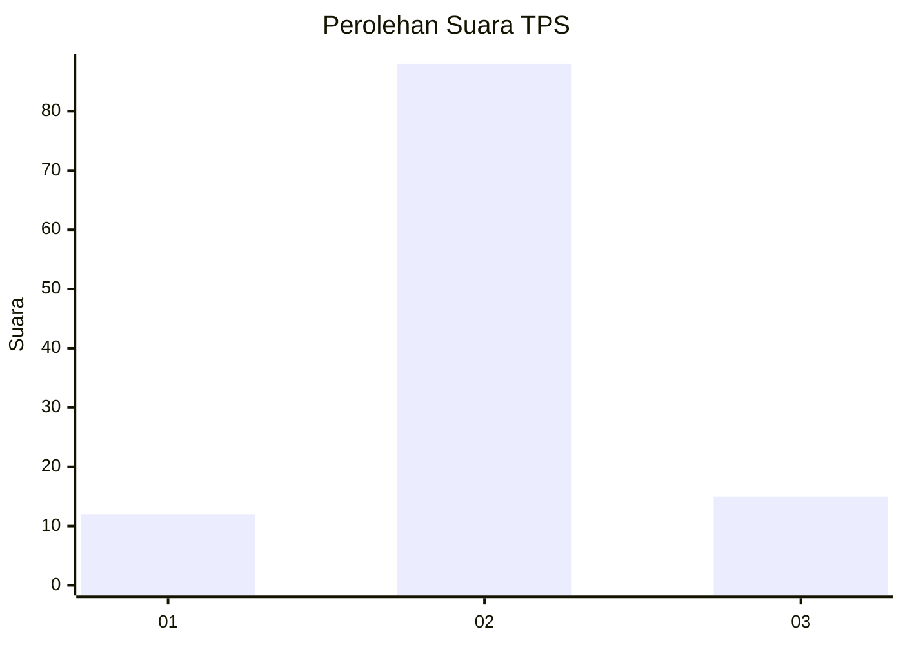
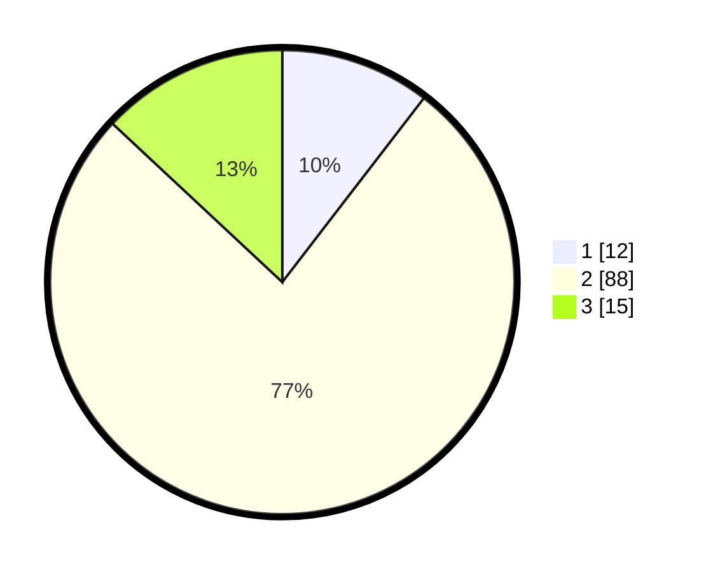

# Hasil

## Grafik

## Tabel

| No. | Nama Paslon    | Suara | Suara (raw) | Persentase |
|:--- |:-------------- | -----:| -----------:| ----------:|
| 1   | ANIES MUHAIMIN | 12    | [12][p-1]   | 10,43      |
| 2   | PRABOWO GIBRAN | 88    | [88][p-2]   | 76,52      |
| 3   | GANJAR MAHFUD  | 15    | [15][p-3]   | 13,04      |

[p-1]: https://github.com/gigit-pemilu/pemilu-2024-16-sumatera-selatan/blob/main/pilpres/hitung-suara/sub/16-sumatera-selatan/sub/01-ogan-komering-ulu/sub/32-kedaton-peninjauan-raya/sub/2001-bunglai/sub/006-tps/sub/paslon-1.txt
[p-2]: https://github.com/gigit-pemilu/pemilu-2024-16-sumatera-selatan/blob/main/pilpres/hitung-suara/sub/16-sumatera-selatan/sub/01-ogan-komering-ulu/sub/32-kedaton-peninjauan-raya/sub/2001-bunglai/sub/006-tps/sub/paslon-2.txt
[p-3]: https://github.com/gigit-pemilu/pemilu-2024-16-sumatera-selatan/blob/main/pilpres/hitung-suara/sub/16-sumatera-selatan/sub/01-ogan-komering-ulu/sub/32-kedaton-peninjauan-raya/sub/2001-bunglai/sub/006-tps/sub/paslon-3.txt

## Foto C Plano

https://sirekap-obj-formc.kpu.go.id/c9cf/pemilu/ppwp/16/01/32/20/01/1601322001006-20240216-022813--3918c883-6f5a-4f73-ab71-a0d8f74399f2.jpg

https://sirekap-obj-formc.kpu.go.id/c9cf/pemilu/ppwp/16/01/32/20/01/1601322001006-20240216-022817--bd6c7c74-9846-4b10-8c64-83b7d2f6592a.jpg

https://sirekap-obj-formc.kpu.go.id/c9cf/pemilu/ppwp/16/01/32/20/01/1601322001006-20240216-022815--90955c04-f746-486d-a168-27434720ec8a.jpg

## Metadata

| Key        | Value               |
| ---------- | ------------------- |
| Time Stamp | 2024-02-22 11:00:00 |

## DATA PEMILIH TETAP

Jumlah pemilih dalam DPT: **136**.
 * L: **64**.
 * P: **72**.

## DATA PENGGUNA HAK PILIH

Jumlah pengguna hak pilih dalam DPT: **115**.
 * L: **54**.
 * P: **61**.

Jumlah pengguna hak pilih dalam DPTb: **0**.
 * L: **0**.
 * P: **0**.

Jumlah pengguna hak pilih dalam DPK: **2**.
 * L: **1**.
 * P: **1**.

Jumlah pengguna hak pilih: **117**.
 * L: **55**.
 * P: **62**.

## JUMLAH SUARA SAH DAN TIDAK SAH

JUMLAH SELURUH SUARA SAH: **115**.

JUMLAH SUARA TIDAK SAH: **2**.

JUMLAH SELURUH SUARA SAH DAN SUARA TIDAK SAH: **117**.

