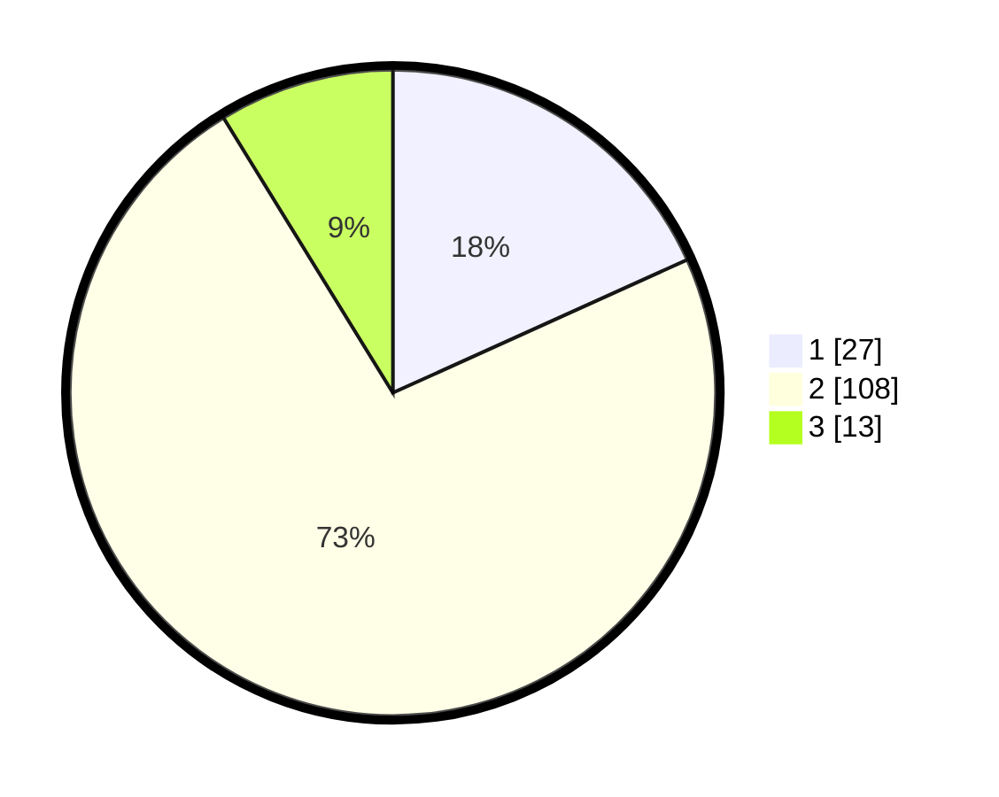

# Hasil

## Grafik

## Tabel

| No. | Nama Paslon    | Suara | Suara (raw) | Persentase |
|:--- |:-------------- | -----:| -----------:| ----------:|
| 1   | ANIES MUHAIMIN | 27    | [27][p-1]   | 18,24      |
| 2   | PRABOWO GIBRAN | 108   | [108][p-2]  | 72,97      |
| 3   | GANJAR MAHFUD  | 13    | [13][p-3]   | 8,78       |

[p-1]: https://github.com/gigit-pemilu/pemilu-2024-16-sumatera-selatan/blob/main/pilpres/hitung-suara/sub/16-sumatera-selatan/sub/01-ogan-komering-ulu/sub/32-kedaton-peninjauan-raya/sub/2006-suka-pindah/sub/002-tps/sub/paslon-1.txt
[p-2]: https://github.com/gigit-pemilu/pemilu-2024-16-sumatera-selatan/blob/main/pilpres/hitung-suara/sub/16-sumatera-selatan/sub/01-ogan-komering-ulu/sub/32-kedaton-peninjauan-raya/sub/2006-suka-pindah/sub/002-tps/sub/paslon-2.txt
[p-3]: https://github.com/gigit-pemilu/pemilu-2024-16-sumatera-selatan/blob/main/pilpres/hitung-suara/sub/16-sumatera-selatan/sub/01-ogan-komering-ulu/sub/32-kedaton-peninjauan-raya/sub/2006-suka-pindah/sub/002-tps/sub/paslon-3.txt

## Foto C Plano

https://sirekap-obj-formc.kpu.go.id/6dd0/pemilu/ppwp/16/01/32/20/06/1601322006002-20240214-221624--63c486a6-a8c2-40d3-9a49-2098b8a4c000.jpg

https://sirekap-obj-formc.kpu.go.id/6dd0/pemilu/ppwp/16/01/32/20/06/1601322006002-20240216-121918--285bb83a-b10b-4cf0-9079-c0fca4948a89.jpg

https://sirekap-obj-formc.kpu.go.id/6dd0/pemilu/ppwp/16/01/32/20/06/1601322006002-20240216-121914--9ed32233-6686-4d3f-88f2-bce76332920a.jpg

## Metadata

| Key        | Value               |
| ---------- | ------------------- |
| Time Stamp | 2024-02-21 17:00:00 |

