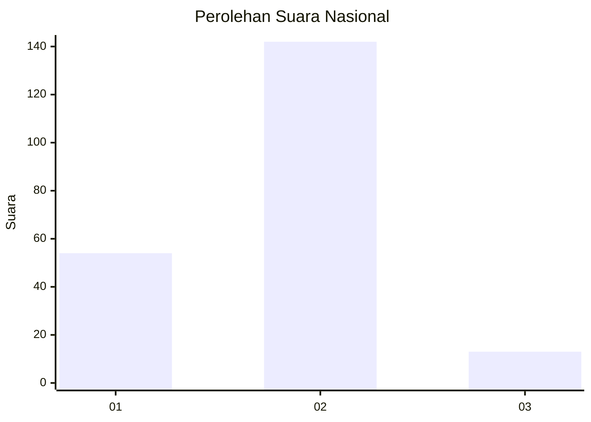
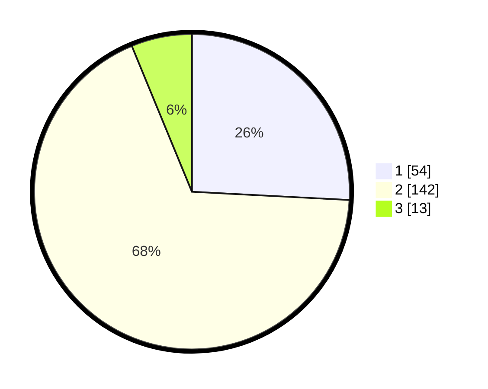

# Hasil

## Grafik

## Tabel

| No. | Nama Paslon    | Suara | Suara (raw) | Persentase |
|:--- |:-------------- | -----:| -----------:| ----------:|
| 1   | ANIES MUHAIMIN | 54    | [54][p-1]   | 25,84      |
| 2   | PRABOWO GIBRAN | 142   | [142][p-2]  | 67,94      |
| 3   | GANJAR MAHFUD  | 13    | [13][p-3]   | 6,22       |

[p-1]: https://github.com/gigit-pemilu/pemilu-2024/blob/main/pilpres/hitung-suara/sub/16-sumatera-selatan/sub/02-ogan-komering-ilir/sub/02-tanjung-lubuk/sub/1011-tanjung-lubuk/sub/005-tps/sub/paslon-1.txt
[p-2]: https://github.com/gigit-pemilu/pemilu-2024/blob/main/pilpres/hitung-suara/sub/16-sumatera-selatan/sub/02-ogan-komering-ilir/sub/02-tanjung-lubuk/sub/1011-tanjung-lubuk/sub/005-tps/sub/paslon-2.txt
[p-3]: https://github.com/gigit-pemilu/pemilu-2024/blob/main/pilpres/hitung-suara/sub/16-sumatera-selatan/sub/02-ogan-komering-ilir/sub/02-tanjung-lubuk/sub/1011-tanjung-lubuk/sub/005-tps/sub/paslon-3.txt

## Foto C Plano

https://sirekap-obj-formc.kpu.go.id/3b1b/pemilu/ppwp/16/02/02/10/11/1602021011005-20240214-225244--79773b14-5cee-4d6d-9a70-5ba9125912a4.jpg

https://sirekap-obj-formc.kpu.go.id/3b1b/pemilu/ppwp/16/02/02/10/11/1602021011005-20240215-070821--4dbad7d0-2333-4fe4-93de-dfd5ee4f0e34.jpg

https://sirekap-obj-formc.kpu.go.id/3b1b/pemilu/ppwp/16/02/02/10/11/1602021011005-20240215-042002--40833875-f3f2-4dd8-87b2-e82df9196521.jpg

## Metadata

| Key        | Value               |
| ---------- | ------------------- |
| Time Stamp | 2024-02-15 15:00:29 |

