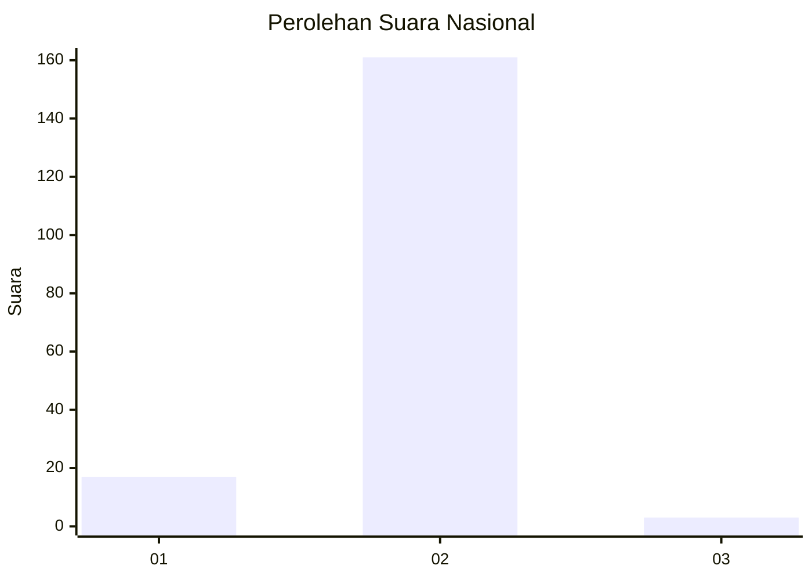
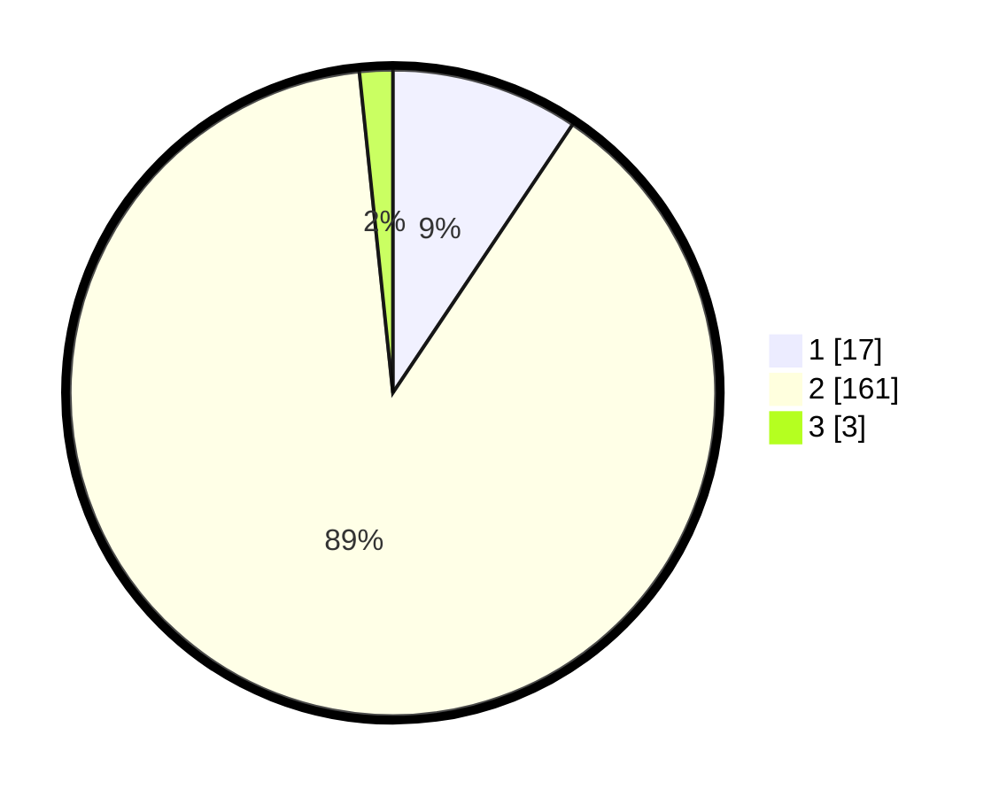

# Hasil

## Grafik

## Tabel

| No. | Nama Paslon    | Suara | Suara (raw) | Persentase |
|:--- |:-------------- | -----:| -----------:| ----------:|
| 1   | ANIES MUHAIMIN | 17    | [17][p-1]   | 9,39       |
| 2   | PRABOWO GIBRAN | 161   | [161][p-2]  | 88,95      |
| 3   | GANJAR MAHFUD  | 3     | [3][p-3]    | 1,66       |

[p-1]: https://github.com/gigit-pemilu/pemilu-2024/blob/main/pilpres/hitung-suara/sub/16-sumatera-selatan/sub/02-ogan-komering-ilir/sub/02-tanjung-lubuk/sub/2017-ulak-balam/sub/004-tps/sub/paslon-1.txt
[p-2]: https://github.com/gigit-pemilu/pemilu-2024/blob/main/pilpres/hitung-suara/sub/16-sumatera-selatan/sub/02-ogan-komering-ilir/sub/02-tanjung-lubuk/sub/2017-ulak-balam/sub/004-tps/sub/paslon-2.txt
[p-3]: https://github.com/gigit-pemilu/pemilu-2024/blob/main/pilpres/hitung-suara/sub/16-sumatera-selatan/sub/02-ogan-komering-ilir/sub/02-tanjung-lubuk/sub/2017-ulak-balam/sub/004-tps/sub/paslon-3.txt

## Foto C Plano

https://sirekap-obj-formc.kpu.go.id/12e5/pemilu/ppwp/16/02/02/20/17/1602022017004-20240215-024607--0ba99ba0-d7b2-4c98-8592-0974f3a53920.jpg

https://sirekap-obj-formc.kpu.go.id/12e5/pemilu/ppwp/16/02/02/20/17/1602022017004-20240215-024731--d16cb774-74cc-4146-93e5-9b3285acc592.jpg

https://sirekap-obj-formc.kpu.go.id/12e5/pemilu/ppwp/16/02/02/20/17/1602022017004-20240215-033820--c31f40b0-9f1e-49e0-86cf-4a3ed61fe7ff.jpg

## Metadata

| Key        | Value               |
| ---------- | ------------------- |
| Time Stamp | 2024-02-16 03:00:26 |

