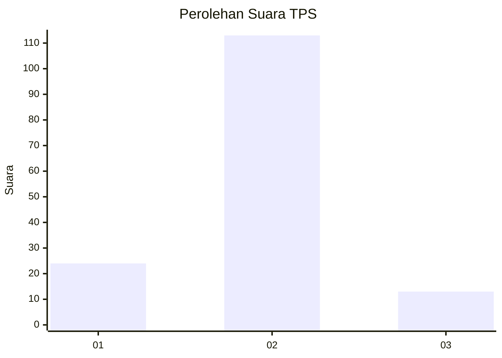
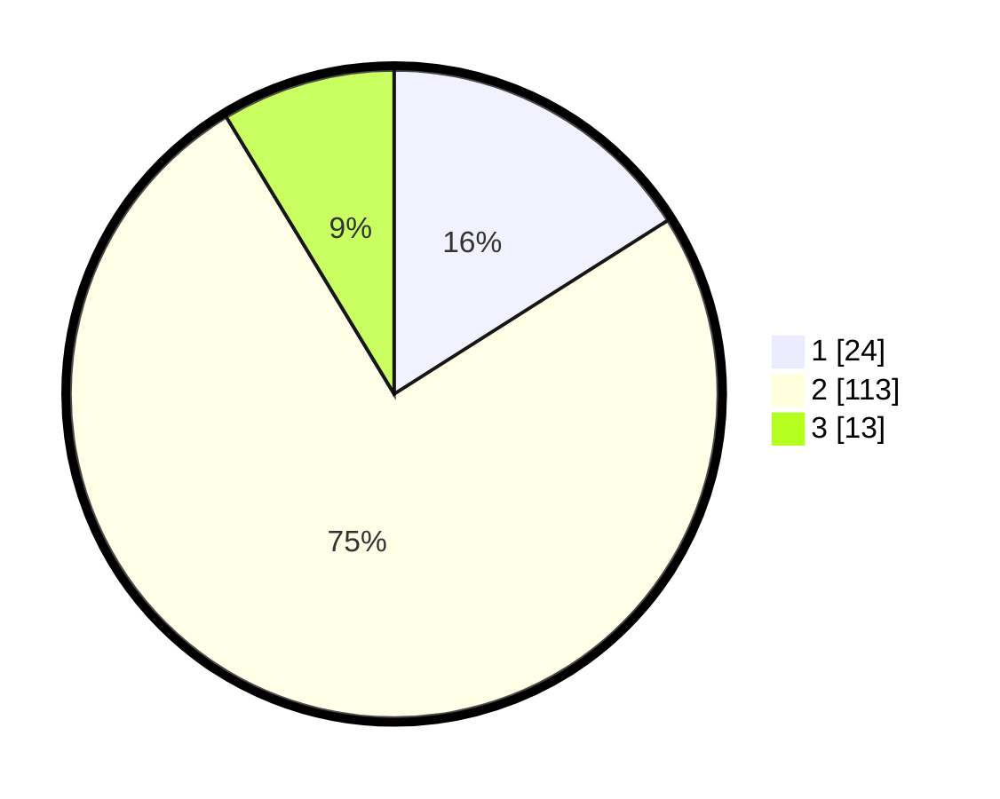

# Hasil

## Grafik

## Tabel

| No. | Nama Paslon    | Suara | Suara (raw) | Persentase |
|:--- |:-------------- | -----:| -----------:| ----------:|
| 1   | ANIES MUHAIMIN | 24    | [24][p-1]   | 16,00      |
| 2   | PRABOWO GIBRAN | 113   | [113][p-2]  | 75,33      |
| 3   | GANJAR MAHFUD  | 13    | [13][p-3]   | 8,67       |

[p-1]: https://github.com/gigit-pemilu/pemilu-2024-16-sumatera-selatan/blob/main/pilpres/hitung-suara/sub/16-sumatera-selatan/sub/02-ogan-komering-ilir/sub/02-tanjung-lubuk/sub/2018-jambu-ilir/sub/006-tps/sub/paslon-1.txt
[p-2]: https://github.com/gigit-pemilu/pemilu-2024-16-sumatera-selatan/blob/main/pilpres/hitung-suara/sub/16-sumatera-selatan/sub/02-ogan-komering-ilir/sub/02-tanjung-lubuk/sub/2018-jambu-ilir/sub/006-tps/sub/paslon-2.txt
[p-3]: https://github.com/gigit-pemilu/pemilu-2024-16-sumatera-selatan/blob/main/pilpres/hitung-suara/sub/16-sumatera-selatan/sub/02-ogan-komering-ilir/sub/02-tanjung-lubuk/sub/2018-jambu-ilir/sub/006-tps/sub/paslon-3.txt

## Foto C Plano

https://sirekap-obj-formc.kpu.go.id/faf8/pemilu/ppwp/16/02/02/20/18/1602022018006-20240215-000039--e6bdfaf5-8fb8-4408-9543-6845c9ef2a2f.jpg

https://sirekap-obj-formc.kpu.go.id/faf8/pemilu/ppwp/16/02/02/20/18/1602022018006-20240215-000217--25088a3d-b9e7-4a34-a4d2-8df6da5c7b01.jpg

https://sirekap-obj-formc.kpu.go.id/faf8/pemilu/ppwp/16/02/02/20/18/1602022018006-20240215-001619--e7e5698e-cfe9-469b-b601-0860fd62542d.jpg

## Metadata

| Key        | Value               |
| ---------- | ------------------- |
| Time Stamp | 2024-02-15 15:00:29 |

