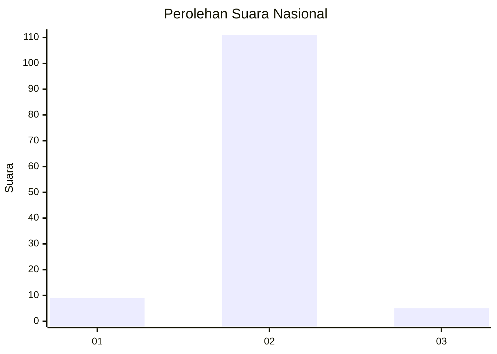
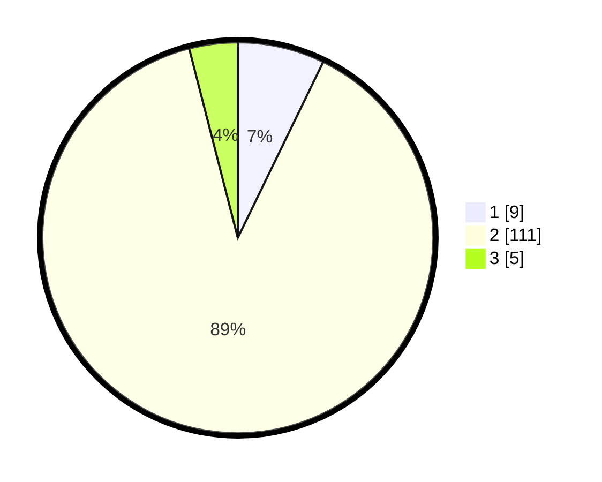

# Hasil

## Grafik

## Tabel

| No. | Nama Paslon    | Suara | Suara (raw) | Persentase |
|:--- |:-------------- | -----:| -----------:| ----------:|
| 1   | ANIES MUHAIMIN | 9     | [9][p-1]    | 7,20       |
| 2   | PRABOWO GIBRAN | 111   | [111][p-2]  | 88,80      |
| 3   | GANJAR MAHFUD  | 5     | [5][p-3]    | 4,00       |

[p-1]: https://github.com/gigit-pemilu/pemilu-2024/blob/main/pilpres/hitung-suara/sub/16-sumatera-selatan/sub/02-ogan-komering-ilir/sub/02-tanjung-lubuk/sub/2032-atar-balam/sub/002-tps/sub/paslon-1.txt
[p-2]: https://github.com/gigit-pemilu/pemilu-2024/blob/main/pilpres/hitung-suara/sub/16-sumatera-selatan/sub/02-ogan-komering-ilir/sub/02-tanjung-lubuk/sub/2032-atar-balam/sub/002-tps/sub/paslon-2.txt
[p-3]: https://github.com/gigit-pemilu/pemilu-2024/blob/main/pilpres/hitung-suara/sub/16-sumatera-selatan/sub/02-ogan-komering-ilir/sub/02-tanjung-lubuk/sub/2032-atar-balam/sub/002-tps/sub/paslon-3.txt

## Foto C Plano

https://sirekap-obj-formc.kpu.go.id/9667/pemilu/ppwp/16/02/02/20/32/1602022032002-20240215-024817--26a27cf3-28e3-404b-8f0f-97247dbfd548.jpg

https://sirekap-obj-formc.kpu.go.id/9667/pemilu/ppwp/16/02/02/20/32/1602022032002-20240215-022406--77a40492-ace6-444c-a93a-40c3f08c5147.jpg

https://sirekap-obj-formc.kpu.go.id/9667/pemilu/ppwp/16/02/02/20/32/1602022032002-20240215-022618--f0047e2e-a82f-4a11-8bc3-2b240eecc9ca.jpg

## Metadata

| Key        | Value               |
| ---------- | ------------------- |
| Time Stamp | 2024-02-15 12:00:28 |

