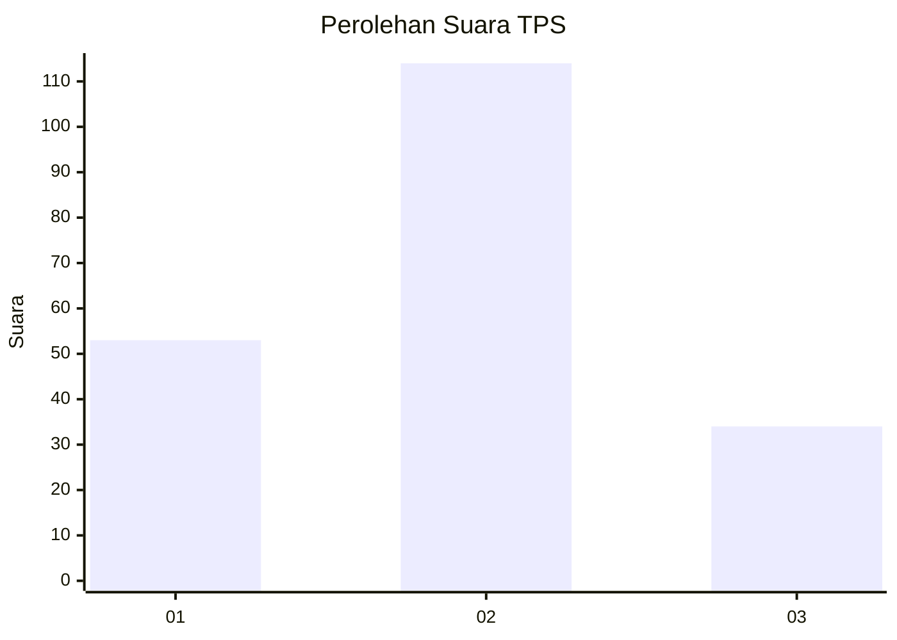
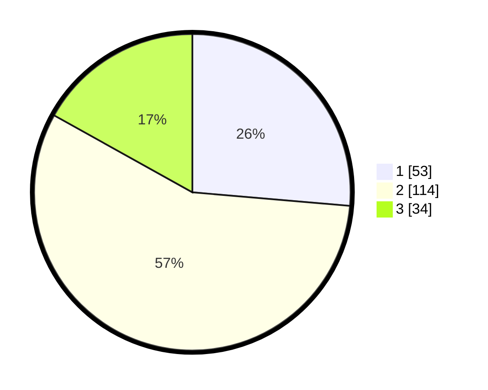

# Hasil

## Grafik

## Tabel

| No. | Nama Paslon    | Suara | Suara (raw) | Persentase |
|:--- |:-------------- | -----:| -----------:| ----------:|
| 1   | ANIES MUHAIMIN | 53    | [53][p-1]   | 26,37      |
| 2   | PRABOWO GIBRAN | 114   | [114][p-2]  | 56,72      |
| 3   | GANJAR MAHFUD  | 34    | [34][p-3]   | 16,92      |

[p-1]: https://github.com/gigit-pemilu/pemilu-2024-16-sumatera-selatan/blob/main/pilpres/hitung-suara/sub/16-sumatera-selatan/sub/02-ogan-komering-ilir/sub/03-pedamaran/sub/2002-pedamaran-vi/sub/003-tps/sub/paslon-1.txt
[p-2]: https://github.com/gigit-pemilu/pemilu-2024-16-sumatera-selatan/blob/main/pilpres/hitung-suara/sub/16-sumatera-selatan/sub/02-ogan-komering-ilir/sub/03-pedamaran/sub/2002-pedamaran-vi/sub/003-tps/sub/paslon-2.txt
[p-3]: https://github.com/gigit-pemilu/pemilu-2024-16-sumatera-selatan/blob/main/pilpres/hitung-suara/sub/16-sumatera-selatan/sub/02-ogan-komering-ilir/sub/03-pedamaran/sub/2002-pedamaran-vi/sub/003-tps/sub/paslon-3.txt

## Foto C Plano

https://sirekap-obj-formc.kpu.go.id/a564/pemilu/ppwp/16/02/03/20/02/1602032002003-20240215-021002--0fdd11d9-23f3-41ec-a60c-f038f2f1e915.jpg

https://sirekap-obj-formc.kpu.go.id/a564/pemilu/ppwp/16/02/03/20/02/1602032002003-20240215-042548--566e3495-eceb-40da-b57a-f49fff5dd486.jpg

https://sirekap-obj-formc.kpu.go.id/a564/pemilu/ppwp/16/02/03/20/02/1602032002003-20240215-042721--0b340975-88fd-469c-aee0-e4ea389f32b3.jpg

## Metadata

| Key        | Value               |
| ---------- | ------------------- |
| Time Stamp | 2024-02-15 15:30:25 |

