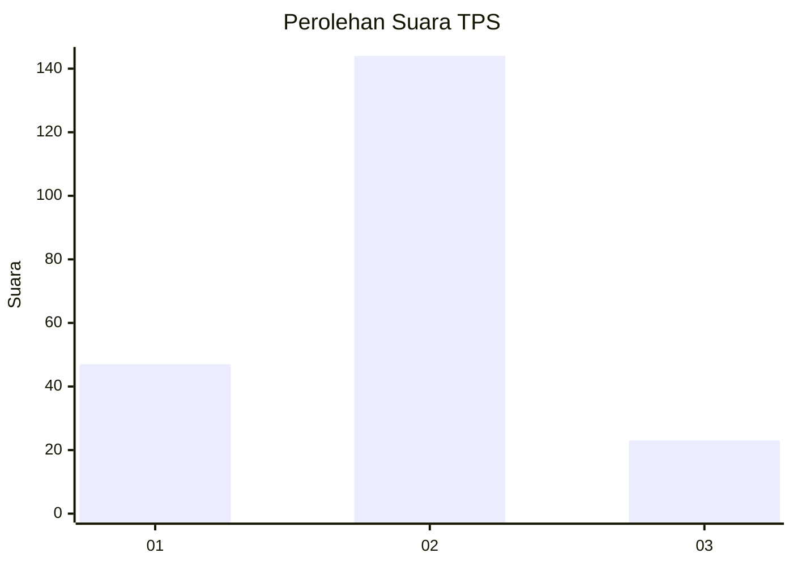
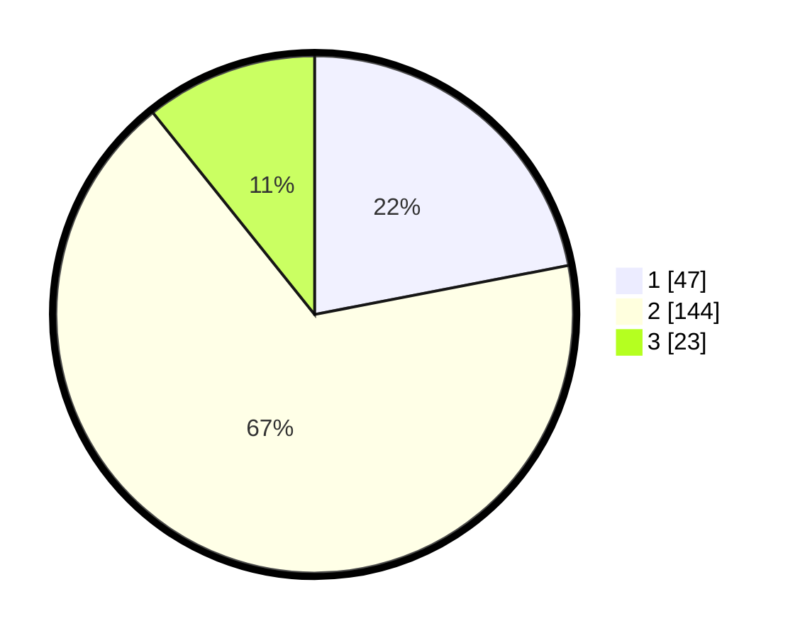

# Hasil

## Grafik

## Tabel

| No. | Nama Paslon    | Suara | Suara (raw) | Persentase |
|:--- |:-------------- | -----:| -----------:| ----------:|
| 1   | ANIES MUHAIMIN | 47    | [47][p-1]   | 21,96      |
| 2   | PRABOWO GIBRAN | 144   | [144][p-2]  | 67,29      |
| 3   | GANJAR MAHFUD  | 23    | [23][p-3]   | 10,75      |

[p-1]: https://github.com/gigit-pemilu/pemilu-2024-16-sumatera-selatan/blob/main/pilpres/hitung-suara/sub/16-sumatera-selatan/sub/02-ogan-komering-ilir/sub/03-pedamaran/sub/2002-pedamaran-vi/sub/004-tps/sub/paslon-1.txt
[p-2]: https://github.com/gigit-pemilu/pemilu-2024-16-sumatera-selatan/blob/main/pilpres/hitung-suara/sub/16-sumatera-selatan/sub/02-ogan-komering-ilir/sub/03-pedamaran/sub/2002-pedamaran-vi/sub/004-tps/sub/paslon-2.txt
[p-3]: https://github.com/gigit-pemilu/pemilu-2024-16-sumatera-selatan/blob/main/pilpres/hitung-suara/sub/16-sumatera-selatan/sub/02-ogan-komering-ilir/sub/03-pedamaran/sub/2002-pedamaran-vi/sub/004-tps/sub/paslon-3.txt

## Foto C Plano

https://sirekap-obj-formc.kpu.go.id/e770/pemilu/ppwp/16/02/03/20/02/1602032002004-20240215-004832--a6abf9ff-2117-47cb-9c50-f44aa5c6785c.jpg

https://sirekap-obj-formc.kpu.go.id/e770/pemilu/ppwp/16/02/03/20/02/1602032002004-20240215-005019--56d06924-c42f-4ad3-9257-6c90e13ea584.jpg

https://sirekap-obj-formc.kpu.go.id/e770/pemilu/ppwp/16/02/03/20/02/1602032002004-20240215-005254--a7ae5048-8c67-4264-ba12-16ae6f63ab98.jpg

## Metadata

| Key        | Value               |
| ---------- | ------------------- |
| Time Stamp | 2024-02-15 15:00:29 |

