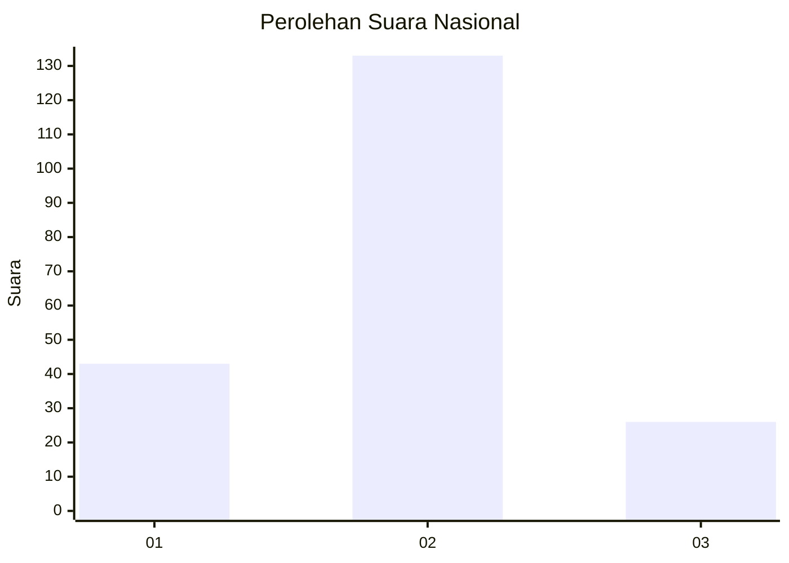
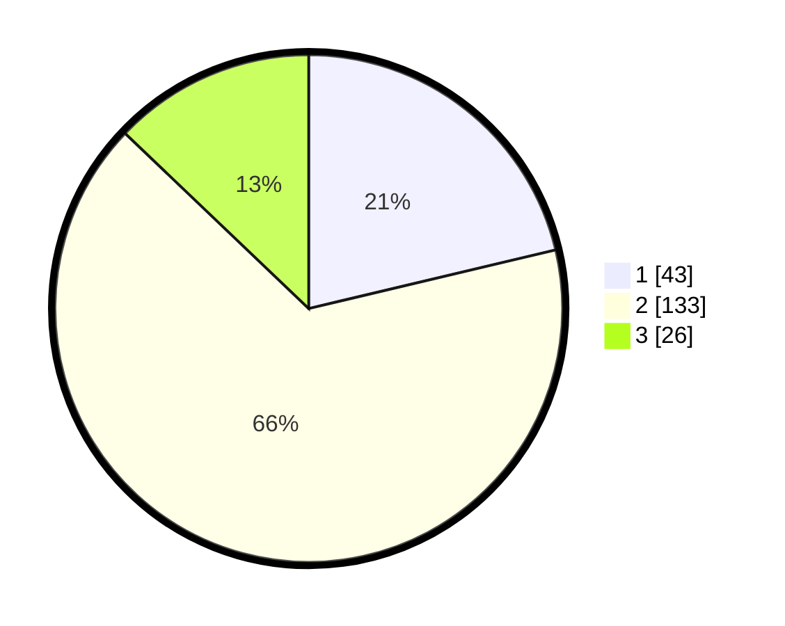

# Hasil

## Grafik

## Tabel

| No. | Nama Paslon    | Suara | Suara (raw) | Persentase |
|:--- |:-------------- | -----:| -----------:| ----------:|
| 1   | ANIES MUHAIMIN | 43    | [43][p-1]   | 21,29      |
| 2   | PRABOWO GIBRAN | 133   | [133][p-2]  | 65,84      |
| 3   | GANJAR MAHFUD  | 26    | [26][p-3]   | 12,87      |

[p-1]: https://github.com/gigit-pemilu/pemilu-2024/blob/main/pilpres/hitung-suara/sub/16-sumatera-selatan/sub/02-ogan-komering-ilir/sub/03-pedamaran/sub/2002-pedamaran-vi/sub/006-tps/sub/paslon-1.txt
[p-2]: https://github.com/gigit-pemilu/pemilu-2024/blob/main/pilpres/hitung-suara/sub/16-sumatera-selatan/sub/02-ogan-komering-ilir/sub/03-pedamaran/sub/2002-pedamaran-vi/sub/006-tps/sub/paslon-2.txt
[p-3]: https://github.com/gigit-pemilu/pemilu-2024/blob/main/pilpres/hitung-suara/sub/16-sumatera-selatan/sub/02-ogan-komering-ilir/sub/03-pedamaran/sub/2002-pedamaran-vi/sub/006-tps/sub/paslon-3.txt

## Foto C Plano

https://sirekap-obj-formc.kpu.go.id/d808/pemilu/ppwp/16/02/03/20/02/1602032002006-20240215-064030--62fd8162-d36a-44dc-b853-9a0ec1f34a0f.jpg

https://sirekap-obj-formc.kpu.go.id/d808/pemilu/ppwp/16/02/03/20/02/1602032002006-20240215-050122--14332f25-a632-488d-b2c4-c62804972246.jpg

https://sirekap-obj-formc.kpu.go.id/d808/pemilu/ppwp/16/02/03/20/02/1602032002006-20240215-050321--7847ebc2-2195-47be-84d2-e13afbb16470.jpg

## Metadata

| Key        | Value               |
| ---------- | ------------------- |
| Time Stamp | 2024-02-15 15:00:29 |

