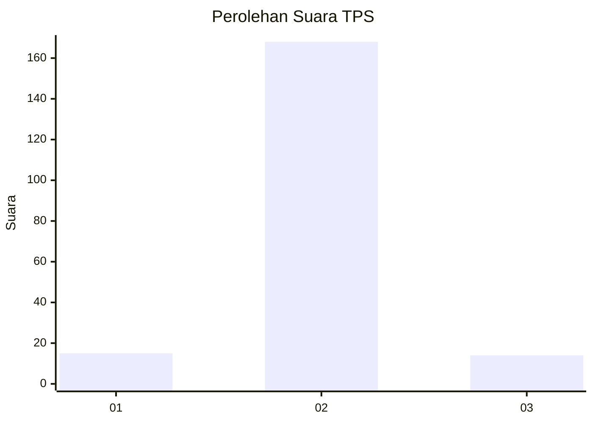
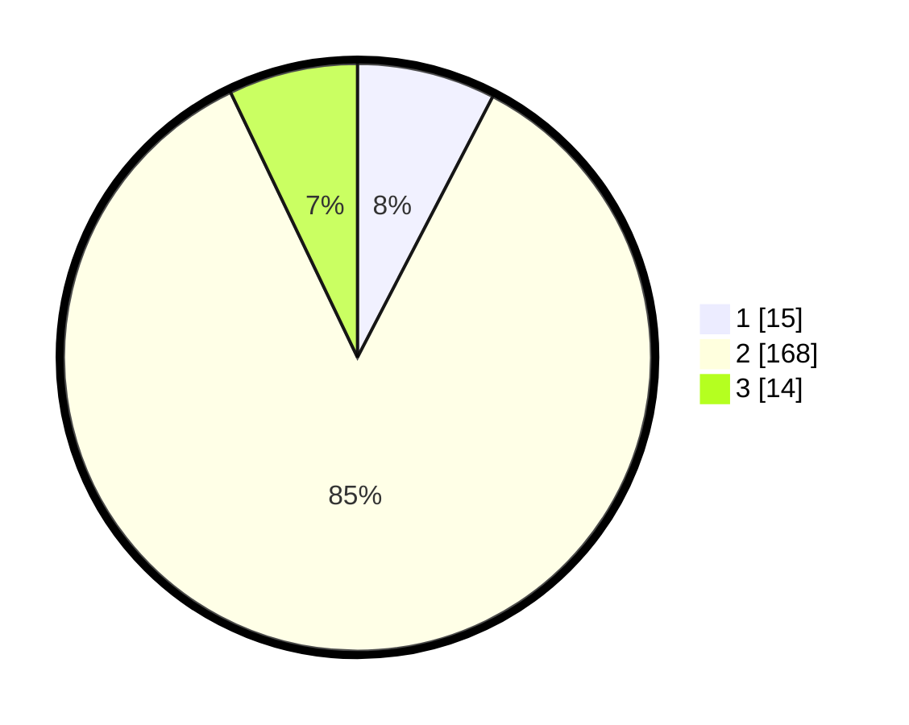

# Hasil

## Grafik

## Tabel

| No. | Nama Paslon    | Suara | Suara (raw) | Persentase |
|:--- |:-------------- | -----:| -----------:| ----------:|
| 1   | ANIES MUHAIMIN | 15    | [15][p-1]   | 7,61       |
| 2   | PRABOWO GIBRAN | 168   | [168][p-2]  | 85,28      |
| 3   | GANJAR MAHFUD  | 14    | [14][p-3]   | 7,11       |

[p-1]: https://github.com/gigit-pemilu/pemilu-2024-16-sumatera-selatan/blob/main/pilpres/hitung-suara/sub/16-sumatera-selatan/sub/02-ogan-komering-ilir/sub/04-mesuji/sub/2001-pematang-panggang/sub/002-tps/sub/paslon-1.txt
[p-2]: https://github.com/gigit-pemilu/pemilu-2024-16-sumatera-selatan/blob/main/pilpres/hitung-suara/sub/16-sumatera-selatan/sub/02-ogan-komering-ilir/sub/04-mesuji/sub/2001-pematang-panggang/sub/002-tps/sub/paslon-2.txt
[p-3]: https://github.com/gigit-pemilu/pemilu-2024-16-sumatera-selatan/blob/main/pilpres/hitung-suara/sub/16-sumatera-selatan/sub/02-ogan-komering-ilir/sub/04-mesuji/sub/2001-pematang-panggang/sub/002-tps/sub/paslon-3.txt

## Foto C Plano

https://sirekap-obj-formc.kpu.go.id/3ab0/pemilu/ppwp/16/02/04/20/01/1602042001002-20240215-003008--29b9ec46-8a90-423a-979c-3ae092dbb2c5.jpg

https://sirekap-obj-formc.kpu.go.id/3ab0/pemilu/ppwp/16/02/04/20/01/1602042001002-20240215-000040--2fddc7ed-8e0b-4e67-bd69-f3987b7bcc74.jpg

https://sirekap-obj-formc.kpu.go.id/3ab0/pemilu/ppwp/16/02/04/20/01/1602042001002-20240215-000724--71a1cd89-7234-4c54-aa2c-e9c14ab651cf.jpg

## Metadata

| Key        | Value               |
| ---------- | ------------------- |
| Time Stamp | 2024-02-15 17:00:25 |

