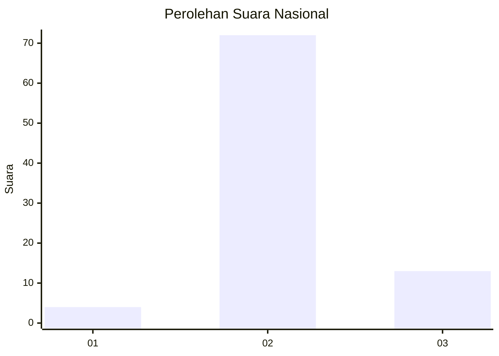
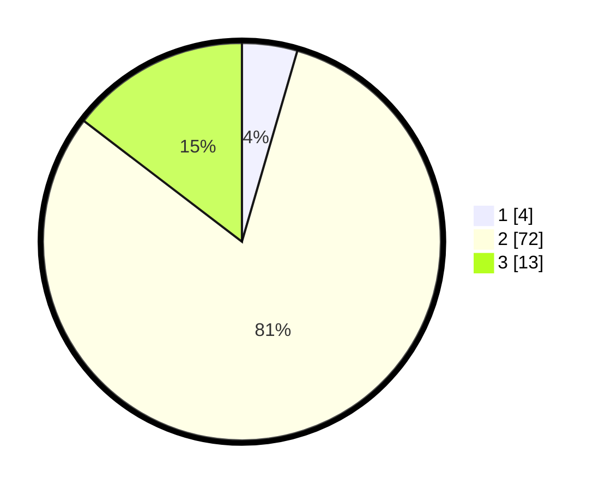

# Hasil

## Grafik

## Tabel

| No. | Nama Paslon    | Suara | Suara (raw) | Persentase |
|:--- |:-------------- | -----:| -----------:| ----------:|
| 1   | ANIES MUHAIMIN | 4     | [4][p-1]    | 4,49       |
| 2   | PRABOWO GIBRAN | 72    | [72][p-2]   | 80,90      |
| 3   | GANJAR MAHFUD  | 13    | [13][p-3]   | 14,61      |

[p-1]: https://github.com/gigit-pemilu/pemilu-2024/blob/main/pilpres/hitung-suara/sub/16-sumatera-selatan/sub/02-ogan-komering-ilir/sub/04-mesuji/sub/2001-pematang-panggang/sub/010-tps/sub/paslon-1.txt
[p-2]: https://github.com/gigit-pemilu/pemilu-2024/blob/main/pilpres/hitung-suara/sub/16-sumatera-selatan/sub/02-ogan-komering-ilir/sub/04-mesuji/sub/2001-pematang-panggang/sub/010-tps/sub/paslon-2.txt
[p-3]: https://github.com/gigit-pemilu/pemilu-2024/blob/main/pilpres/hitung-suara/sub/16-sumatera-selatan/sub/02-ogan-komering-ilir/sub/04-mesuji/sub/2001-pematang-panggang/sub/010-tps/sub/paslon-3.txt

## Foto C Plano

https://sirekap-obj-formc.kpu.go.id/06db/pemilu/ppwp/16/02/04/20/01/1602042001010-20240214-210226--8a1dac11-71cd-4854-9d41-75b180dcc25f.jpg

https://sirekap-obj-formc.kpu.go.id/06db/pemilu/ppwp/16/02/04/20/01/1602042001010-20240214-210443--0db88d3b-3c06-4d06-9202-5a371798e0df.jpg

https://sirekap-obj-formc.kpu.go.id/06db/pemilu/ppwp/16/02/04/20/01/1602042001010-20240214-210615--624da193-eeaa-4e38-808d-f2dd1d19dc19.jpg

## Metadata

| Key        | Value               |
| ---------- | ------------------- |
| Time Stamp | 2024-02-15 23:29:50 |

