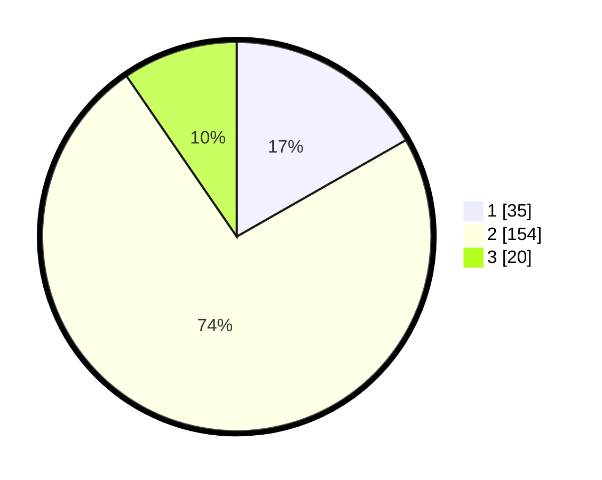

# Hasil

## Grafik

## Tabel

| No. | Nama Paslon    | Suara | Suara (raw) | Persentase |
|:--- |:-------------- | -----:| -----------:| ----------:|
| 1   | ANIES MUHAIMIN | 35    | [35][p-1]   | 16,75      |
| 2   | PRABOWO GIBRAN | 154   | [154][p-2]  | 73,68      |
| 3   | GANJAR MAHFUD  | 20    | [20][p-3]   | 9,57       |

[p-1]: https://github.com/gigit-pemilu/pemilu-2024/blob/main/pilpres/hitung-suara/sub/16-sumatera-selatan/sub/02-ogan-komering-ilir/sub/05-kayu-agung/sub/1001-jua-jua/sub/002-tps/sub/paslon-1.txt
[p-2]: https://github.com/gigit-pemilu/pemilu-2024/blob/main/pilpres/hitung-suara/sub/16-sumatera-selatan/sub/02-ogan-komering-ilir/sub/05-kayu-agung/sub/1001-jua-jua/sub/002-tps/sub/paslon-2.txt
[p-3]: https://github.com/gigit-pemilu/pemilu-2024/blob/main/pilpres/hitung-suara/sub/16-sumatera-selatan/sub/02-ogan-komering-ilir/sub/05-kayu-agung/sub/1001-jua-jua/sub/002-tps/sub/paslon-3.txt

## Foto C Plano

https://sirekap-obj-formc.kpu.go.id/d1a2/pemilu/ppwp/16/02/05/10/01/1602051001002-20240215-054943--83278463-86c5-4531-9088-c097c488cfdb.jpg

https://sirekap-obj-formc.kpu.go.id/d1a2/pemilu/ppwp/16/02/05/10/01/1602051001002-20240215-054610--f39918c1-9a89-4610-8741-9cb4972445a1.jpg

https://sirekap-obj-formc.kpu.go.id/d1a2/pemilu/ppwp/16/02/05/10/01/1602051001002-20240215-054739--c308f71b-c658-4c75-9ec0-72e3a71a94cb.jpg

## Metadata

| Key        | Value               |
| ---------- | ------------------- |
| Time Stamp | 2024-02-17 10:00:02 |

