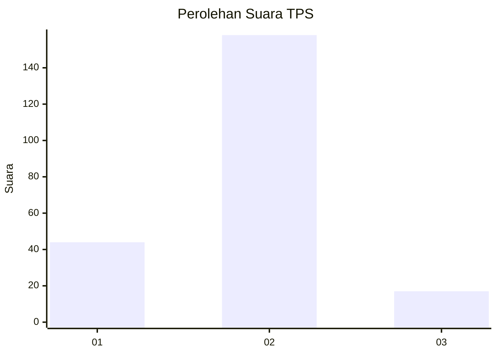
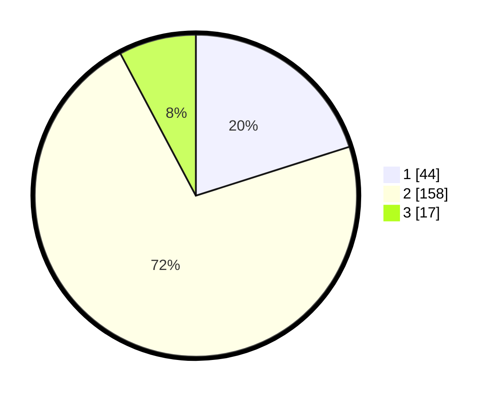

# Hasil

## Grafik

## Tabel

| No. | Nama Paslon    | Suara | Suara (raw) | Persentase |
|:--- |:-------------- | -----:| -----------:| ----------:|
| 1   | ANIES MUHAIMIN | 44    | [44][p-1]   | 20,09      |
| 2   | PRABOWO GIBRAN | 158   | [158][p-2]  | 72,15      |
| 3   | GANJAR MAHFUD  | 17    | [17][p-3]   | 7,76       |

[p-1]: https://github.com/gigit-pemilu/pemilu-2024-16-sumatera-selatan/blob/main/pilpres/hitung-suara/sub/16-sumatera-selatan/sub/02-ogan-komering-ilir/sub/05-kayu-agung/sub/1001-jua-jua/sub/005-tps/sub/paslon-1.txt
[p-2]: https://github.com/gigit-pemilu/pemilu-2024-16-sumatera-selatan/blob/main/pilpres/hitung-suara/sub/16-sumatera-selatan/sub/02-ogan-komering-ilir/sub/05-kayu-agung/sub/1001-jua-jua/sub/005-tps/sub/paslon-2.txt
[p-3]: https://github.com/gigit-pemilu/pemilu-2024-16-sumatera-selatan/blob/main/pilpres/hitung-suara/sub/16-sumatera-selatan/sub/02-ogan-komering-ilir/sub/05-kayu-agung/sub/1001-jua-jua/sub/005-tps/sub/paslon-3.txt

## Foto C Plano

https://sirekap-obj-formc.kpu.go.id/0560/pemilu/ppwp/16/02/05/10/01/1602051001005-20240215-032354--1fdfc3fa-c911-46c2-8e54-d4c52937517e.jpg

https://sirekap-obj-formc.kpu.go.id/0560/pemilu/ppwp/16/02/05/10/01/1602051001005-20240215-032741--64cf733d-f7b9-4169-acdc-955ac17729a1.jpg

https://sirekap-obj-formc.kpu.go.id/0560/pemilu/ppwp/16/02/05/10/01/1602051001005-20240215-032547--7e577179-33f2-4ba7-988d-90406d748256.jpg

## Metadata

| Key        | Value               |
| ---------- | ------------------- |
| Time Stamp | 2024-02-19 13:00:00 |

