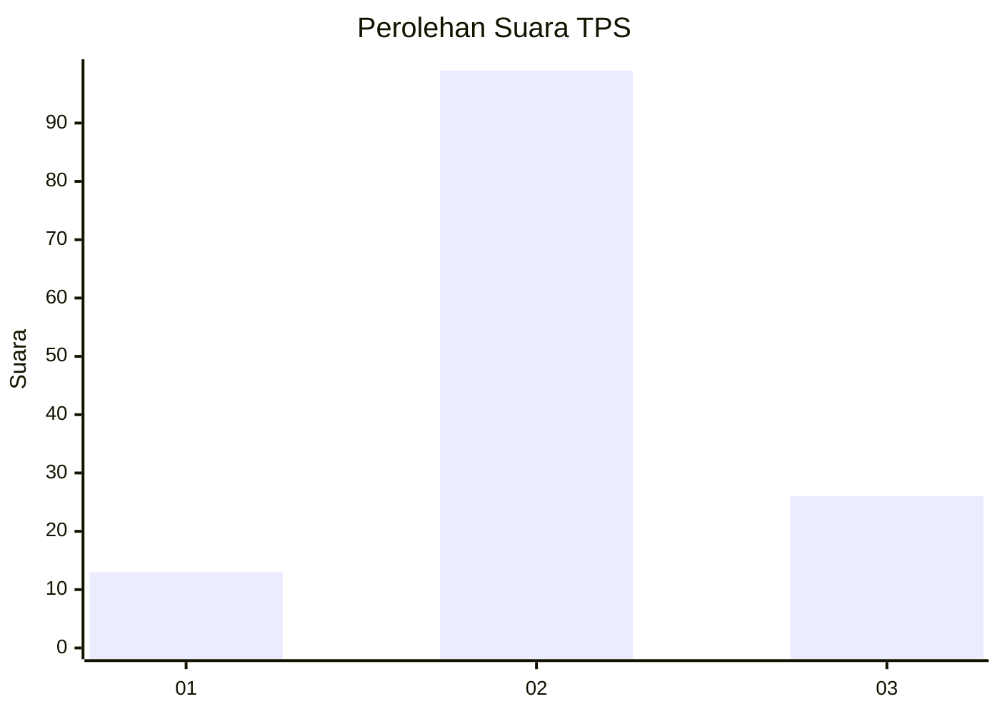
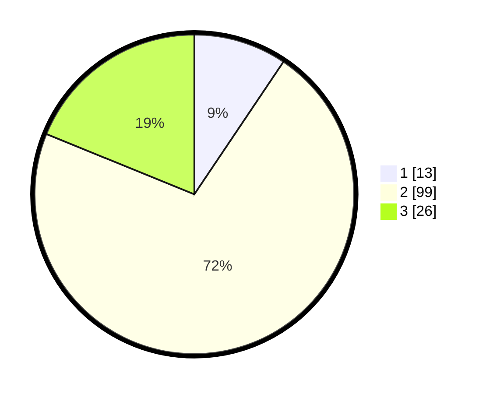

# Hasil

## Grafik

## Tabel

| No. | Nama Paslon    | Suara | Suara (raw) | Persentase |
|:--- |:-------------- | -----:| -----------:| ----------:|
| 1   | ANIES MUHAIMIN | 13    | [13][p-1]   | 9,42       |
| 2   | PRABOWO GIBRAN | 99    | [99][p-2]   | 71,74      |
| 3   | GANJAR MAHFUD  | 26    | [26][p-3]   | 18,84      |

[p-1]: https://github.com/gigit-pemilu/pemilu-2024-16-sumatera-selatan/blob/main/pilpres/hitung-suara/sub/16-sumatera-selatan/sub/02-ogan-komering-ilir/sub/05-kayu-agung/sub/1002-kayuagung/sub/004-tps/sub/paslon-1.txt
[p-2]: https://github.com/gigit-pemilu/pemilu-2024-16-sumatera-selatan/blob/main/pilpres/hitung-suara/sub/16-sumatera-selatan/sub/02-ogan-komering-ilir/sub/05-kayu-agung/sub/1002-kayuagung/sub/004-tps/sub/paslon-2.txt
[p-3]: https://github.com/gigit-pemilu/pemilu-2024-16-sumatera-selatan/blob/main/pilpres/hitung-suara/sub/16-sumatera-selatan/sub/02-ogan-komering-ilir/sub/05-kayu-agung/sub/1002-kayuagung/sub/004-tps/sub/paslon-3.txt

## Foto C Plano

https://sirekap-obj-formc.kpu.go.id/6cfb/pemilu/ppwp/16/02/05/10/02/1602051002004-20240214-234419--2d23ba3c-f53d-4acc-a9f9-e6c46d5b983b.jpg

https://sirekap-obj-formc.kpu.go.id/6cfb/pemilu/ppwp/16/02/05/10/02/1602051002004-20240214-232930--8330022a-a459-4629-8882-4986af1e727c.jpg

https://sirekap-obj-formc.kpu.go.id/6cfb/pemilu/ppwp/16/02/05/10/02/1602051002004-20240214-234359--050f3c74-c71e-4019-924f-753aa4b98930.jpg

## Metadata

| Key        | Value               |
| ---------- | ------------------- |
| Time Stamp | 2024-02-19 06:16:00 |

