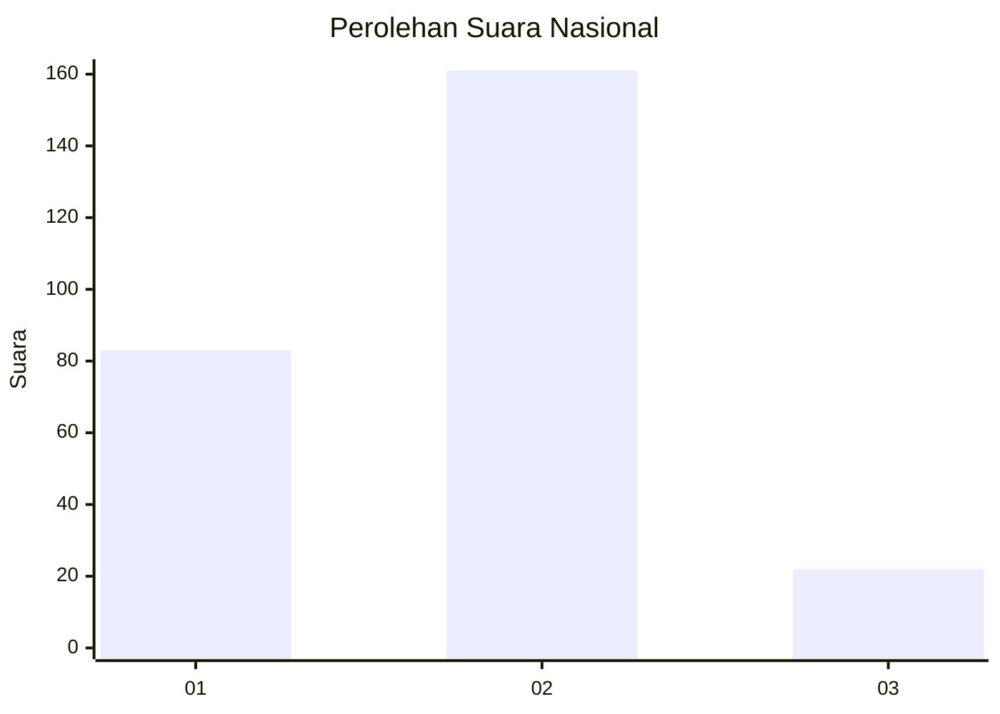
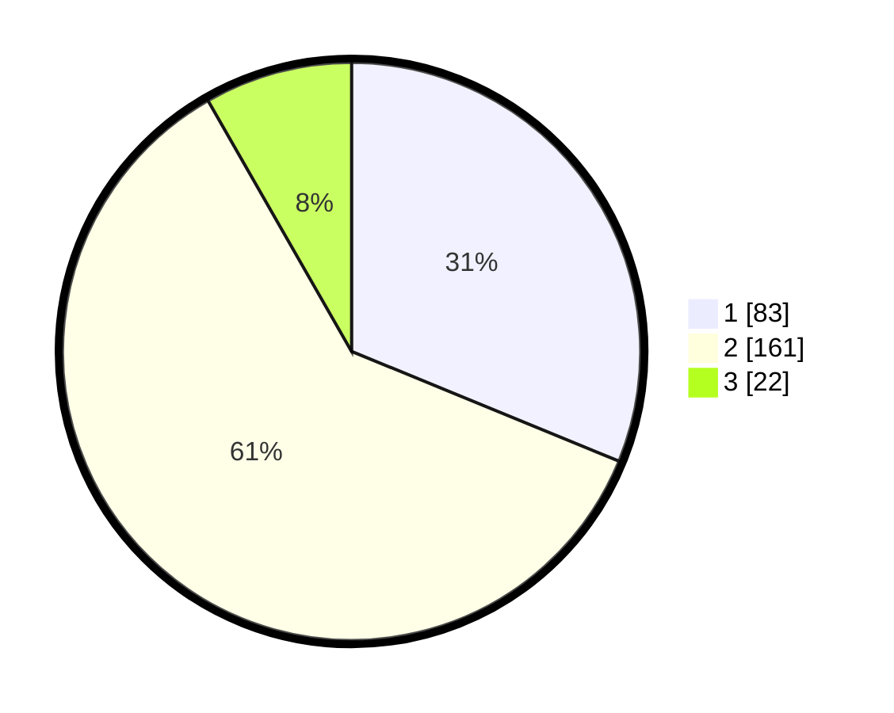

# Hasil

## Grafik

## Tabel

| No. | Nama Paslon    | Suara | Suara (raw) | Persentase |
|:--- |:-------------- | -----:| -----------:| ----------:|
| 1   | ANIES MUHAIMIN | 83    | [83][p-1]   | 31,20      |
| 2   | PRABOWO GIBRAN | 161   | [161][p-2]  | 60,53      |
| 3   | GANJAR MAHFUD  | 22    | [22][p-3]   | 8,27       |

[p-1]: https://github.com/gigit-pemilu/pemilu-2024/blob/main/pilpres/hitung-suara/sub/16-sumatera-selatan/sub/02-ogan-komering-ilir/sub/05-kayu-agung/sub/1010-kutaraja/sub/013-tps/sub/paslon-1.txt
[p-2]: https://github.com/gigit-pemilu/pemilu-2024/blob/main/pilpres/hitung-suara/sub/16-sumatera-selatan/sub/02-ogan-komering-ilir/sub/05-kayu-agung/sub/1010-kutaraja/sub/013-tps/sub/paslon-2.txt
[p-3]: https://github.com/gigit-pemilu/pemilu-2024/blob/main/pilpres/hitung-suara/sub/16-sumatera-selatan/sub/02-ogan-komering-ilir/sub/05-kayu-agung/sub/1010-kutaraja/sub/013-tps/sub/paslon-3.txt

## Foto C Plano

https://sirekap-obj-formc.kpu.go.id/98cd/pemilu/ppwp/16/02/05/10/10/1602051010013-20240215-010422--d16a34da-9a84-436e-85e1-b082f71520e7.jpg

https://sirekap-obj-formc.kpu.go.id/98cd/pemilu/ppwp/16/02/05/10/10/1602051010013-20240215-010522--b65c7e87-1af6-439a-aad7-26c03d0d6848.jpg

https://sirekap-obj-formc.kpu.go.id/98cd/pemilu/ppwp/16/02/05/10/10/1602051010013-20240215-010633--80690930-9a1a-4ec9-a089-711c220a2ede.jpg

## Metadata

| Key        | Value               |
| ---------- | ------------------- |
| Time Stamp | 2024-02-19 14:00:00 |

