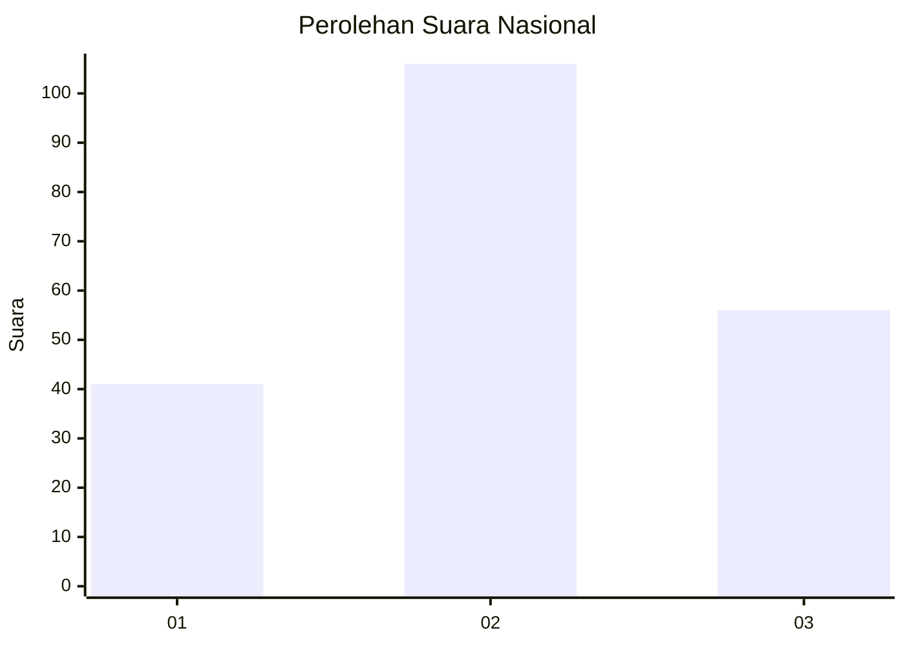
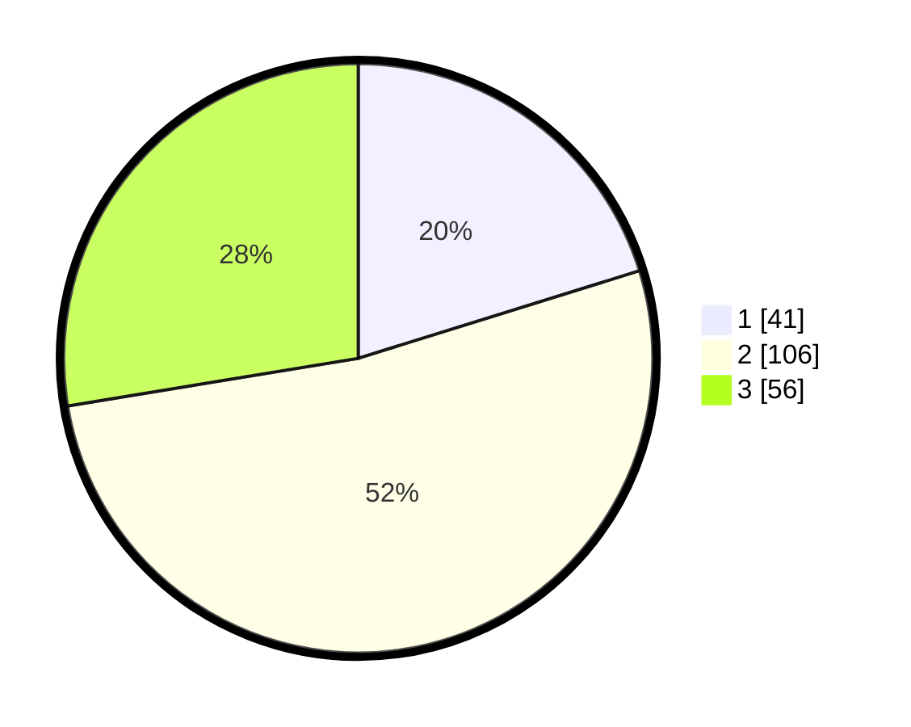

# Hasil

## Grafik

## Tabel

| No. | Nama Paslon    | Suara | Suara (raw) | Persentase |
|:--- |:-------------- | -----:| -----------:| ----------:|
| 1   | ANIES MUHAIMIN | 41    | [41][p-1]   | 20,20      |
| 2   | PRABOWO GIBRAN | 106   | [106][p-2]  | 52,22      |
| 3   | GANJAR MAHFUD  | 56    | [56][p-3]   | 27,59      |

[p-1]: https://github.com/gigit-pemilu/pemilu-2024/blob/main/pilpres/hitung-suara/sub/16-sumatera-selatan/sub/02-ogan-komering-ilir/sub/05-kayu-agung/sub/2013-tanjung-lubuk/sub/001-tps/sub/paslon-1.txt
[p-2]: https://github.com/gigit-pemilu/pemilu-2024/blob/main/pilpres/hitung-suara/sub/16-sumatera-selatan/sub/02-ogan-komering-ilir/sub/05-kayu-agung/sub/2013-tanjung-lubuk/sub/001-tps/sub/paslon-2.txt
[p-3]: https://github.com/gigit-pemilu/pemilu-2024/blob/main/pilpres/hitung-suara/sub/16-sumatera-selatan/sub/02-ogan-komering-ilir/sub/05-kayu-agung/sub/2013-tanjung-lubuk/sub/001-tps/sub/paslon-3.txt

## Foto C Plano

https://sirekap-obj-formc.kpu.go.id/fe6e/pemilu/ppwp/16/02/05/20/13/1602052013001-20240214-233453--8e05a99f-67ad-46ff-966d-ac61df8988a5.jpg

https://sirekap-obj-formc.kpu.go.id/fe6e/pemilu/ppwp/16/02/05/20/13/1602052013001-20240214-233859--6e1c23fa-21cb-4f94-b7bc-348f9fed7ddf.jpg

https://sirekap-obj-formc.kpu.go.id/fe6e/pemilu/ppwp/16/02/05/20/13/1602052013001-20240214-233701--0398cce1-5422-4efb-8f1a-2bf387d9b792.jpg

## Metadata

| Key        | Value               |
| ---------- | ------------------- |
| Time Stamp | 2024-02-19 06:16:00 |

