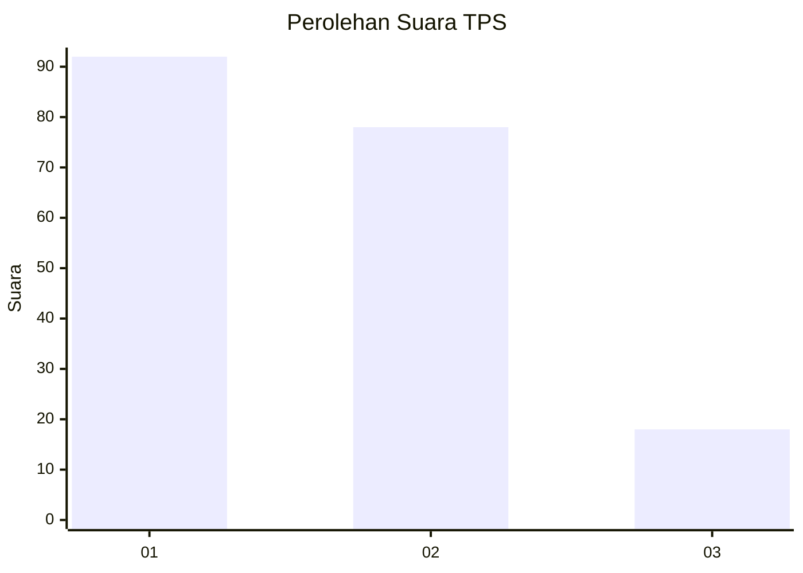
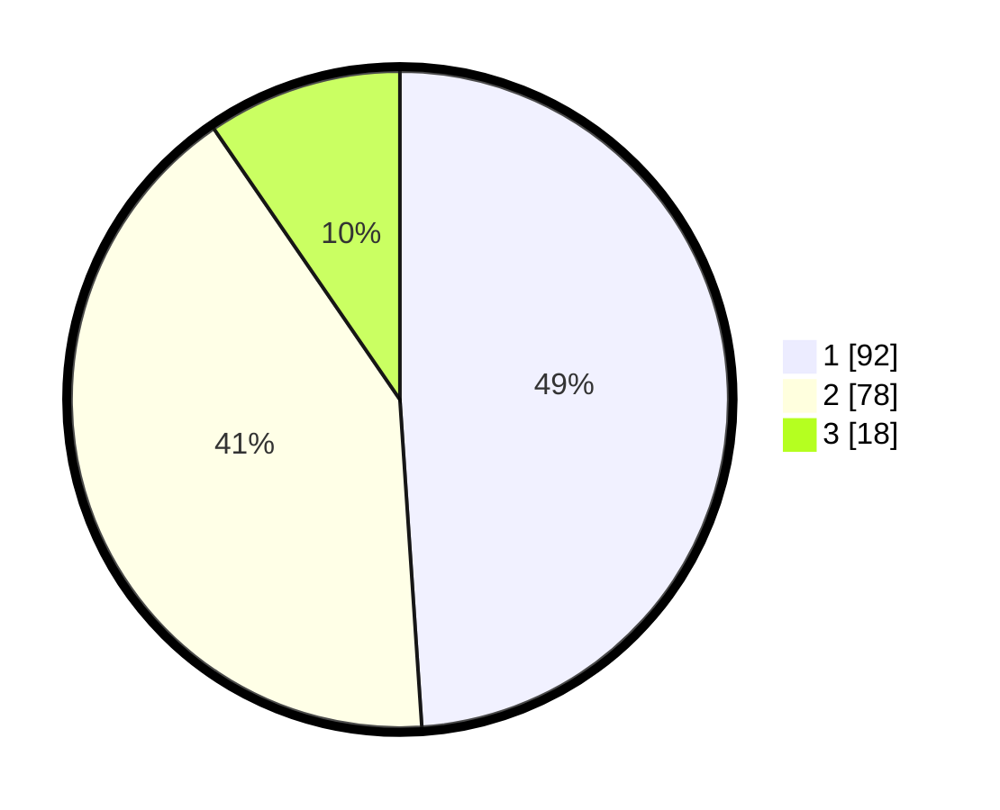

# Hasil

## Grafik

## Tabel

| No. | Nama Paslon    | Suara | Suara (raw) | Persentase |
|:--- |:-------------- | -----:| -----------:| ----------:|
| 1   | ANIES MUHAIMIN | 92    | [92][p-1]   | 48,94      |
| 2   | PRABOWO GIBRAN | 78    | [78][p-2]   | 41,49      |
| 3   | GANJAR MAHFUD  | 18    | [18][p-3]   | 9,57       |

[p-1]: https://github.com/gigit-pemilu/pemilu-2024-16-sumatera-selatan/blob/main/pilpres/hitung-suara/sub/16-sumatera-selatan/sub/02-ogan-komering-ilir/sub/05-kayu-agung/sub/2021-teloko/sub/004-tps/sub/paslon-1.txt
[p-2]: https://github.com/gigit-pemilu/pemilu-2024-16-sumatera-selatan/blob/main/pilpres/hitung-suara/sub/16-sumatera-selatan/sub/02-ogan-komering-ilir/sub/05-kayu-agung/sub/2021-teloko/sub/004-tps/sub/paslon-2.txt
[p-3]: https://github.com/gigit-pemilu/pemilu-2024-16-sumatera-selatan/blob/main/pilpres/hitung-suara/sub/16-sumatera-selatan/sub/02-ogan-komering-ilir/sub/05-kayu-agung/sub/2021-teloko/sub/004-tps/sub/paslon-3.txt

## Foto C Plano

https://sirekap-obj-formc.kpu.go.id/9348/pemilu/ppwp/16/02/05/20/21/1602052021004-20240215-040518--aaaf02d0-5942-4443-819a-ea372b2a1690.jpg

https://sirekap-obj-formc.kpu.go.id/9348/pemilu/ppwp/16/02/05/20/21/1602052021004-20240215-040653--da8d01f7-76c2-4bd2-9d77-556ff5d91483.jpg

https://sirekap-obj-formc.kpu.go.id/9348/pemilu/ppwp/16/02/05/20/21/1602052021004-20240215-040835--026781d1-a8cb-4dc7-9b43-baa6b49eea2d.jpg

## Metadata

| Key        | Value               |
| ---------- | ------------------- |
| Time Stamp | 2024-02-19 14:00:00 |

