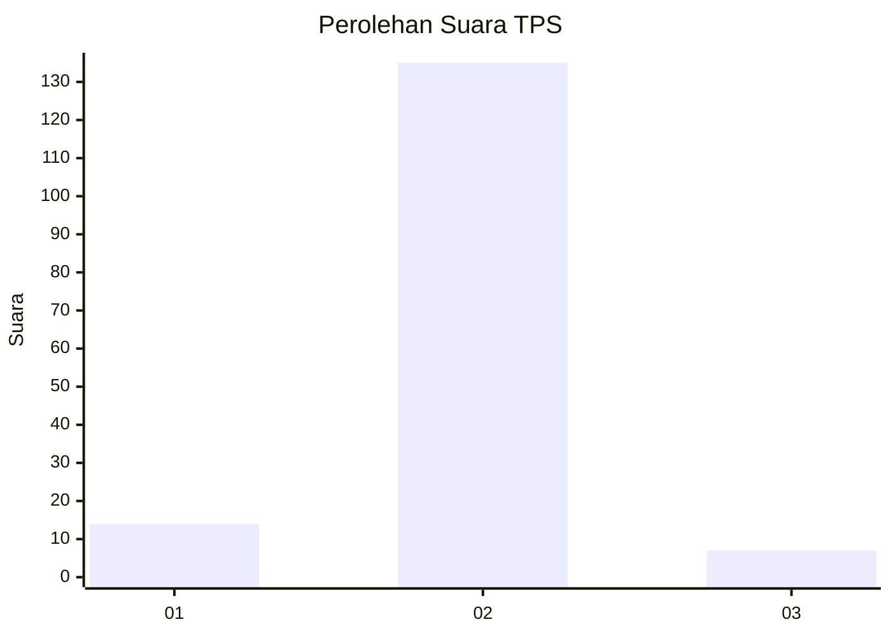
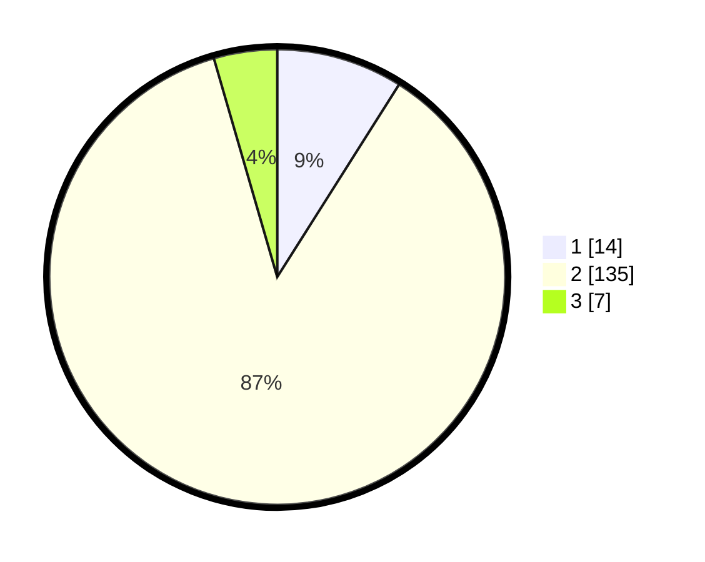

# Hasil

## Grafik

## Tabel

| No. | Nama Paslon    | Suara | Suara (raw) | Persentase |
|:--- |:-------------- | -----:| -----------:| ----------:|
| 1   | ANIES MUHAIMIN | 14    | [14][p-1]   | 8,97       |
| 2   | PRABOWO GIBRAN | 135   | [135][p-2]  | 86,54      |
| 3   | GANJAR MAHFUD  | 7     | [7][p-3]    | 4,49       |

[p-1]: https://github.com/gigit-pemilu/pemilu-2024-16-sumatera-selatan/blob/main/pilpres/hitung-suara/sub/16-sumatera-selatan/sub/02-ogan-komering-ilir/sub/08-sirah-pulau-padang/sub/2001-tanjung-alai/sub/004-tps/sub/paslon-1.txt
[p-2]: https://github.com/gigit-pemilu/pemilu-2024-16-sumatera-selatan/blob/main/pilpres/hitung-suara/sub/16-sumatera-selatan/sub/02-ogan-komering-ilir/sub/08-sirah-pulau-padang/sub/2001-tanjung-alai/sub/004-tps/sub/paslon-2.txt
[p-3]: https://github.com/gigit-pemilu/pemilu-2024-16-sumatera-selatan/blob/main/pilpres/hitung-suara/sub/16-sumatera-selatan/sub/02-ogan-komering-ilir/sub/08-sirah-pulau-padang/sub/2001-tanjung-alai/sub/004-tps/sub/paslon-3.txt

## Foto C Plano

https://sirekap-obj-formc.kpu.go.id/a77e/pemilu/ppwp/16/02/08/20/01/1602082001004-20240216-081536--98288150-6837-464b-92b4-e954c07db6bf.jpg

https://sirekap-obj-formc.kpu.go.id/a77e/pemilu/ppwp/16/02/08/20/01/1602082001004-20240216-081539--667a4141-cfa7-4110-bedf-d6eacd96e8e8.jpg

https://sirekap-obj-formc.kpu.go.id/a77e/pemilu/ppwp/16/02/08/20/01/1602082001004-20240216-081537--5a8c8662-b5e6-4def-9d6d-671e9038ce26.jpg

## Metadata

| Key        | Value               |
| ---------- | ------------------- |
| Time Stamp | 2024-02-16 10:00:28 |

## DATA PEMILIH TETAP

Jumlah pemilih dalam DPT: **214**.
 * L: **103**.
 * P: **111**.

## DATA PENGGUNA HAK PILIH

Jumlah pengguna hak pilih dalam DPT: **168**.
 * L: **80**.
 * P: **88**.

Jumlah pengguna hak pilih dalam DPTb: **0**.
 * L: **0**.
 * P: **0**.

Jumlah pengguna hak pilih dalam DPK: **1**.
 * L: **0**.
 * P: **1**.

Jumlah pengguna hak pilih: **169**.
 * L: **80**.
 * P: **89**.

## JUMLAH SUARA SAH DAN TIDAK SAH

JUMLAH SELURUH SUARA SAH: **156**.

JUMLAH SUARA TIDAK SAH: **13**.

JUMLAH SELURUH SUARA SAH DAN SUARA TIDAK SAH: **169**.

