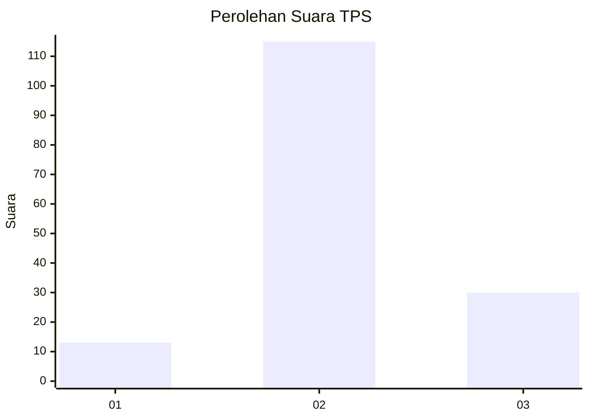
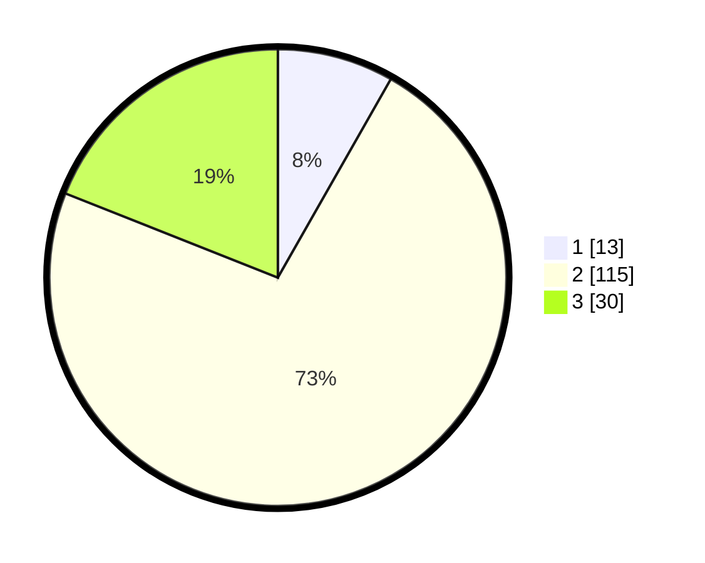

# Hasil

## Grafik

## Tabel

| No. | Nama Paslon    | Suara | Suara (raw) | Persentase |
|:--- |:-------------- | -----:| -----------:| ----------:|
| 1   | ANIES MUHAIMIN | 13    | [13][p-1]   | 8,23       |
| 2   | PRABOWO GIBRAN | 115   | [115][p-2]  | 72,78      |
| 3   | GANJAR MAHFUD  | 30    | [30][p-3]   | 18,99      |

[p-1]: https://github.com/gigit-pemilu/pemilu-2024-16-sumatera-selatan/blob/main/pilpres/hitung-suara/sub/16-sumatera-selatan/sub/02-ogan-komering-ilir/sub/08-sirah-pulau-padang/sub/2017-pematang-buluran/sub/005-tps/sub/paslon-1.txt
[p-2]: https://github.com/gigit-pemilu/pemilu-2024-16-sumatera-selatan/blob/main/pilpres/hitung-suara/sub/16-sumatera-selatan/sub/02-ogan-komering-ilir/sub/08-sirah-pulau-padang/sub/2017-pematang-buluran/sub/005-tps/sub/paslon-2.txt
[p-3]: https://github.com/gigit-pemilu/pemilu-2024-16-sumatera-selatan/blob/main/pilpres/hitung-suara/sub/16-sumatera-selatan/sub/02-ogan-komering-ilir/sub/08-sirah-pulau-padang/sub/2017-pematang-buluran/sub/005-tps/sub/paslon-3.txt

## Foto C Plano

https://sirekap-obj-formc.kpu.go.id/2b63/pemilu/ppwp/16/02/08/20/17/1602082017005-20240214-155231--e97a3f5a-1d0a-4719-8e28-47a94e83434c.jpg

https://sirekap-obj-formc.kpu.go.id/2b63/pemilu/ppwp/16/02/08/20/17/1602082017005-20240214-155250--2d9cd6ab-02ec-497d-ac83-30d9430f0851.jpg

https://sirekap-obj-formc.kpu.go.id/2b63/pemilu/ppwp/16/02/08/20/17/1602082017005-20240215-070713--ca6eb5de-3d2b-400c-96cb-e7ad515ee858.jpg

## Metadata

| Key        | Value               |
| ---------- | ------------------- |
| Time Stamp | 2024-02-15 19:30:26 |

