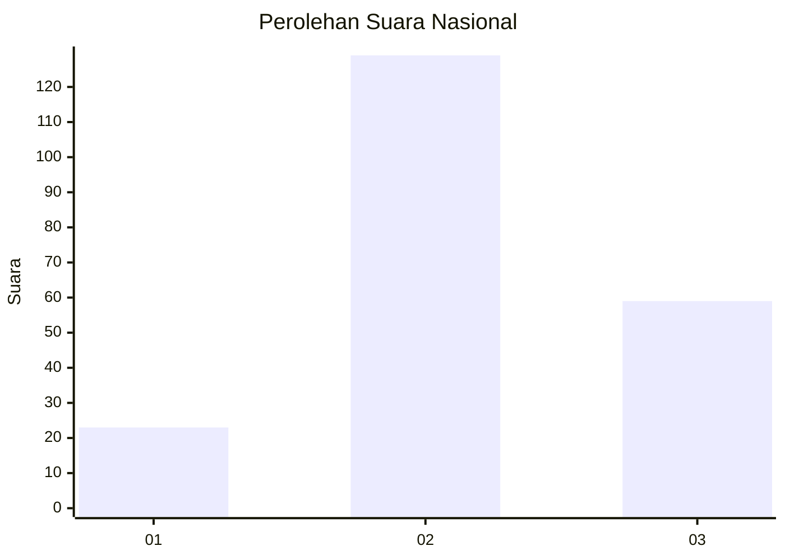
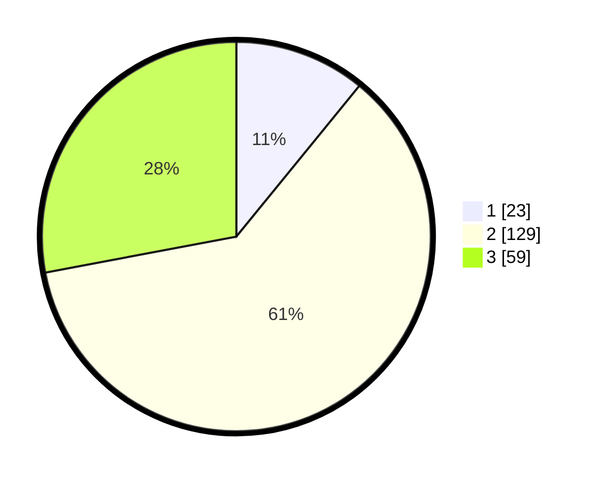

# Hasil

## Grafik

## Tabel

| No. | Nama Paslon    | Suara | Suara (raw) | Persentase |
|:--- |:-------------- | -----:| -----------:| ----------:|
| 1   | ANIES MUHAIMIN | 23    | [23][p-1]   | 10,90      |
| 2   | PRABOWO GIBRAN | 129   | [129][p-2]  | 61,14      |
| 3   | GANJAR MAHFUD  | 59    | [59][p-3]   | 27,96      |

[p-1]: https://github.com/gigit-pemilu/pemilu-2024/blob/main/pilpres/hitung-suara/sub/16-sumatera-selatan/sub/02-ogan-komering-ilir/sub/11-tulung-selapan/sub/1016-tulung-selapan-ulu/sub/002-tps/sub/paslon-1.txt
[p-2]: https://github.com/gigit-pemilu/pemilu-2024/blob/main/pilpres/hitung-suara/sub/16-sumatera-selatan/sub/02-ogan-komering-ilir/sub/11-tulung-selapan/sub/1016-tulung-selapan-ulu/sub/002-tps/sub/paslon-2.txt
[p-3]: https://github.com/gigit-pemilu/pemilu-2024/blob/main/pilpres/hitung-suara/sub/16-sumatera-selatan/sub/02-ogan-komering-ilir/sub/11-tulung-selapan/sub/1016-tulung-selapan-ulu/sub/002-tps/sub/paslon-3.txt

## Foto C Plano

https://sirekap-obj-formc.kpu.go.id/9e02/pemilu/ppwp/16/02/11/10/16/1602111016002-20240215-105541--b16b95ec-2625-4b91-96a7-763d7057a429.jpg

https://sirekap-obj-formc.kpu.go.id/9e02/pemilu/ppwp/16/02/11/10/16/1602111016002-20240215-105722--1c7866f9-483e-4cdf-9c67-75da438cf49e.jpg

https://sirekap-obj-formc.kpu.go.id/9e02/pemilu/ppwp/16/02/11/10/16/1602111016002-20240215-105845--9e1bdfa3-fb27-4edc-bb47-632d6f0da6e3.jpg

## Metadata

| Key        | Value               |
| ---------- | ------------------- |
| Time Stamp | 2024-02-17 03:00:02 |

