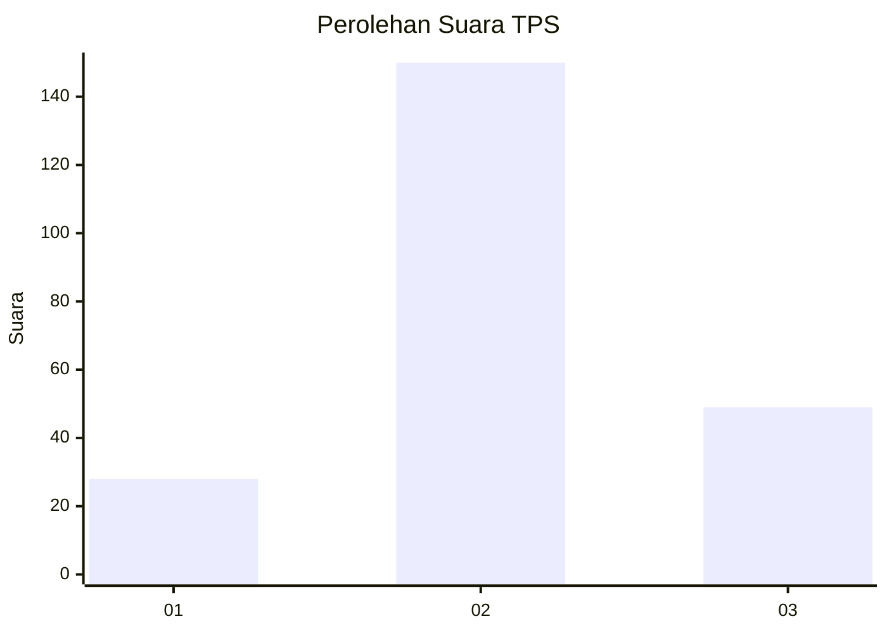
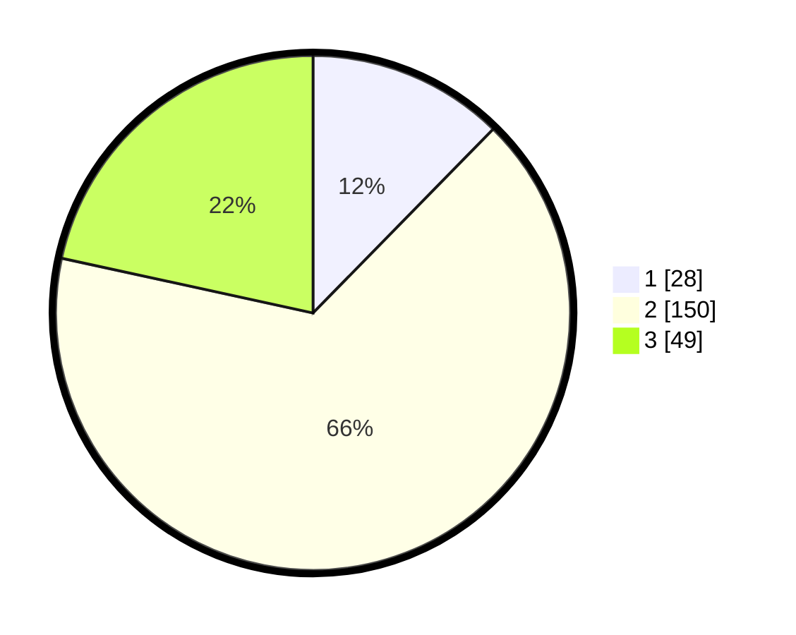

# Hasil

## Grafik

## Tabel

| No. | Nama Paslon    | Suara | Suara (raw) | Persentase |
|:--- |:-------------- | -----:| -----------:| ----------:|
| 1   | ANIES MUHAIMIN | 28    | [28][p-1]   | 12,33      |
| 2   | PRABOWO GIBRAN | 150   | [150][p-2]  | 66,08      |
| 3   | GANJAR MAHFUD  | 49    | [49][p-3]   | 21,59      |

[p-1]: https://github.com/gigit-pemilu/pemilu-2024-16-sumatera-selatan/blob/main/pilpres/hitung-suara/sub/16-sumatera-selatan/sub/02-ogan-komering-ilir/sub/11-tulung-selapan/sub/1016-tulung-selapan-ulu/sub/004-tps/sub/paslon-1.txt
[p-2]: https://github.com/gigit-pemilu/pemilu-2024-16-sumatera-selatan/blob/main/pilpres/hitung-suara/sub/16-sumatera-selatan/sub/02-ogan-komering-ilir/sub/11-tulung-selapan/sub/1016-tulung-selapan-ulu/sub/004-tps/sub/paslon-2.txt
[p-3]: https://github.com/gigit-pemilu/pemilu-2024-16-sumatera-selatan/blob/main/pilpres/hitung-suara/sub/16-sumatera-selatan/sub/02-ogan-komering-ilir/sub/11-tulung-selapan/sub/1016-tulung-selapan-ulu/sub/004-tps/sub/paslon-3.txt

## Foto C Plano

https://sirekap-obj-formc.kpu.go.id/2b4b/pemilu/ppwp/16/02/11/10/16/1602111016004-20240215-171517--ff7c4de6-1ba6-4002-bbb0-c4a1dfa8a4c9.jpg

https://sirekap-obj-formc.kpu.go.id/2b4b/pemilu/ppwp/16/02/11/10/16/1602111016004-20240215-171710--e13012ad-5c32-4098-8db3-23e73e003370.jpg

https://sirekap-obj-formc.kpu.go.id/2b4b/pemilu/ppwp/16/02/11/10/16/1602111016004-20240215-171248--82351fc7-a31f-4ba6-8b29-7f71a3754496.jpg

## Metadata

| Key        | Value               |
| ---------- | ------------------- |
| Time Stamp | 2024-02-17 03:00:02 |

