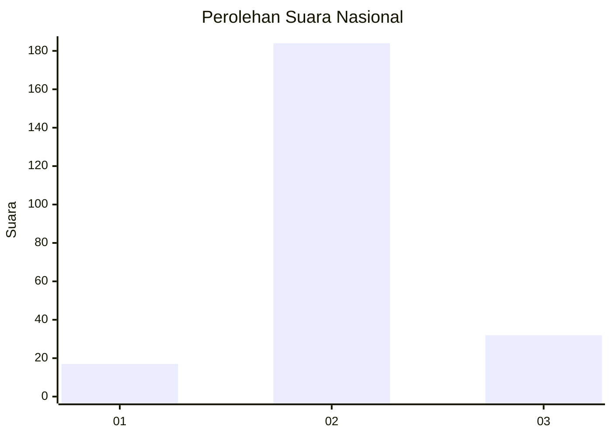
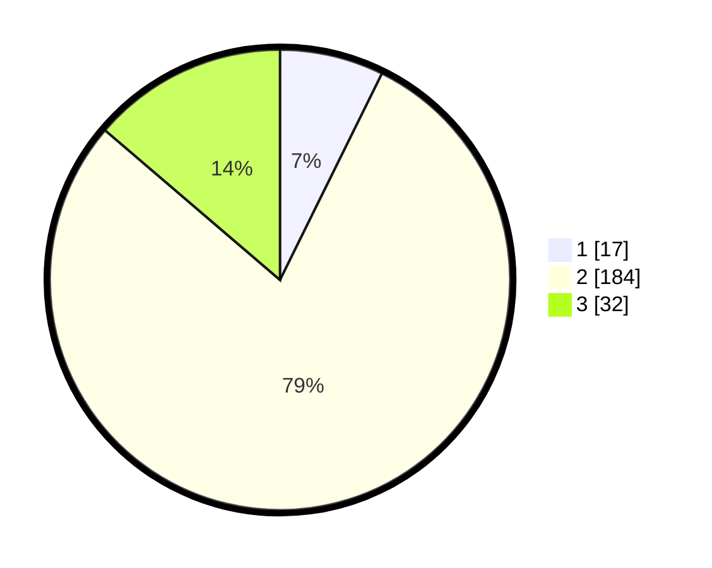

# Hasil

## Grafik

## Tabel

| No. | Nama Paslon    | Suara | Suara (raw) | Persentase |
|:--- |:-------------- | -----:| -----------:| ----------:|
| 1   | ANIES MUHAIMIN | 17    | [17][p-1]   | 7,30       |
| 2   | PRABOWO GIBRAN | 184   | [184][p-2]  | 78,97      |
| 3   | GANJAR MAHFUD  | 32    | [32][p-3]   | 13,73      |

[p-1]: https://github.com/gigit-pemilu/pemilu-2024/blob/main/pilpres/hitung-suara/sub/16-sumatera-selatan/sub/02-ogan-komering-ilir/sub/11-tulung-selapan/sub/1016-tulung-selapan-ulu/sub/008-tps/sub/paslon-1.txt
[p-2]: https://github.com/gigit-pemilu/pemilu-2024/blob/main/pilpres/hitung-suara/sub/16-sumatera-selatan/sub/02-ogan-komering-ilir/sub/11-tulung-selapan/sub/1016-tulung-selapan-ulu/sub/008-tps/sub/paslon-2.txt
[p-3]: https://github.com/gigit-pemilu/pemilu-2024/blob/main/pilpres/hitung-suara/sub/16-sumatera-selatan/sub/02-ogan-komering-ilir/sub/11-tulung-selapan/sub/1016-tulung-selapan-ulu/sub/008-tps/sub/paslon-3.txt

## Foto C Plano

https://sirekap-obj-formc.kpu.go.id/edd0/pemilu/ppwp/16/02/11/10/16/1602111016008-20240215-113926--9dd3ace6-1258-4baf-8d3e-64448a6a4aae.jpg

https://sirekap-obj-formc.kpu.go.id/edd0/pemilu/ppwp/16/02/11/10/16/1602111016008-20240215-114057--7570aa30-8073-411c-a2e7-97d9ff2d4a60.jpg

https://sirekap-obj-formc.kpu.go.id/edd0/pemilu/ppwp/16/02/11/10/16/1602111016008-20240215-114201--e7e32fa5-e914-444a-8de9-317e7ca36cae.jpg

## Metadata

| Key        | Value               |
| ---------- | ------------------- |
| Time Stamp | 2024-02-16 00:00:26 |

