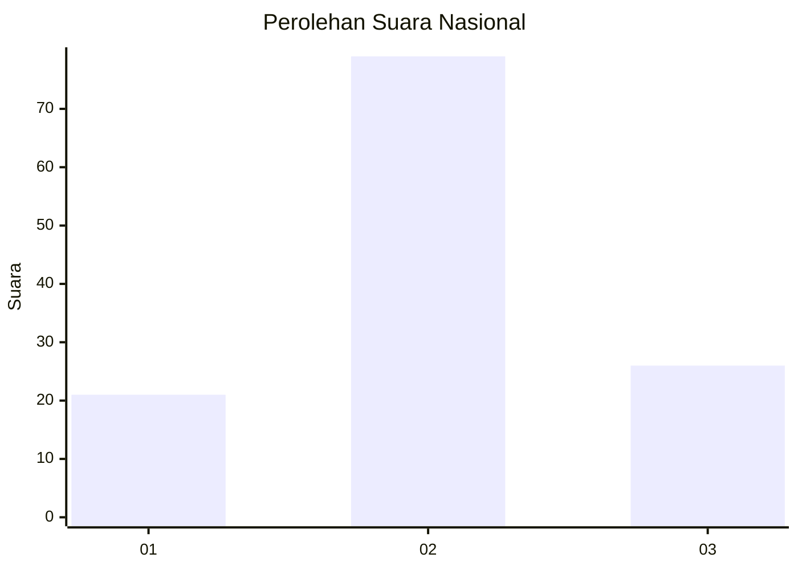
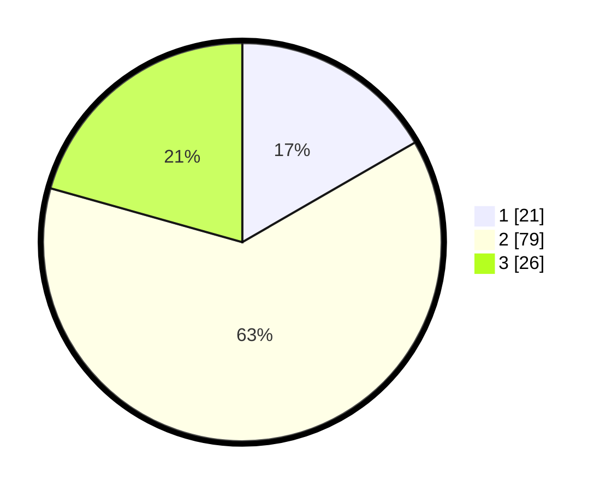

# Hasil

## Grafik

## Tabel

| No. | Nama Paslon    | Suara | Suara (raw) | Persentase |
|:--- |:-------------- | -----:| -----------:| ----------:|
| 1   | ANIES MUHAIMIN | 21    | [21][p-1]   | 16,67      |
| 2   | PRABOWO GIBRAN | 79    | [79][p-2]   | 62,70      |
| 3   | GANJAR MAHFUD  | 26    | [26][p-3]   | 20,63      |

[p-1]: https://github.com/gigit-pemilu/pemilu-2024/blob/main/pilpres/hitung-suara/sub/16-sumatera-selatan/sub/02-ogan-komering-ilir/sub/11-tulung-selapan/sub/1016-tulung-selapan-ulu/sub/009-tps/sub/paslon-1.txt
[p-2]: https://github.com/gigit-pemilu/pemilu-2024/blob/main/pilpres/hitung-suara/sub/16-sumatera-selatan/sub/02-ogan-komering-ilir/sub/11-tulung-selapan/sub/1016-tulung-selapan-ulu/sub/009-tps/sub/paslon-2.txt
[p-3]: https://github.com/gigit-pemilu/pemilu-2024/blob/main/pilpres/hitung-suara/sub/16-sumatera-selatan/sub/02-ogan-komering-ilir/sub/11-tulung-selapan/sub/1016-tulung-selapan-ulu/sub/009-tps/sub/paslon-3.txt

## Foto C Plano

https://sirekap-obj-formc.kpu.go.id/74fb/pemilu/ppwp/16/02/11/10/16/1602111016009-20240215-111646--f155f97f-110a-46a8-95fa-d228e13d1d64.jpg

https://sirekap-obj-formc.kpu.go.id/74fb/pemilu/ppwp/16/02/11/10/16/1602111016009-20240215-111859--b39a98de-c45b-46a0-9918-f248a8d2d3ac.jpg

https://sirekap-obj-formc.kpu.go.id/74fb/pemilu/ppwp/16/02/11/10/16/1602111016009-20240215-112018--eafc2db4-75ca-40fe-b5c2-61e9999a2bc8.jpg

## Metadata

| Key        | Value               |
| ---------- | ------------------- |
| Time Stamp | 2024-02-16 00:00:26 |

