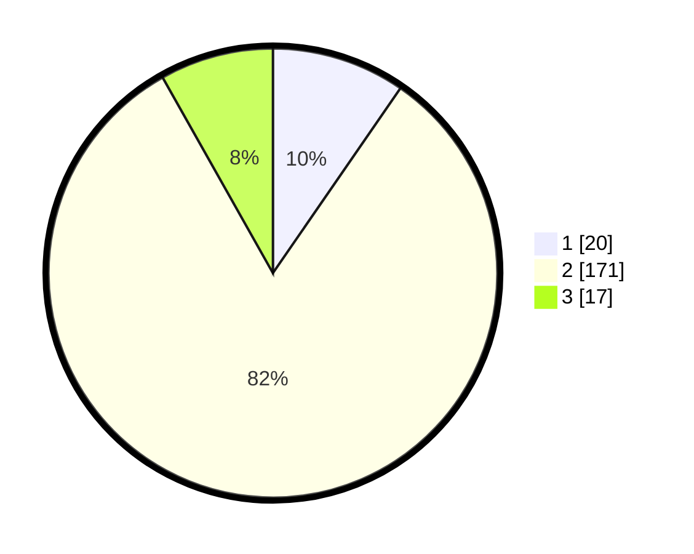

# Hasil

## Grafik

## Tabel

| No. | Nama Paslon    | Suara | Suara (raw) | Persentase |
|:--- |:-------------- | -----:| -----------:| ----------:|
| 1   | ANIES MUHAIMIN | 20    | [20][p-1]   | 9,62       |
| 2   | PRABOWO GIBRAN | 171   | [171][p-2]  | 82,21      |
| 3   | GANJAR MAHFUD  | 17    | [17][p-3]   | 8,17       |

[p-1]: https://github.com/gigit-pemilu/pemilu-2024-16-sumatera-selatan/blob/main/pilpres/hitung-suara/sub/16-sumatera-selatan/sub/02-ogan-komering-ilir/sub/11-tulung-selapan/sub/2002-pulau-beruang/sub/002-tps/sub/paslon-1.txt
[p-2]: https://github.com/gigit-pemilu/pemilu-2024-16-sumatera-selatan/blob/main/pilpres/hitung-suara/sub/16-sumatera-selatan/sub/02-ogan-komering-ilir/sub/11-tulung-selapan/sub/2002-pulau-beruang/sub/002-tps/sub/paslon-2.txt
[p-3]: https://github.com/gigit-pemilu/pemilu-2024-16-sumatera-selatan/blob/main/pilpres/hitung-suara/sub/16-sumatera-selatan/sub/02-ogan-komering-ilir/sub/11-tulung-selapan/sub/2002-pulau-beruang/sub/002-tps/sub/paslon-3.txt

## Foto C Plano

https://sirekap-obj-formc.kpu.go.id/ea3b/pemilu/ppwp/16/02/11/20/02/1602112002002-20240215-012231--4280967d-a5e5-420d-9beb-99ce31add78e.jpg

https://sirekap-obj-formc.kpu.go.id/ea3b/pemilu/ppwp/16/02/11/20/02/1602112002002-20240215-012038--f7fdc523-19b9-4ce8-8ede-7c44af2078ed.jpg

https://sirekap-obj-formc.kpu.go.id/ea3b/pemilu/ppwp/16/02/11/20/02/1602112002002-20240215-012213--7bdf8db4-9368-44ac-bc65-6528a379bc78.jpg

## Metadata

| Key        | Value               |
| ---------- | ------------------- |
| Time Stamp | 2024-02-16 00:00:26 |

