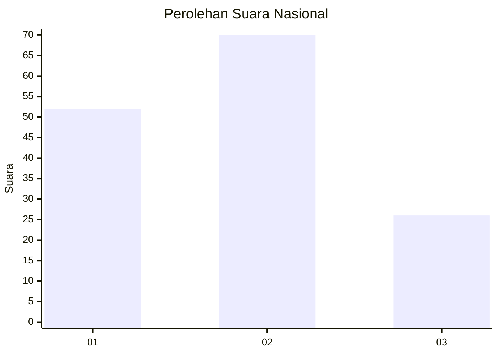
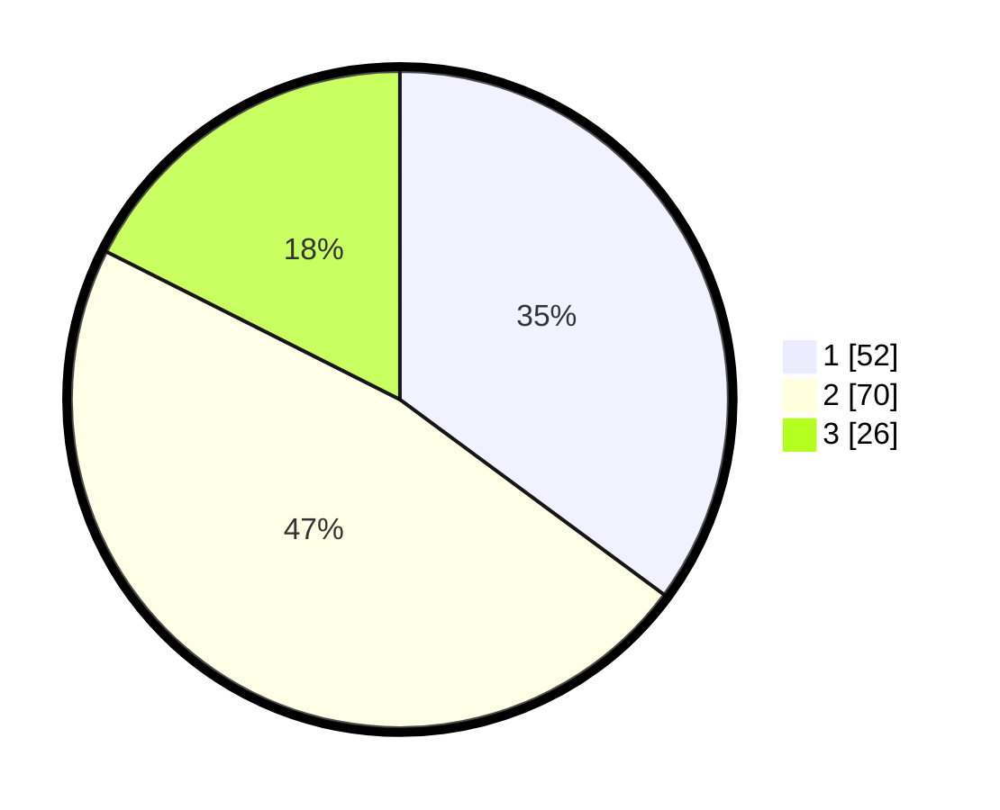

# Hasil

## Grafik

## Tabel

| No. | Nama Paslon    | Suara | Suara (raw) | Persentase |
|:--- |:-------------- | -----:| -----------:| ----------:|
| 1   | ANIES MUHAIMIN | 52    | [52][p-1]   | 35,14      |
| 2   | PRABOWO GIBRAN | 70    | [70][p-2]   | 47,30      |
| 3   | GANJAR MAHFUD  | 26    | [26][p-3]   | 17,57      |

[p-1]: https://github.com/gigit-pemilu/pemilu-2024/blob/main/pilpres/hitung-suara/sub/16-sumatera-selatan/sub/02-ogan-komering-ilir/sub/11-tulung-selapan/sub/2017-simpang-tiga-jaya/sub/008-tps/sub/paslon-1.txt
[p-2]: https://github.com/gigit-pemilu/pemilu-2024/blob/main/pilpres/hitung-suara/sub/16-sumatera-selatan/sub/02-ogan-komering-ilir/sub/11-tulung-selapan/sub/2017-simpang-tiga-jaya/sub/008-tps/sub/paslon-2.txt
[p-3]: https://github.com/gigit-pemilu/pemilu-2024/blob/main/pilpres/hitung-suara/sub/16-sumatera-selatan/sub/02-ogan-komering-ilir/sub/11-tulung-selapan/sub/2017-simpang-tiga-jaya/sub/008-tps/sub/paslon-3.txt

## Foto C Plano

https://sirekap-obj-formc.kpu.go.id/ed22/pemilu/ppwp/16/02/11/20/17/1602112017008-20240214-215730--4fc88229-8bd8-4fe6-b722-56cd5b2a4964.jpg

https://sirekap-obj-formc.kpu.go.id/ed22/pemilu/ppwp/16/02/11/20/17/1602112017008-20240214-215304--3edf8eb0-fa98-4a5f-86ab-9e38cc0beece.jpg

https://sirekap-obj-formc.kpu.go.id/ed22/pemilu/ppwp/16/02/11/20/17/1602112017008-20240214-215414--ae84367a-ee08-414f-8c76-8950635811fd.jpg

## Metadata

| Key        | Value               |
| ---------- | ------------------- |
| Time Stamp | 2024-02-17 03:30:02 |

## DATA PEMILIH TETAP

Jumlah pemilih dalam DPT: **2**.
 * L: **100**.
 * P: **982**.

## DATA PENGGUNA HAK PILIH

Jumlah pengguna hak pilih dalam DPT: **113**.
 * L: **57**.
 * P: **56**.

Jumlah pengguna hak pilih dalam DPTb: **4**.
 * L: **5**.
 * P: **3**.

Jumlah pengguna hak pilih dalam DPK: **34**.
 * L: **12**.
 * P: **22**.

Jumlah pengguna hak pilih: **151**.
 * L: **72**.
 * P: **13**.

## JUMLAH SUARA SAH DAN TIDAK SAH

JUMLAH SELURUH SUARA SAH: **148**.

JUMLAH SUARA TIDAK SAH: **3**.

JUMLAH SELURUH SUARA SAH DAN SUARA TIDAK SAH: **151**.

