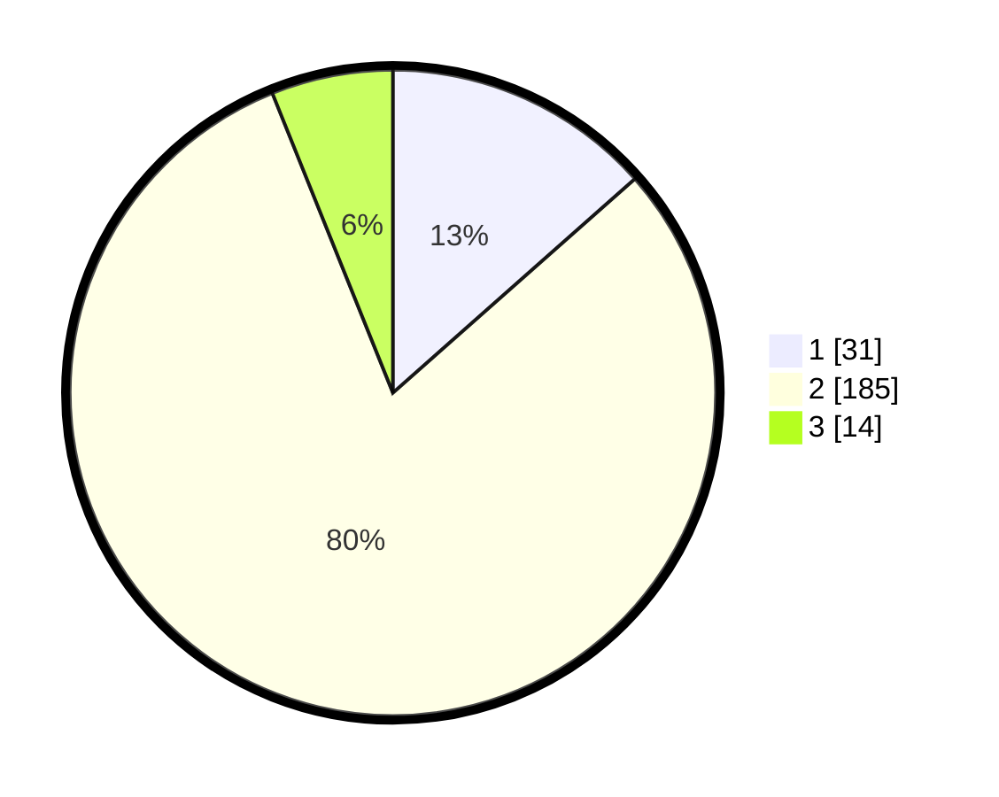

# Hasil

## Grafik

## Tabel

| No. | Nama Paslon    | Suara | Suara (raw) | Persentase |
|:--- |:-------------- | -----:| -----------:| ----------:|
| 1   | ANIES MUHAIMIN | 31    | [31][p-1]   | 13,48      |
| 2   | PRABOWO GIBRAN | 185   | [185][p-2]  | 80,43      |
| 3   | GANJAR MAHFUD  | 14    | [14][p-3]   | 6,09       |

[p-1]: https://github.com/gigit-pemilu/pemilu-2024-16-sumatera-selatan/blob/main/pilpres/hitung-suara/sub/16-sumatera-selatan/sub/02-ogan-komering-ilir/sub/12-pampangan/sub/2001-ulak-kemang/sub/003-tps/sub/paslon-1.txt
[p-2]: https://github.com/gigit-pemilu/pemilu-2024-16-sumatera-selatan/blob/main/pilpres/hitung-suara/sub/16-sumatera-selatan/sub/02-ogan-komering-ilir/sub/12-pampangan/sub/2001-ulak-kemang/sub/003-tps/sub/paslon-2.txt
[p-3]: https://github.com/gigit-pemilu/pemilu-2024-16-sumatera-selatan/blob/main/pilpres/hitung-suara/sub/16-sumatera-selatan/sub/02-ogan-komering-ilir/sub/12-pampangan/sub/2001-ulak-kemang/sub/003-tps/sub/paslon-3.txt

## Foto C Plano

https://sirekap-obj-formc.kpu.go.id/494c/pemilu/ppwp/16/02/12/20/01/1602122001003-20240215-024410--5292228e-fb65-4a49-82e1-0d6f071f80f6.jpg

https://sirekap-obj-formc.kpu.go.id/494c/pemilu/ppwp/16/02/12/20/01/1602122001003-20240215-024727--801f588e-373a-42b0-be2b-c2466779bd4d.jpg

https://sirekap-obj-formc.kpu.go.id/494c/pemilu/ppwp/16/02/12/20/01/1602122001003-20240215-025325--762ad12a-df02-4126-868d-29ebaec7b337.jpg

## Metadata

| Key        | Value               |
| ---------- | ------------------- |
| Time Stamp | 2024-02-19 12:00:00 |

