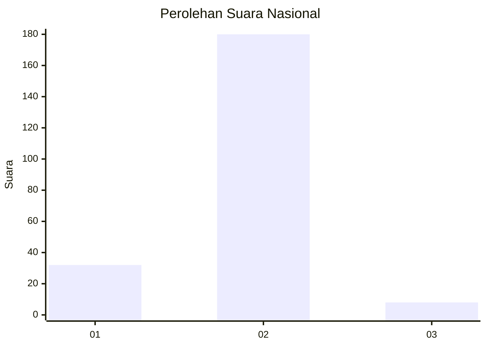
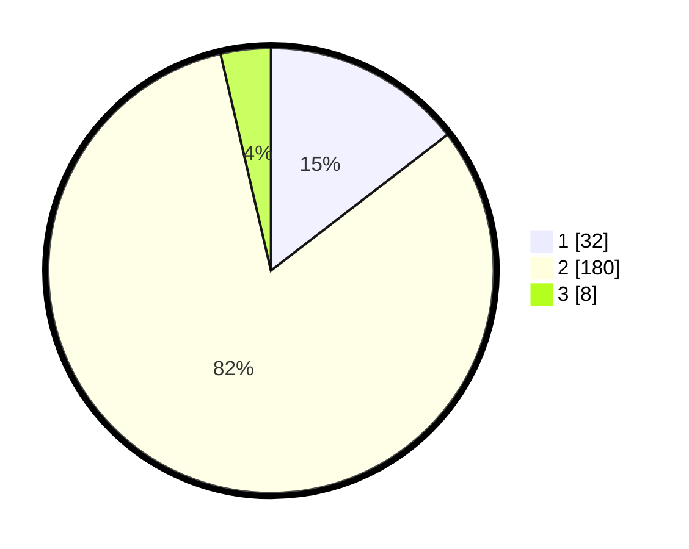

# Hasil

## Grafik

## Tabel

| No. | Nama Paslon    | Suara | Suara (raw) | Persentase |
|:--- |:-------------- | -----:| -----------:| ----------:|
| 1   | ANIES MUHAIMIN | 32    | [32][p-1]   | 14,55      |
| 2   | PRABOWO GIBRAN | 180   | [180][p-2]  | 81,82      |
| 3   | GANJAR MAHFUD  | 8     | [8][p-3]    | 3,64       |

[p-1]: https://github.com/gigit-pemilu/pemilu-2024/blob/main/pilpres/hitung-suara/sub/16-sumatera-selatan/sub/02-ogan-komering-ilir/sub/12-pampangan/sub/2001-ulak-kemang/sub/004-tps/sub/paslon-1.txt
[p-2]: https://github.com/gigit-pemilu/pemilu-2024/blob/main/pilpres/hitung-suara/sub/16-sumatera-selatan/sub/02-ogan-komering-ilir/sub/12-pampangan/sub/2001-ulak-kemang/sub/004-tps/sub/paslon-2.txt
[p-3]: https://github.com/gigit-pemilu/pemilu-2024/blob/main/pilpres/hitung-suara/sub/16-sumatera-selatan/sub/02-ogan-komering-ilir/sub/12-pampangan/sub/2001-ulak-kemang/sub/004-tps/sub/paslon-3.txt

## Foto C Plano

https://sirekap-obj-formc.kpu.go.id/1b27/pemilu/ppwp/16/02/12/20/01/1602122001004-20240215-141411--0c0e9e2d-2295-41c1-9561-5c70c45f534f.jpg

https://sirekap-obj-formc.kpu.go.id/1b27/pemilu/ppwp/16/02/12/20/01/1602122001004-20240215-141558--76302d0b-0d39-4b23-a3dd-9484adbfd970.jpg

https://sirekap-obj-formc.kpu.go.id/1b27/pemilu/ppwp/16/02/12/20/01/1602122001004-20240215-141700--a699f855-ab0e-4dba-af7a-ce430efc259b.jpg

## Metadata

| Key        | Value               |
| ---------- | ------------------- |
| Time Stamp | 2024-02-19 12:00:00 |

