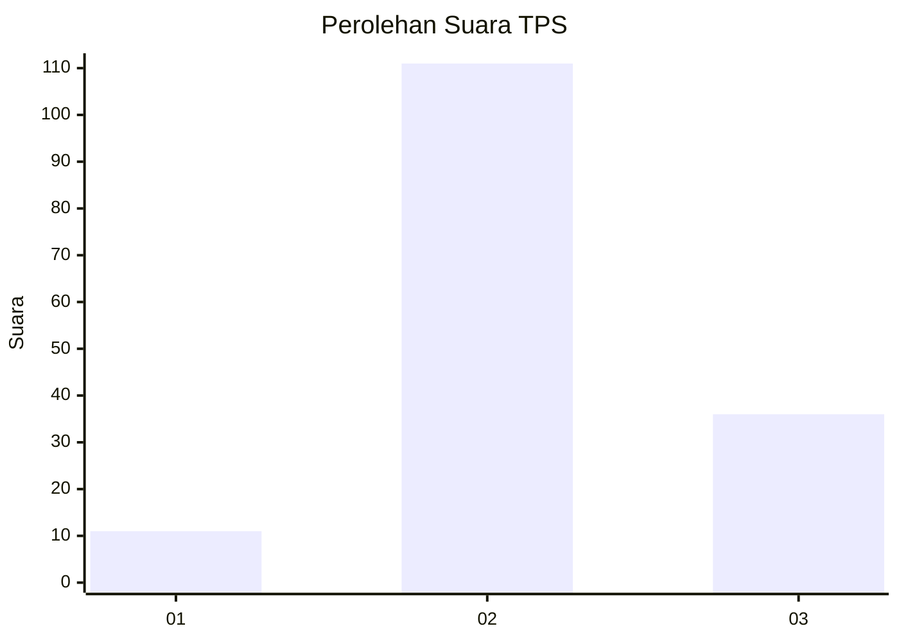
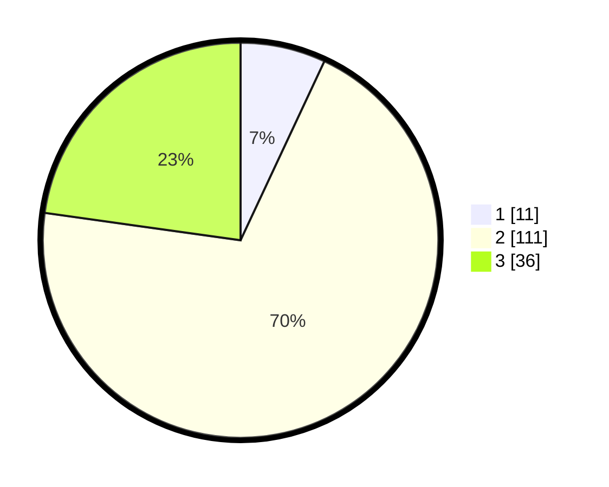

# Hasil

## Grafik

## Tabel

| No. | Nama Paslon    | Suara | Suara (raw) | Persentase |
|:--- |:-------------- | -----:| -----------:| ----------:|
| 1   | ANIES MUHAIMIN | 11    | [11][p-1]   | 6,96       |
| 2   | PRABOWO GIBRAN | 111   | [111][p-2]  | 70,25      |
| 3   | GANJAR MAHFUD  | 36    | [36][p-3]   | 22,78      |

[p-1]: https://github.com/gigit-pemilu/pemilu-2024-16-sumatera-selatan/blob/main/pilpres/hitung-suara/sub/16-sumatera-selatan/sub/02-ogan-komering-ilir/sub/12-pampangan/sub/2005-ulak-depati/sub/002-tps/sub/paslon-1.txt
[p-2]: https://github.com/gigit-pemilu/pemilu-2024-16-sumatera-selatan/blob/main/pilpres/hitung-suara/sub/16-sumatera-selatan/sub/02-ogan-komering-ilir/sub/12-pampangan/sub/2005-ulak-depati/sub/002-tps/sub/paslon-2.txt
[p-3]: https://github.com/gigit-pemilu/pemilu-2024-16-sumatera-selatan/blob/main/pilpres/hitung-suara/sub/16-sumatera-selatan/sub/02-ogan-komering-ilir/sub/12-pampangan/sub/2005-ulak-depati/sub/002-tps/sub/paslon-3.txt

## Foto C Plano

https://sirekap-obj-formc.kpu.go.id/7f5a/pemilu/ppwp/16/02/12/20/05/1602122005002-20240215-021918--a780a5a4-6f88-4793-9882-044f4b4a6024.jpg

https://sirekap-obj-formc.kpu.go.id/7f5a/pemilu/ppwp/16/02/12/20/05/1602122005002-20240215-021944--202e155d-2149-42c9-9cd9-37c2cf5db581.jpg

https://sirekap-obj-formc.kpu.go.id/7f5a/pemilu/ppwp/16/02/12/20/05/1602122005002-20240215-022003--1e491ba3-4cec-4acb-bb53-a44efa1e3fcf.jpg

## Metadata

| Key        | Value               |
| ---------- | ------------------- |
| Time Stamp | 2024-02-20 03:00:00 |

## DATA PEMILIH TETAP

Jumlah pemilih dalam DPT: **499**.
 * L: **92**.
 * P: **807**.

## DATA PENGGUNA HAK PILIH

Jumlah pengguna hak pilih dalam DPT: **159**.
 * L: **64**.
 * P: **95**.

Jumlah pengguna hak pilih dalam DPTb: **805**.
 * L: **807**.
 * P: **880**.

Jumlah pengguna hak pilih dalam DPK: **2**.
 * L: **8**.
 * P: **0**.

Jumlah pengguna hak pilih: **161**.
 * L: **66**.
 * P: **95**.

## JUMLAH SUARA SAH DAN TIDAK SAH

JUMLAH SELURUH SUARA SAH: **158**.

JUMLAH SUARA TIDAK SAH: **3**.

JUMLAH SELURUH SUARA SAH DAN SUARA TIDAK SAH: **161**.

