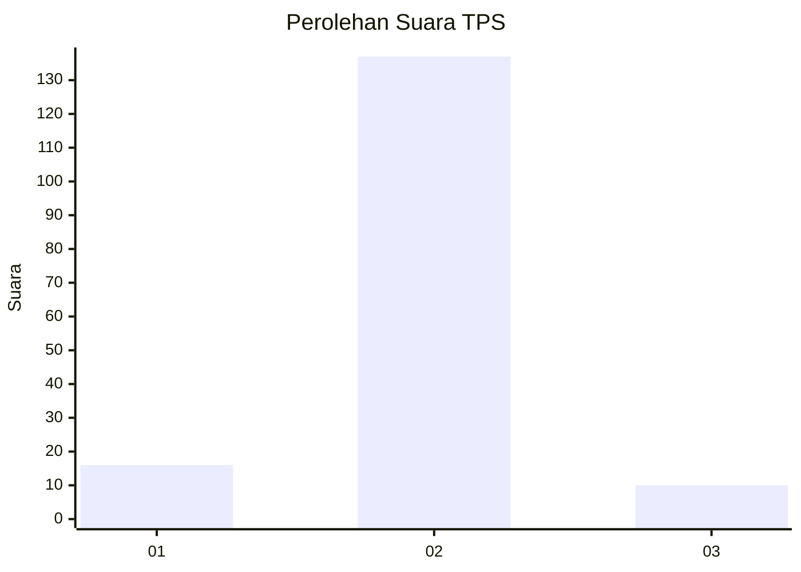
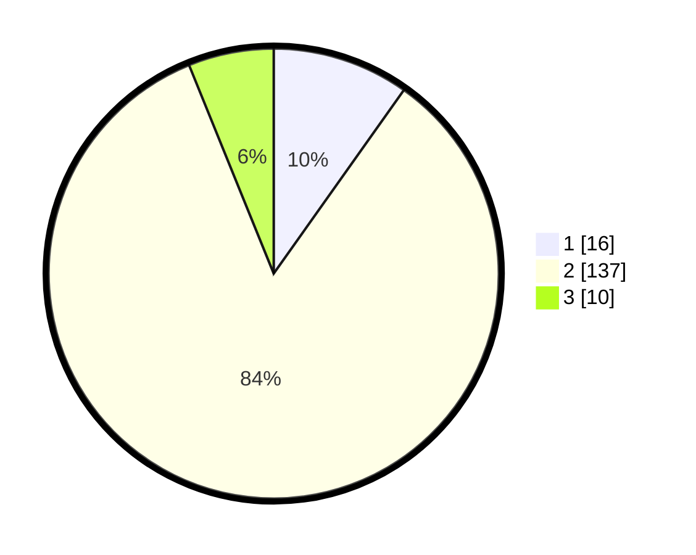

# Hasil

## Grafik

## Tabel

| No. | Nama Paslon    | Suara | Suara (raw) | Persentase |
|:--- |:-------------- | -----:| -----------:| ----------:|
| 1   | ANIES MUHAIMIN | 16    | [16][p-1]   | 9,82       |
| 2   | PRABOWO GIBRAN | 137   | [137][p-2]  | 84,05      |
| 3   | GANJAR MAHFUD  | 10    | [10][p-3]   | 6,13       |

[p-1]: https://github.com/gigit-pemilu/pemilu-2024-16-sumatera-selatan/blob/main/pilpres/hitung-suara/sub/16-sumatera-selatan/sub/02-ogan-komering-ilir/sub/12-pampangan/sub/2008-pulau-betung/sub/004-tps/sub/paslon-1.txt
[p-2]: https://github.com/gigit-pemilu/pemilu-2024-16-sumatera-selatan/blob/main/pilpres/hitung-suara/sub/16-sumatera-selatan/sub/02-ogan-komering-ilir/sub/12-pampangan/sub/2008-pulau-betung/sub/004-tps/sub/paslon-2.txt
[p-3]: https://github.com/gigit-pemilu/pemilu-2024-16-sumatera-selatan/blob/main/pilpres/hitung-suara/sub/16-sumatera-selatan/sub/02-ogan-komering-ilir/sub/12-pampangan/sub/2008-pulau-betung/sub/004-tps/sub/paslon-3.txt

## Foto C Plano

https://sirekap-obj-formc.kpu.go.id/c285/pemilu/ppwp/16/02/12/20/08/1602122008004-20240216-235733--5ea71080-a5d5-4d0f-b1a4-8e9776dbaf96.jpg

https://sirekap-obj-formc.kpu.go.id/c285/pemilu/ppwp/16/02/12/20/08/1602122008004-20240216-235943--b0676762-3a21-461f-9840-ef0e5ac90285.jpg

https://sirekap-obj-formc.kpu.go.id/c285/pemilu/ppwp/16/02/12/20/08/1602122008004-20240216-235614--4bf2e7bb-8f7d-4491-94b2-cf98dfca5b01.jpg

## Metadata

| Key        | Value               |
| ---------- | ------------------- |
| Time Stamp | 2024-02-20 02:00:00 |

