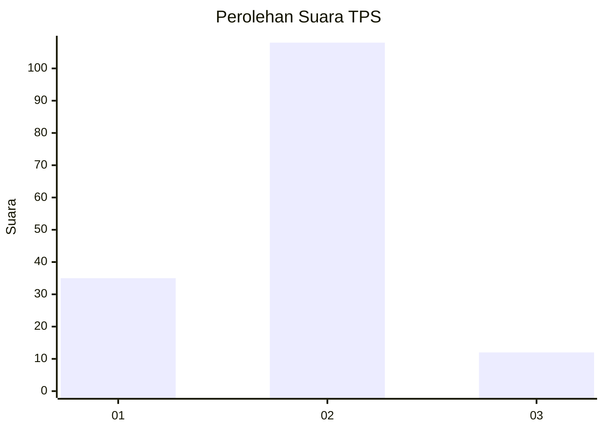
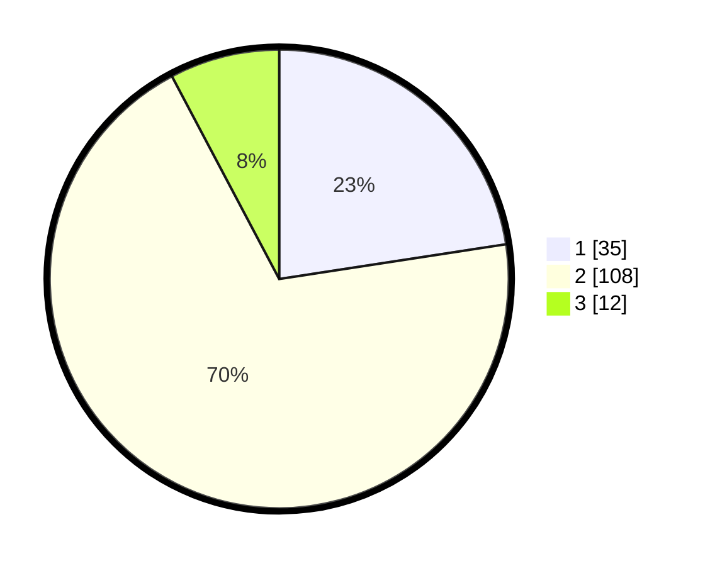

# Hasil

## Grafik

## Tabel

| No. | Nama Paslon    | Suara | Suara (raw) | Persentase |
|:--- |:-------------- | -----:| -----------:| ----------:|
| 1   | ANIES MUHAIMIN | 35    | [35][p-1]   | 22,58      |
| 2   | PRABOWO GIBRAN | 108   | [108][p-2]  | 69,68      |
| 3   | GANJAR MAHFUD  | 12    | [12][p-3]   | 7,74       |

[p-1]: https://github.com/gigit-pemilu/pemilu-2024-16-sumatera-selatan/blob/main/pilpres/hitung-suara/sub/16-sumatera-selatan/sub/02-ogan-komering-ilir/sub/12-pampangan/sub/2008-pulau-betung/sub/006-tps/sub/paslon-1.txt
[p-2]: https://github.com/gigit-pemilu/pemilu-2024-16-sumatera-selatan/blob/main/pilpres/hitung-suara/sub/16-sumatera-selatan/sub/02-ogan-komering-ilir/sub/12-pampangan/sub/2008-pulau-betung/sub/006-tps/sub/paslon-2.txt
[p-3]: https://github.com/gigit-pemilu/pemilu-2024-16-sumatera-selatan/blob/main/pilpres/hitung-suara/sub/16-sumatera-selatan/sub/02-ogan-komering-ilir/sub/12-pampangan/sub/2008-pulau-betung/sub/006-tps/sub/paslon-3.txt

## Foto C Plano

https://sirekap-obj-formc.kpu.go.id/2b94/pemilu/ppwp/16/02/12/20/08/1602122008006-20240214-235440--3c225e12-b794-488a-be87-667da713569f.jpg

https://sirekap-obj-formc.kpu.go.id/2b94/pemilu/ppwp/16/02/12/20/08/1602122008006-20240214-235450--22661b3c-424d-437d-99a9-56f6930126fe.jpg

https://sirekap-obj-formc.kpu.go.id/2b94/pemilu/ppwp/16/02/12/20/08/1602122008006-20240214-235432--15ee8597-8150-4443-aa98-d8aa17be662c.jpg

## Metadata

| Key        | Value               |
| ---------- | ------------------- |
| Time Stamp | 2024-02-19 06:16:00 |

