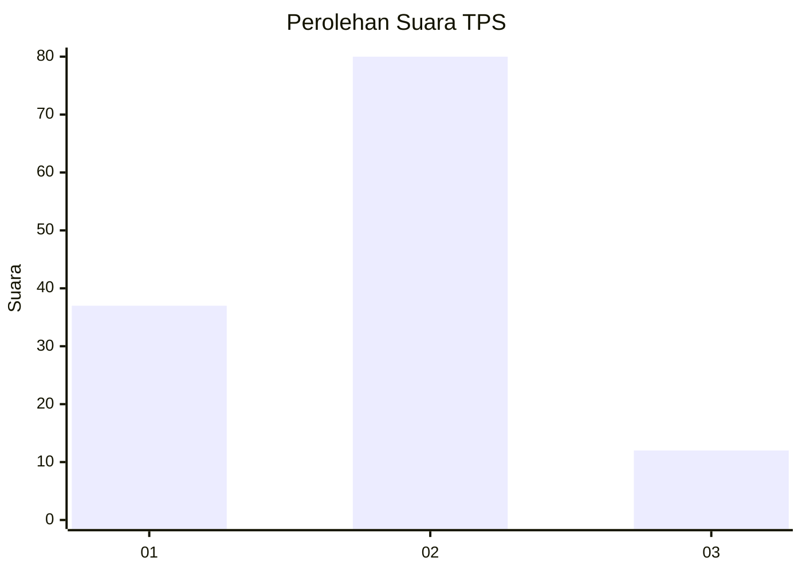
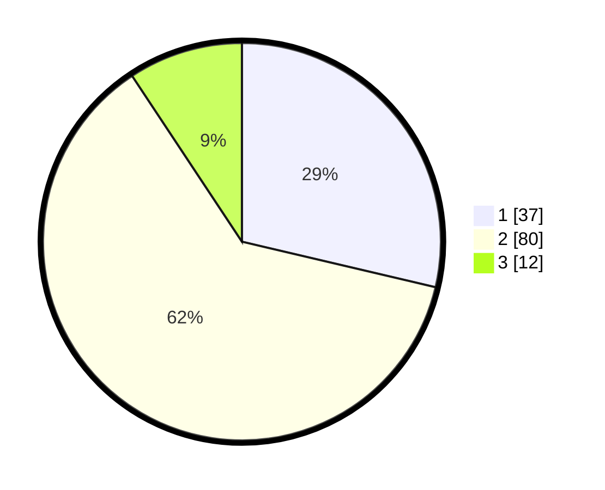

# Hasil

## Grafik

## Tabel

| No. | Nama Paslon    | Suara | Suara (raw) | Persentase |
|:--- |:-------------- | -----:| -----------:| ----------:|
| 1   | ANIES MUHAIMIN | 37    | [37][p-1]   | 28,68      |
| 2   | PRABOWO GIBRAN | 80    | [80][p-2]   | 62,02      |
| 3   | GANJAR MAHFUD  | 12    | [12][p-3]   | 9,30       |

[p-1]: https://github.com/gigit-pemilu/pemilu-2024-16-sumatera-selatan/blob/main/pilpres/hitung-suara/sub/16-sumatera-selatan/sub/02-ogan-komering-ilir/sub/12-pampangan/sub/2010-kuro/sub/001-tps/sub/paslon-1.txt
[p-2]: https://github.com/gigit-pemilu/pemilu-2024-16-sumatera-selatan/blob/main/pilpres/hitung-suara/sub/16-sumatera-selatan/sub/02-ogan-komering-ilir/sub/12-pampangan/sub/2010-kuro/sub/001-tps/sub/paslon-2.txt
[p-3]: https://github.com/gigit-pemilu/pemilu-2024-16-sumatera-selatan/blob/main/pilpres/hitung-suara/sub/16-sumatera-selatan/sub/02-ogan-komering-ilir/sub/12-pampangan/sub/2010-kuro/sub/001-tps/sub/paslon-3.txt

## Foto C Plano

https://sirekap-obj-formc.kpu.go.id/e595/pemilu/ppwp/16/02/12/20/10/1602122010001-20240215-020912--80156438-d709-42c5-bac4-46c2622ad9a6.jpg

https://sirekap-obj-formc.kpu.go.id/e595/pemilu/ppwp/16/02/12/20/10/1602122010001-20240216-133156--4728398a-77b4-4748-9fa0-2706b8c8d49d.jpg

https://sirekap-obj-formc.kpu.go.id/e595/pemilu/ppwp/16/02/12/20/10/1602122010001-20240215-232654--7ecbb2b1-c86a-46eb-b4d1-721b8791866b.jpg

## Metadata

| Key        | Value               |
| ---------- | ------------------- |
| Time Stamp | 2024-02-20 02:00:00 |

