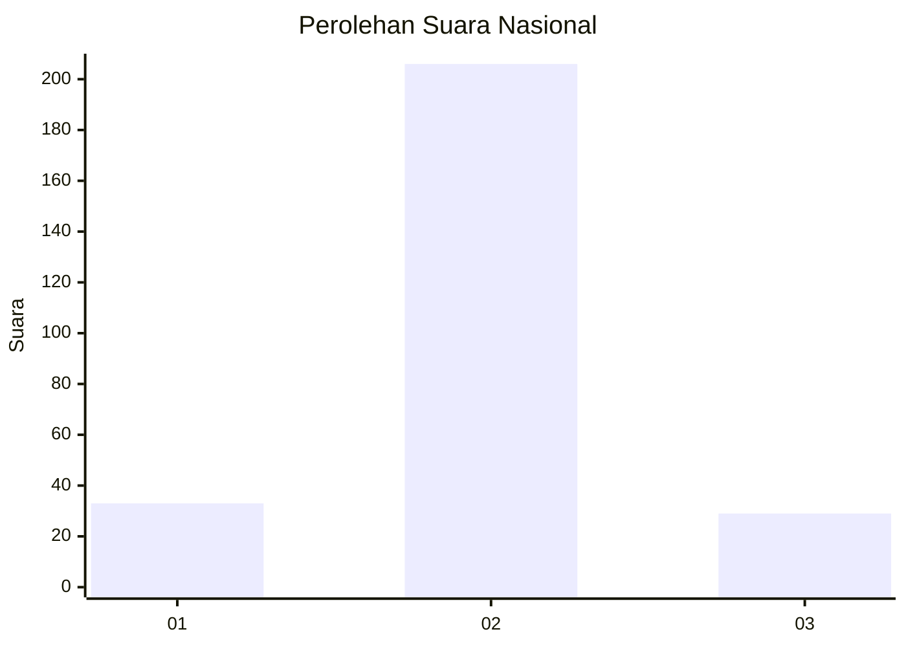
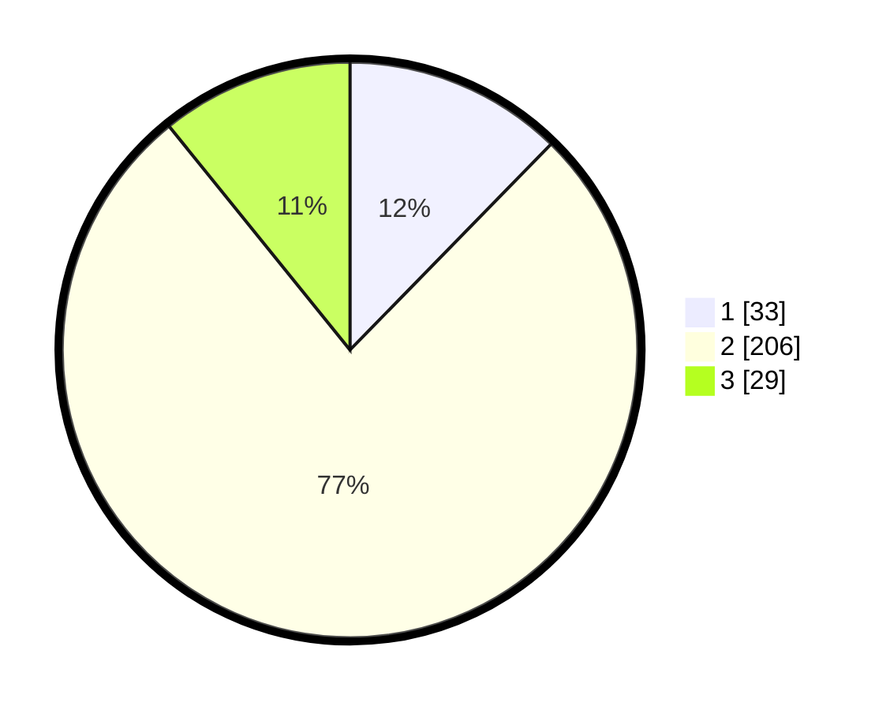

# Hasil

## Grafik

## Tabel

| No. | Nama Paslon    | Suara | Suara (raw) | Persentase |
|:--- |:-------------- | -----:| -----------:| ----------:|
| 1   | ANIES MUHAIMIN | 33    | [33][p-1]   | 12,31      |
| 2   | PRABOWO GIBRAN | 206   | [206][p-2]  | 76,87      |
| 3   | GANJAR MAHFUD  | 29    | [29][p-3]   | 10,82      |

[p-1]: https://github.com/gigit-pemilu/pemilu-2024/blob/main/pilpres/hitung-suara/sub/16-sumatera-selatan/sub/02-ogan-komering-ilir/sub/13-lempuing/sub/2005-tebing-suluh/sub/005-tps/sub/paslon-1.txt
[p-2]: https://github.com/gigit-pemilu/pemilu-2024/blob/main/pilpres/hitung-suara/sub/16-sumatera-selatan/sub/02-ogan-komering-ilir/sub/13-lempuing/sub/2005-tebing-suluh/sub/005-tps/sub/paslon-2.txt
[p-3]: https://github.com/gigit-pemilu/pemilu-2024/blob/main/pilpres/hitung-suara/sub/16-sumatera-selatan/sub/02-ogan-komering-ilir/sub/13-lempuing/sub/2005-tebing-suluh/sub/005-tps/sub/paslon-3.txt

## Foto C Plano

https://sirekap-obj-formc.kpu.go.id/b0af/pemilu/ppwp/16/02/13/20/05/1602132005005-20240214-214628--2620a8b0-5045-4134-9bc4-ef0d0570ed32.jpg

https://sirekap-obj-formc.kpu.go.id/b0af/pemilu/ppwp/16/02/13/20/05/1602132005005-20240215-000328--ac1d4a82-dcf5-4924-89f1-e57da805be0c.jpg

https://sirekap-obj-formc.kpu.go.id/b0af/pemilu/ppwp/16/02/13/20/05/1602132005005-20240214-214935--23842316-7a93-4e2b-aa89-e82266f0b8fa.jpg

## Metadata

| Key        | Value               |
| ---------- | ------------------- |
| Time Stamp | 2024-02-19 06:16:00 |

