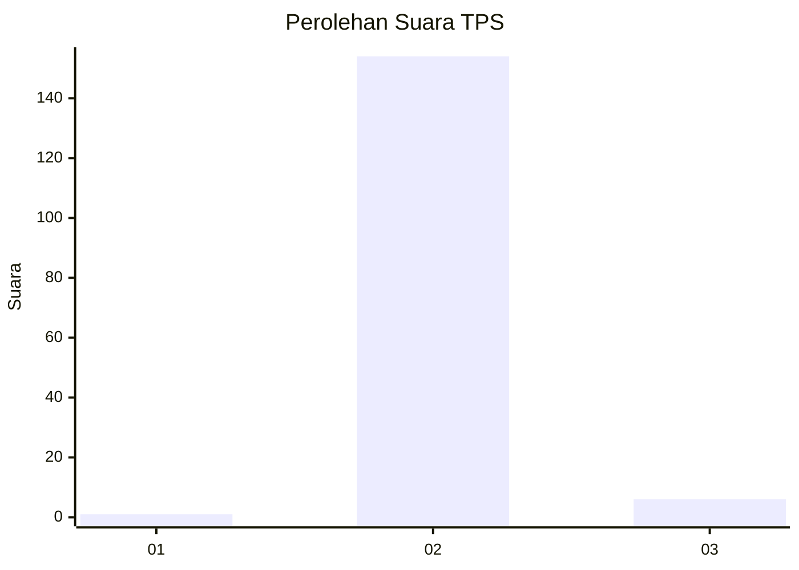
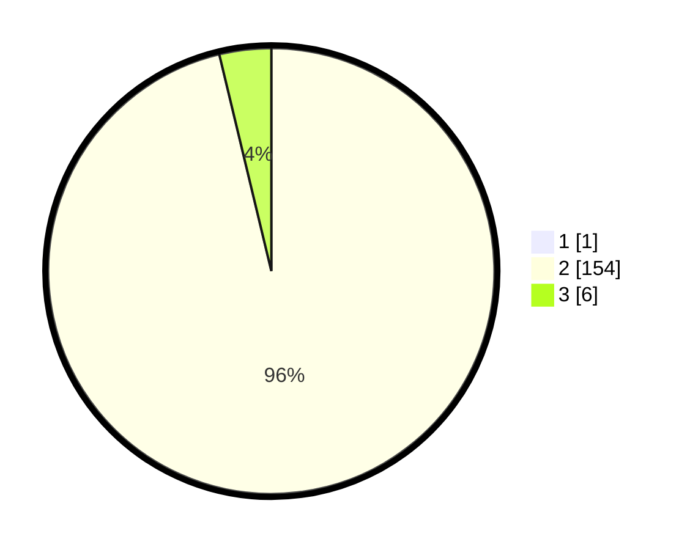

# Hasil

## Grafik

## Tabel

| No. | Nama Paslon    | Suara | Suara (raw) | Persentase |
|:--- |:-------------- | -----:| -----------:| ----------:|
| 1   | ANIES MUHAIMIN | 1     | [1][p-1]    | 0,62       |
| 2   | PRABOWO GIBRAN | 154   | [154][p-2]  | 95,65      |
| 3   | GANJAR MAHFUD  | 6     | [6][p-3]    | 3,73       |

[p-1]: https://github.com/gigit-pemilu/pemilu-2024-16-sumatera-selatan/blob/main/pilpres/hitung-suara/sub/16-sumatera-selatan/sub/02-ogan-komering-ilir/sub/13-lempuing/sub/2006-cahya-bumi/sub/007-tps/sub/paslon-1.txt
[p-2]: https://github.com/gigit-pemilu/pemilu-2024-16-sumatera-selatan/blob/main/pilpres/hitung-suara/sub/16-sumatera-selatan/sub/02-ogan-komering-ilir/sub/13-lempuing/sub/2006-cahya-bumi/sub/007-tps/sub/paslon-2.txt
[p-3]: https://github.com/gigit-pemilu/pemilu-2024-16-sumatera-selatan/blob/main/pilpres/hitung-suara/sub/16-sumatera-selatan/sub/02-ogan-komering-ilir/sub/13-lempuing/sub/2006-cahya-bumi/sub/007-tps/sub/paslon-3.txt

## Foto C Plano

https://sirekap-obj-formc.kpu.go.id/98b7/pemilu/ppwp/16/02/13/20/06/1602132006007-20240215-023535--566abd3a-70d4-42fb-bf8e-a2e4a4b98589.jpg

https://sirekap-obj-formc.kpu.go.id/98b7/pemilu/ppwp/16/02/13/20/06/1602132006007-20240215-023606--4e6b2932-9169-48b5-bb00-cbf9159b76ee.jpg

https://sirekap-obj-formc.kpu.go.id/98b7/pemilu/ppwp/16/02/13/20/06/1602132006007-20240215-023611--6d369a43-4f30-4172-94c8-e428f35bfefb.jpg

## Metadata

| Key        | Value               |
| ---------- | ------------------- |
| Time Stamp | 2024-02-20 02:00:00 |

