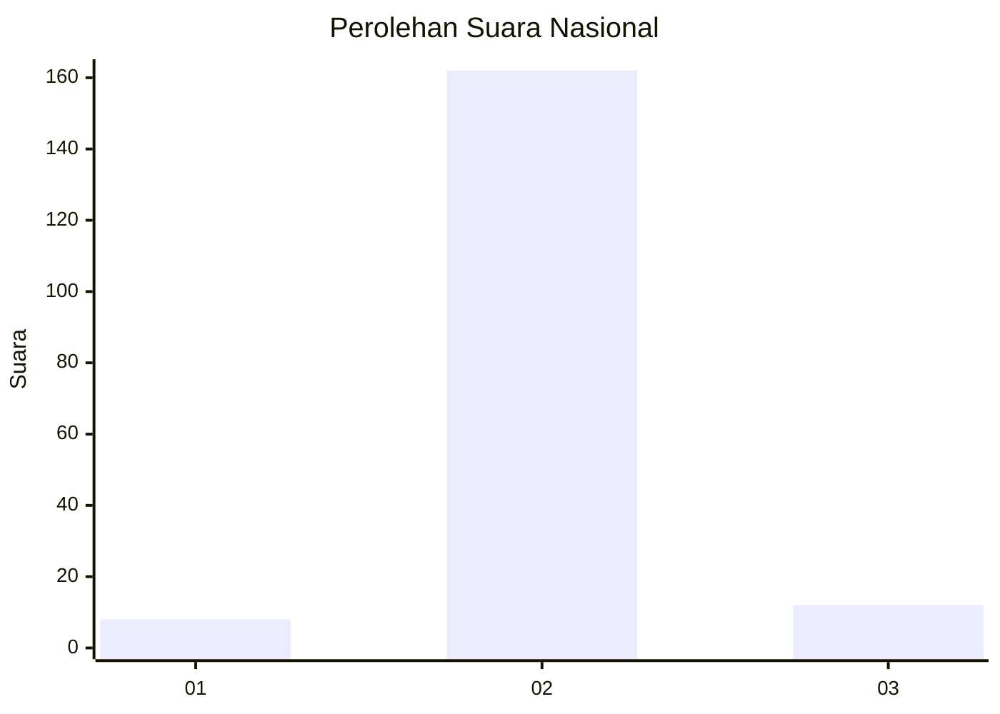
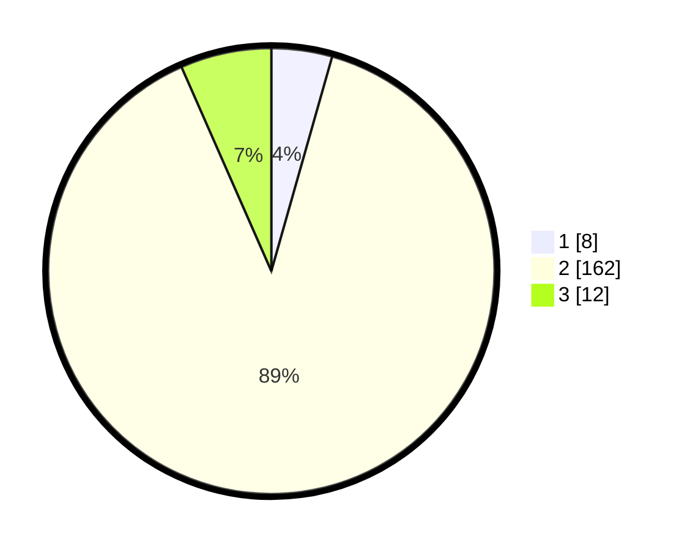

# Hasil

## Grafik

## Tabel

| No. | Nama Paslon    | Suara | Suara (raw) | Persentase |
|:--- |:-------------- | -----:| -----------:| ----------:|
| 1   | ANIES MUHAIMIN | 8     | [8][p-1]    | 4,40       |
| 2   | PRABOWO GIBRAN | 162   | [162][p-2]  | 89,01      |
| 3   | GANJAR MAHFUD  | 12    | [12][p-3]   | 6,59       |

[p-1]: https://github.com/gigit-pemilu/pemilu-2024/blob/main/pilpres/hitung-suara/sub/16-sumatera-selatan/sub/02-ogan-komering-ilir/sub/13-lempuing/sub/2008-cahaya-maju/sub/001-tps/sub/paslon-1.txt
[p-2]: https://github.com/gigit-pemilu/pemilu-2024/blob/main/pilpres/hitung-suara/sub/16-sumatera-selatan/sub/02-ogan-komering-ilir/sub/13-lempuing/sub/2008-cahaya-maju/sub/001-tps/sub/paslon-2.txt
[p-3]: https://github.com/gigit-pemilu/pemilu-2024/blob/main/pilpres/hitung-suara/sub/16-sumatera-selatan/sub/02-ogan-komering-ilir/sub/13-lempuing/sub/2008-cahaya-maju/sub/001-tps/sub/paslon-3.txt

## Foto C Plano

https://sirekap-obj-formc.kpu.go.id/e3d0/pemilu/ppwp/16/02/13/20/08/1602132008001-20240218-135951--6068e03b-b1e0-4e99-a13c-f7098615c00f.jpg

https://sirekap-obj-formc.kpu.go.id/e3d0/pemilu/ppwp/16/02/13/20/08/1602132008001-20240215-160457--dd6c24d8-1f68-464e-8862-7be93bbd8c90.jpg

https://sirekap-obj-formc.kpu.go.id/e3d0/pemilu/ppwp/16/02/13/20/08/1602132008001-20240215-064412--6881c845-cdee-4fdd-8d1b-7fbee9802005.jpg

## Metadata

| Key        | Value               |
| ---------- | ------------------- |
| Time Stamp | 2024-02-20 02:00:00 |

