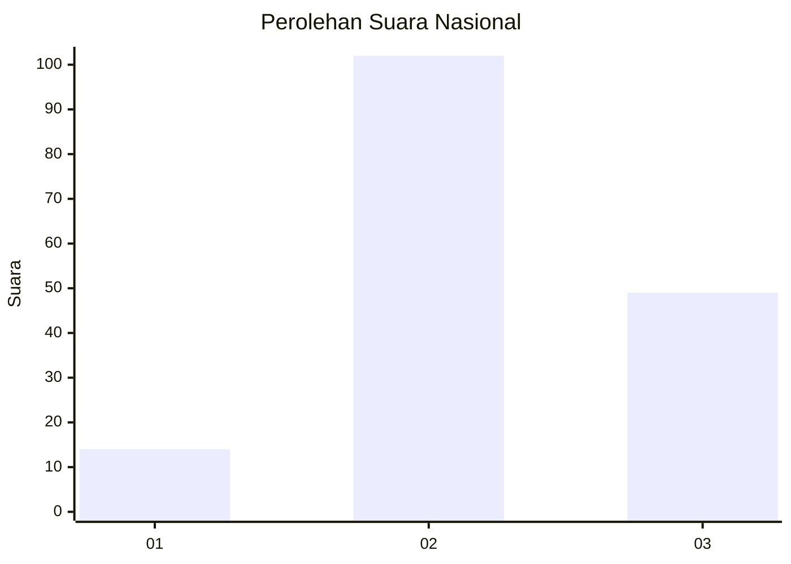
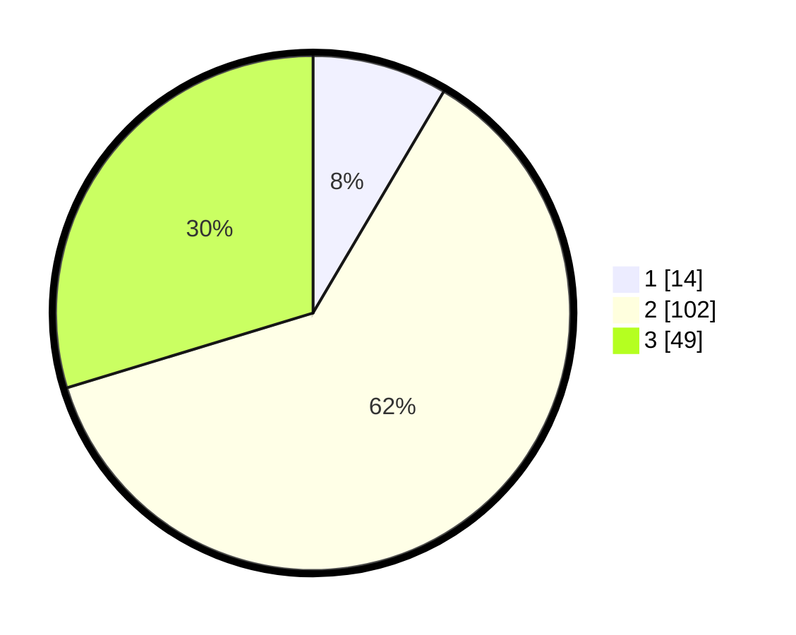

# Hasil

## Grafik

## Tabel

| No. | Nama Paslon    | Suara | Suara (raw) | Persentase |
|:--- |:-------------- | -----:| -----------:| ----------:|
| 1   | ANIES MUHAIMIN | 14    | [14][p-1]   | 8,48       |
| 2   | PRABOWO GIBRAN | 102   | [102][p-2]  | 61,82      |
| 3   | GANJAR MAHFUD  | 49    | [49][p-3]   | 29,70      |

[p-1]: https://github.com/gigit-pemilu/pemilu-2024/blob/main/pilpres/hitung-suara/sub/16-sumatera-selatan/sub/02-ogan-komering-ilir/sub/13-lempuing/sub/2008-cahaya-maju/sub/002-tps/sub/paslon-1.txt
[p-2]: https://github.com/gigit-pemilu/pemilu-2024/blob/main/pilpres/hitung-suara/sub/16-sumatera-selatan/sub/02-ogan-komering-ilir/sub/13-lempuing/sub/2008-cahaya-maju/sub/002-tps/sub/paslon-2.txt
[p-3]: https://github.com/gigit-pemilu/pemilu-2024/blob/main/pilpres/hitung-suara/sub/16-sumatera-selatan/sub/02-ogan-komering-ilir/sub/13-lempuing/sub/2008-cahaya-maju/sub/002-tps/sub/paslon-3.txt

## Foto C Plano

https://sirekap-obj-formc.kpu.go.id/c9bd/pemilu/ppwp/16/02/13/20/08/1602132008002-20240214-231131--11bb8547-4b71-409c-bc61-1f7119ee4e41.jpg

https://sirekap-obj-formc.kpu.go.id/c9bd/pemilu/ppwp/16/02/13/20/08/1602132008002-20240215-120308--68fec25d-1134-4902-a3e0-81d27f104cbb.jpg

https://sirekap-obj-formc.kpu.go.id/c9bd/pemilu/ppwp/16/02/13/20/08/1602132008002-20240215-120642--3d945097-c907-4c19-b6a8-1a690b689562.jpg

## Metadata

| Key        | Value               |
| ---------- | ------------------- |
| Time Stamp | 2024-02-19 06:16:00 |

