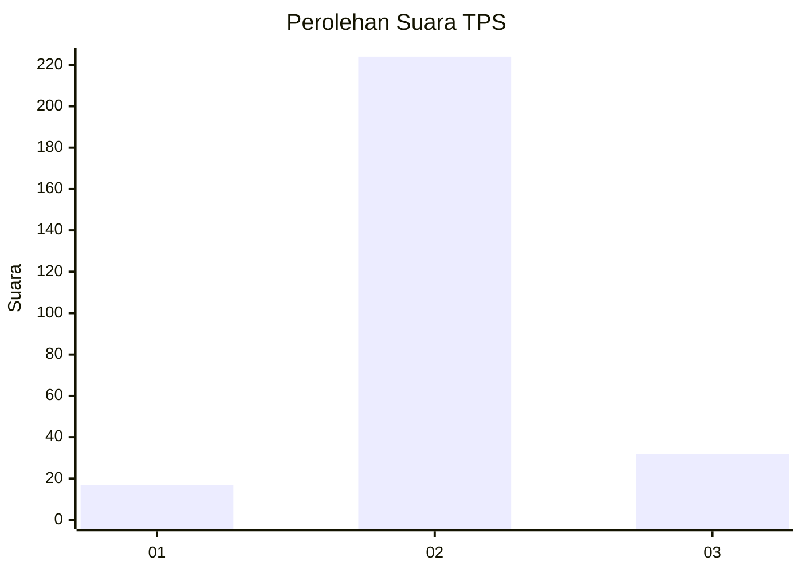
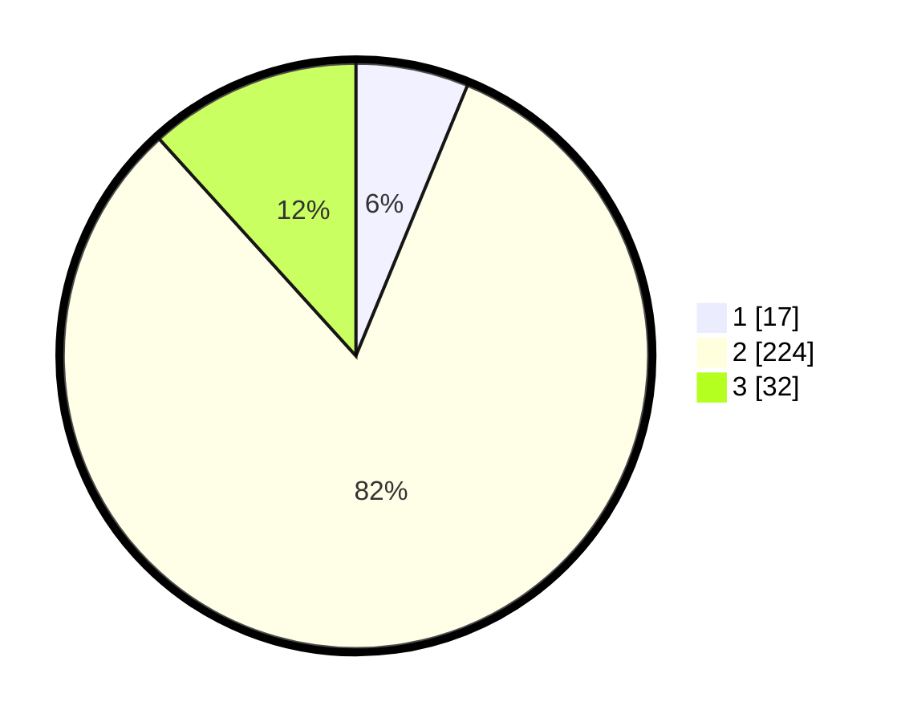

# Hasil

## Grafik

## Tabel

| No. | Nama Paslon    | Suara | Suara (raw) | Persentase |
|:--- |:-------------- | -----:| -----------:| ----------:|
| 1   | ANIES MUHAIMIN | 17    | [17][p-1]   | 6,23       |
| 2   | PRABOWO GIBRAN | 224   | [224][p-2]  | 82,05      |
| 3   | GANJAR MAHFUD  | 32    | [32][p-3]   | 11,72      |

[p-1]: https://github.com/gigit-pemilu/pemilu-2024-16-sumatera-selatan/blob/main/pilpres/hitung-suara/sub/16-sumatera-selatan/sub/02-ogan-komering-ilir/sub/13-lempuing/sub/2008-cahaya-maju/sub/006-tps/sub/paslon-1.txt
[p-2]: https://github.com/gigit-pemilu/pemilu-2024-16-sumatera-selatan/blob/main/pilpres/hitung-suara/sub/16-sumatera-selatan/sub/02-ogan-komering-ilir/sub/13-lempuing/sub/2008-cahaya-maju/sub/006-tps/sub/paslon-2.txt
[p-3]: https://github.com/gigit-pemilu/pemilu-2024-16-sumatera-selatan/blob/main/pilpres/hitung-suara/sub/16-sumatera-selatan/sub/02-ogan-komering-ilir/sub/13-lempuing/sub/2008-cahaya-maju/sub/006-tps/sub/paslon-3.txt

## Foto C Plano

https://sirekap-obj-formc.kpu.go.id/b341/pemilu/ppwp/16/02/13/20/08/1602132008006-20240215-013746--12031ee9-5569-41e9-bfe7-ae4398cd69ae.jpg

https://sirekap-obj-formc.kpu.go.id/b341/pemilu/ppwp/16/02/13/20/08/1602132008006-20240215-163249--0a2a26cd-0ba6-44ec-8d0e-069594479266.jpg

https://sirekap-obj-formc.kpu.go.id/b341/pemilu/ppwp/16/02/13/20/08/1602132008006-20240215-033959--b833f194-a4b0-4d0a-8e84-d17097eb6048.jpg

## Metadata

| Key        | Value               |
| ---------- | ------------------- |
| Time Stamp | 2024-02-15 19:00:26 |

