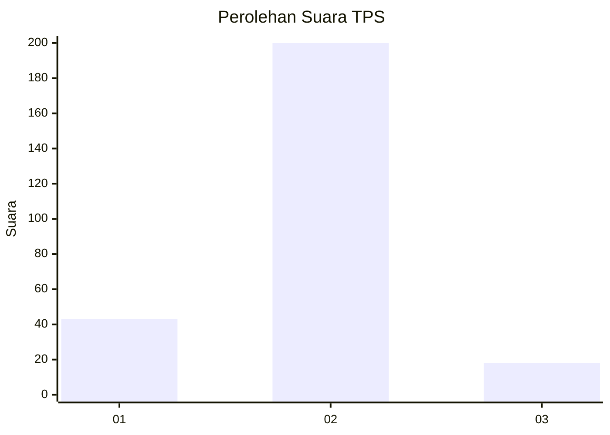
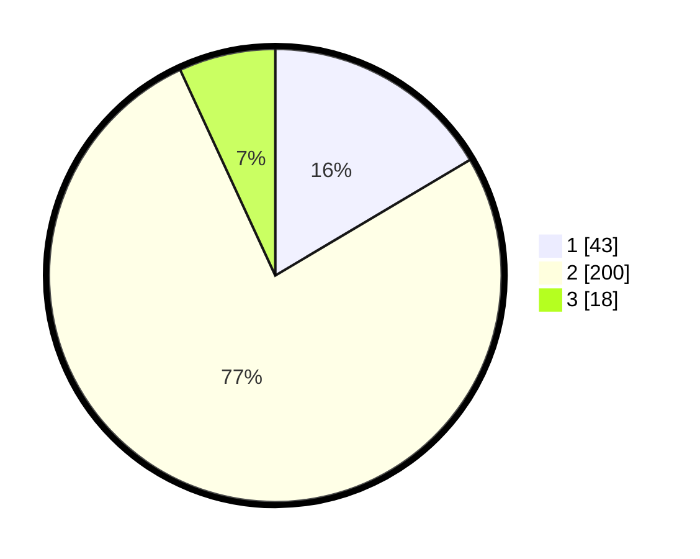

# Hasil

## Grafik

## Tabel

| No. | Nama Paslon    | Suara | Suara (raw) | Persentase |
|:--- |:-------------- | -----:| -----------:| ----------:|
| 1   | ANIES MUHAIMIN | 43    | [43][p-1]   | 16,48      |
| 2   | PRABOWO GIBRAN | 200   | [200][p-2]  | 76,63      |
| 3   | GANJAR MAHFUD  | 18    | [18][p-3]   | 6,90       |

[p-1]: https://github.com/gigit-pemilu/pemilu-2024-16-sumatera-selatan/blob/main/pilpres/hitung-suara/sub/16-sumatera-selatan/sub/02-ogan-komering-ilir/sub/13-lempuing/sub/2008-cahaya-maju/sub/008-tps/sub/paslon-1.txt
[p-2]: https://github.com/gigit-pemilu/pemilu-2024-16-sumatera-selatan/blob/main/pilpres/hitung-suara/sub/16-sumatera-selatan/sub/02-ogan-komering-ilir/sub/13-lempuing/sub/2008-cahaya-maju/sub/008-tps/sub/paslon-2.txt
[p-3]: https://github.com/gigit-pemilu/pemilu-2024-16-sumatera-selatan/blob/main/pilpres/hitung-suara/sub/16-sumatera-selatan/sub/02-ogan-komering-ilir/sub/13-lempuing/sub/2008-cahaya-maju/sub/008-tps/sub/paslon-3.txt

## Foto C Plano

https://sirekap-obj-formc.kpu.go.id/5953/pemilu/ppwp/16/02/13/20/08/1602132008008-20240215-002356--b95a41d1-6e91-4c0b-8ce5-2ebd972a704a.jpg

https://sirekap-obj-formc.kpu.go.id/5953/pemilu/ppwp/16/02/13/20/08/1602132008008-20240215-023817--20faaab0-0f7a-448a-ad90-4d153dc9b634.jpg

https://sirekap-obj-formc.kpu.go.id/5953/pemilu/ppwp/16/02/13/20/08/1602132008008-20240215-005536--2988cf6b-9591-4d33-845f-02220de21501.jpg

## Metadata

| Key        | Value               |
| ---------- | ------------------- |
| Time Stamp | 2024-02-15 16:30:25 |

