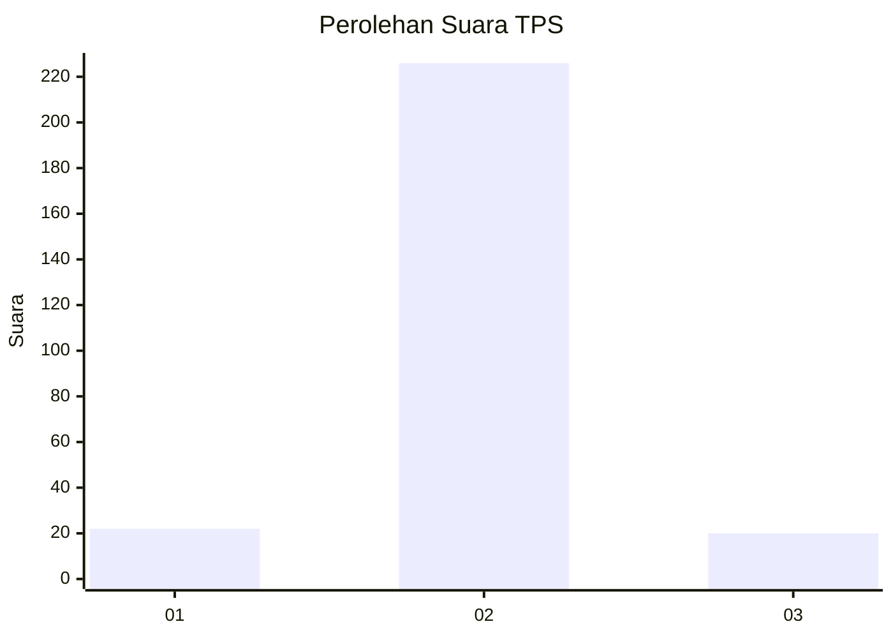
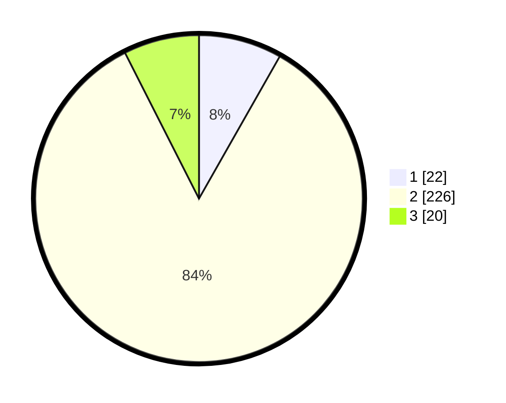

# Hasil

## Grafik

## Tabel

| No. | Nama Paslon    | Suara | Suara (raw) | Persentase |
|:--- |:-------------- | -----:| -----------:| ----------:|
| 1   | ANIES MUHAIMIN | 22    | [22][p-1]   | 8,21       |
| 2   | PRABOWO GIBRAN | 226   | [226][p-2]  | 84,33      |
| 3   | GANJAR MAHFUD  | 20    | [20][p-3]   | 7,46       |

[p-1]: https://github.com/gigit-pemilu/pemilu-2024-16-sumatera-selatan/blob/main/pilpres/hitung-suara/sub/16-sumatera-selatan/sub/02-ogan-komering-ilir/sub/13-lempuing/sub/2016-tulung-harapan/sub/002-tps/sub/paslon-1.txt
[p-2]: https://github.com/gigit-pemilu/pemilu-2024-16-sumatera-selatan/blob/main/pilpres/hitung-suara/sub/16-sumatera-selatan/sub/02-ogan-komering-ilir/sub/13-lempuing/sub/2016-tulung-harapan/sub/002-tps/sub/paslon-2.txt
[p-3]: https://github.com/gigit-pemilu/pemilu-2024-16-sumatera-selatan/blob/main/pilpres/hitung-suara/sub/16-sumatera-selatan/sub/02-ogan-komering-ilir/sub/13-lempuing/sub/2016-tulung-harapan/sub/002-tps/sub/paslon-3.txt

## Foto C Plano

https://sirekap-obj-formc.kpu.go.id/2b13/pemilu/ppwp/16/02/13/20/16/1602132016002-20240214-221007--6537976b-3a4d-45cb-ad33-50894ce260ec.jpg

https://sirekap-obj-formc.kpu.go.id/2b13/pemilu/ppwp/16/02/13/20/16/1602132016002-20240214-221146--9f2add98-ba6e-4e3b-a2eb-e76981e34266.jpg

https://sirekap-obj-formc.kpu.go.id/2b13/pemilu/ppwp/16/02/13/20/16/1602132016002-20240214-175314--ce89dc55-5083-495f-bb60-a9e0944339c7.jpg

## Metadata

| Key        | Value               |
| ---------- | ------------------- |
| Time Stamp | 2024-02-19 06:16:00 |

