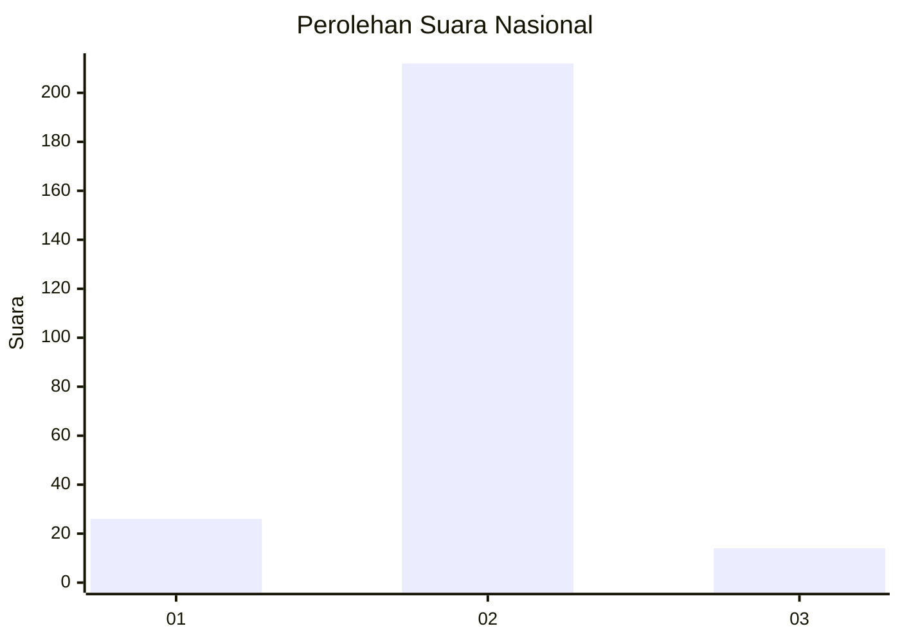
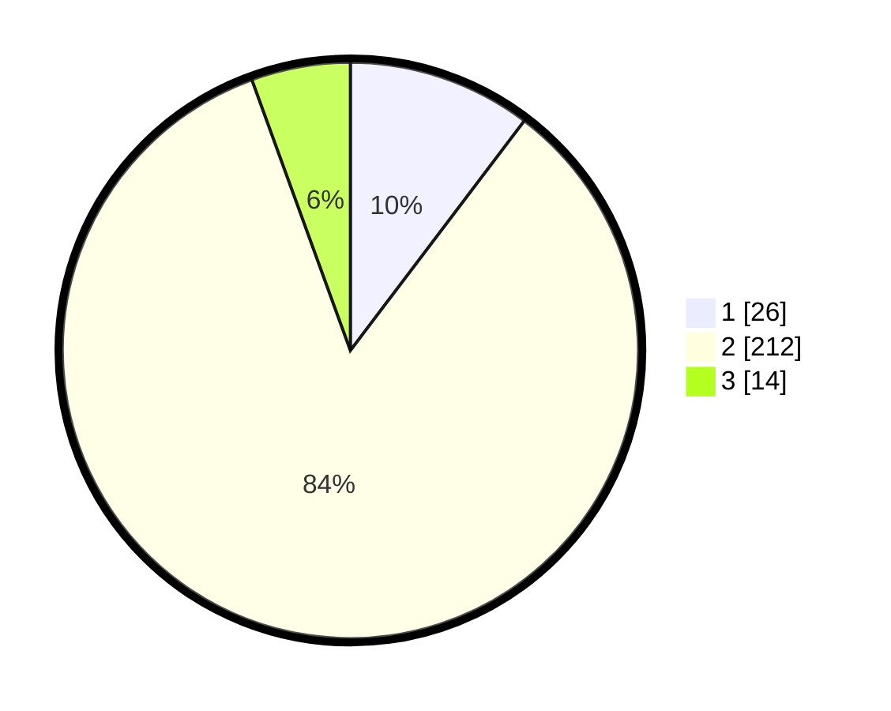

# Hasil

## Grafik

## Tabel

| No. | Nama Paslon    | Suara | Suara (raw) | Persentase |
|:--- |:-------------- | -----:| -----------:| ----------:|
| 1   | ANIES MUHAIMIN | 26    | [26][p-1]   | 10,32      |
| 2   | PRABOWO GIBRAN | 212   | [212][p-2]  | 84,13      |
| 3   | GANJAR MAHFUD  | 14    | [14][p-3]   | 5,56       |

[p-1]: https://github.com/gigit-pemilu/pemilu-2024/blob/main/pilpres/hitung-suara/sub/16-sumatera-selatan/sub/02-ogan-komering-ilir/sub/13-lempuing/sub/2017-kepayang/sub/002-tps/sub/paslon-1.txt
[p-2]: https://github.com/gigit-pemilu/pemilu-2024/blob/main/pilpres/hitung-suara/sub/16-sumatera-selatan/sub/02-ogan-komering-ilir/sub/13-lempuing/sub/2017-kepayang/sub/002-tps/sub/paslon-2.txt
[p-3]: https://github.com/gigit-pemilu/pemilu-2024/blob/main/pilpres/hitung-suara/sub/16-sumatera-selatan/sub/02-ogan-komering-ilir/sub/13-lempuing/sub/2017-kepayang/sub/002-tps/sub/paslon-3.txt

## Foto C Plano

https://sirekap-obj-formc.kpu.go.id/0320/pemilu/ppwp/16/02/13/20/17/1602132017002-20240217-140955--df1ea938-5cf7-49bb-bbb0-ff7ac07b6e22.jpg

https://sirekap-obj-formc.kpu.go.id/0320/pemilu/ppwp/16/02/13/20/17/1602132017002-20240217-141807--2e98cc94-09f8-4b5b-baef-0626b3bb557a.jpg

https://sirekap-obj-formc.kpu.go.id/0320/pemilu/ppwp/16/02/13/20/17/1602132017002-20240217-142017--df53eb3c-9862-46f9-9573-6ca40d0c2d0d.jpg

## Metadata

| Key        | Value               |
| ---------- | ------------------- |
| Time Stamp | 2024-02-19 06:16:00 |

