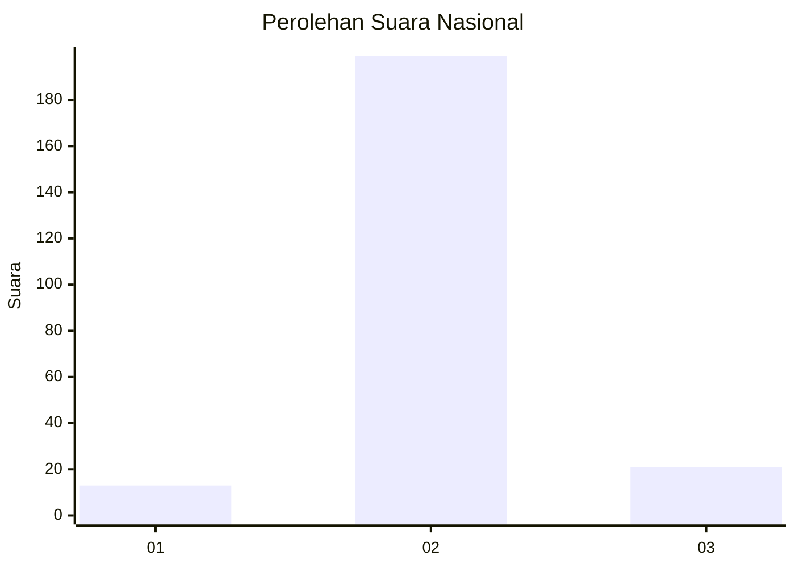
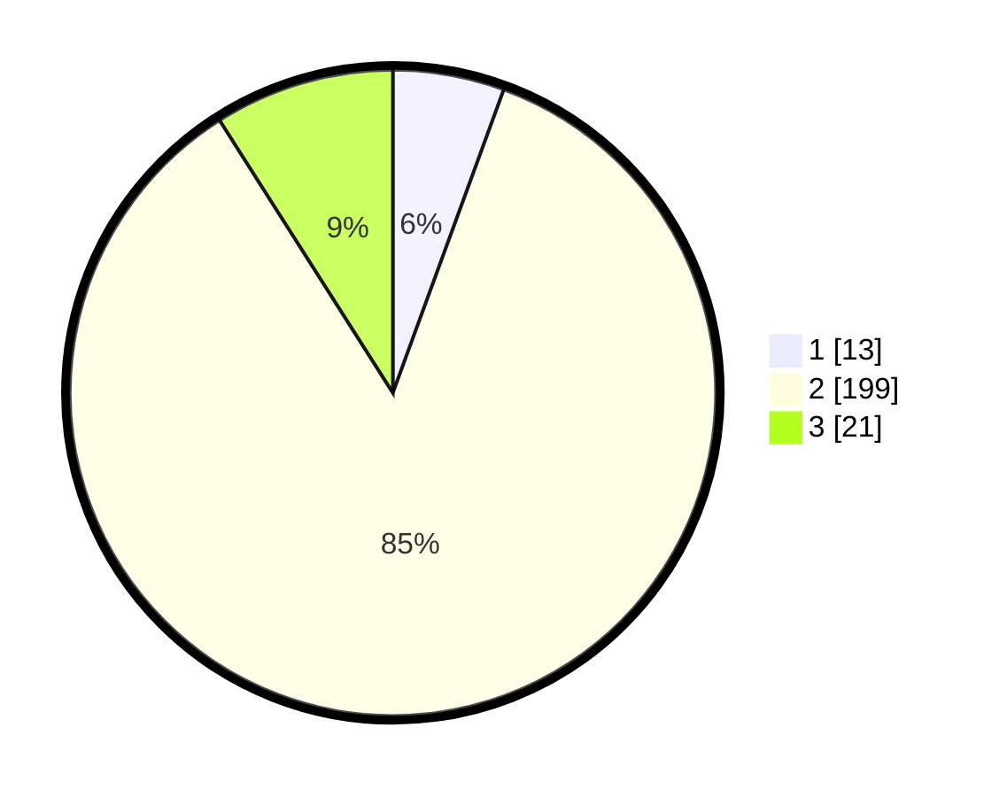

# Hasil

## Grafik

## Tabel

| No. | Nama Paslon    | Suara | Suara (raw) | Persentase |
|:--- |:-------------- | -----:| -----------:| ----------:|
| 1   | ANIES MUHAIMIN | 13    | [13][p-1]   | 5,58       |
| 2   | PRABOWO GIBRAN | 199   | [199][p-2]  | 85,41      |
| 3   | GANJAR MAHFUD  | 21    | [21][p-3]   | 9,01       |

[p-1]: https://github.com/gigit-pemilu/pemilu-2024/blob/main/pilpres/hitung-suara/sub/16-sumatera-selatan/sub/02-ogan-komering-ilir/sub/13-lempuing/sub/2027-sindang-sari/sub/003-tps/sub/paslon-1.txt
[p-2]: https://github.com/gigit-pemilu/pemilu-2024/blob/main/pilpres/hitung-suara/sub/16-sumatera-selatan/sub/02-ogan-komering-ilir/sub/13-lempuing/sub/2027-sindang-sari/sub/003-tps/sub/paslon-2.txt
[p-3]: https://github.com/gigit-pemilu/pemilu-2024/blob/main/pilpres/hitung-suara/sub/16-sumatera-selatan/sub/02-ogan-komering-ilir/sub/13-lempuing/sub/2027-sindang-sari/sub/003-tps/sub/paslon-3.txt

## Foto C Plano

https://sirekap-obj-formc.kpu.go.id/97bf/pemilu/ppwp/16/02/13/20/27/1602132027003-20240215-164643--ba3accb5-021a-48ba-85e8-16466fa1fc34.jpg

https://sirekap-obj-formc.kpu.go.id/97bf/pemilu/ppwp/16/02/13/20/27/1602132027003-20240214-212204--88ba40b5-7500-4a6d-b85e-0ecc523d811b.jpg

https://sirekap-obj-formc.kpu.go.id/97bf/pemilu/ppwp/16/02/13/20/27/1602132027003-20240214-215040--fab2a889-dc36-407e-91bf-e77d96eff941.jpg

## Metadata

| Key        | Value               |
| ---------- | ------------------- |
| Time Stamp | 2024-02-19 06:16:00 |

