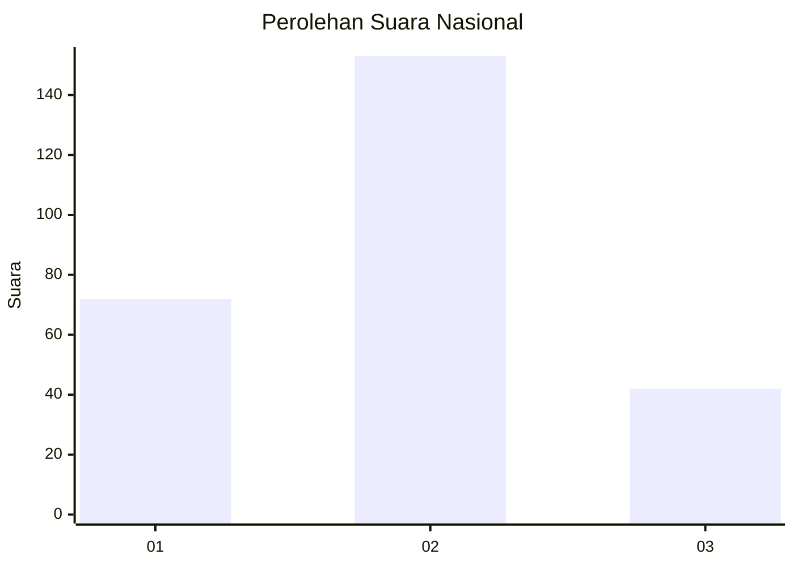
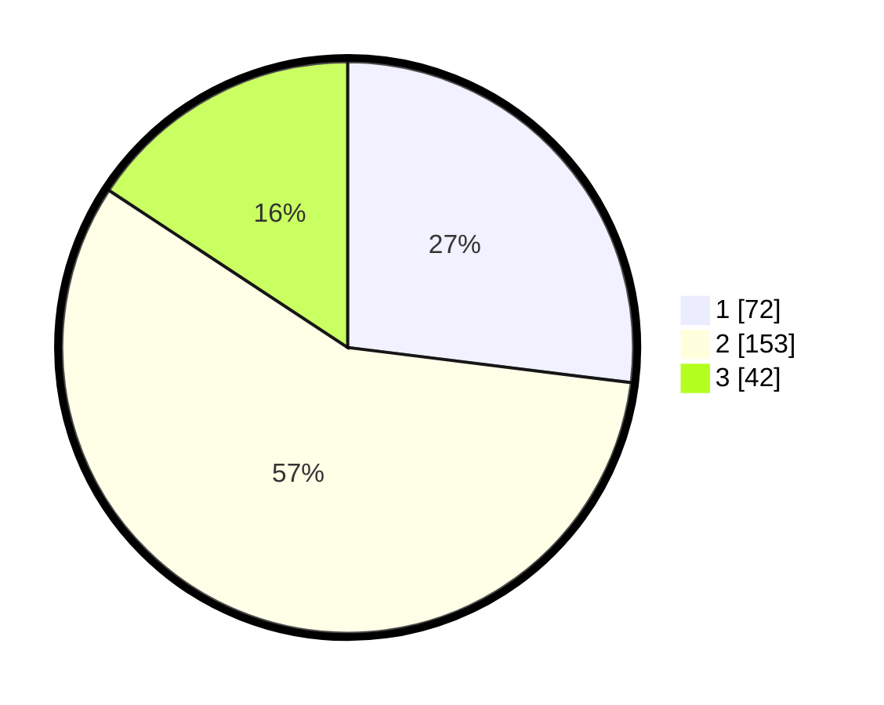

# Hasil

## Grafik

## Tabel

| No. | Nama Paslon    | Suara | Suara (raw) | Persentase |
|:--- |:-------------- | -----:| -----------:| ----------:|
| 1   | ANIES MUHAIMIN | 72    | [72][p-1]   | 26,97      |
| 2   | PRABOWO GIBRAN | 153   | [153][p-2]  | 57,30      |
| 3   | GANJAR MAHFUD  | 42    | [42][p-3]   | 15,73      |

[p-1]: https://github.com/gigit-pemilu/pemilu-2024/blob/main/pilpres/hitung-suara/sub/16-sumatera-selatan/sub/02-ogan-komering-ilir/sub/14-air-sugihan/sub/2015-pangkalan-sakti/sub/004-tps/sub/paslon-1.txt
[p-2]: https://github.com/gigit-pemilu/pemilu-2024/blob/main/pilpres/hitung-suara/sub/16-sumatera-selatan/sub/02-ogan-komering-ilir/sub/14-air-sugihan/sub/2015-pangkalan-sakti/sub/004-tps/sub/paslon-2.txt
[p-3]: https://github.com/gigit-pemilu/pemilu-2024/blob/main/pilpres/hitung-suara/sub/16-sumatera-selatan/sub/02-ogan-komering-ilir/sub/14-air-sugihan/sub/2015-pangkalan-sakti/sub/004-tps/sub/paslon-3.txt

## Foto C Plano

https://sirekap-obj-formc.kpu.go.id/0d76/pemilu/ppwp/16/02/14/20/15/1602142015004-20240215-031709--6645c66b-4dc1-42d1-8a48-fa2329da2236.jpg

https://sirekap-obj-formc.kpu.go.id/0d76/pemilu/ppwp/16/02/14/20/15/1602142015004-20240215-031815--8205414d-d15f-4651-b2d9-ed498dccfe15.jpg

https://sirekap-obj-formc.kpu.go.id/0d76/pemilu/ppwp/16/02/14/20/15/1602142015004-20240215-032316--26e27ae2-199b-43c3-8ef6-e1e50f092e2b.jpg

## Metadata

| Key        | Value               |
| ---------- | ------------------- |
| Time Stamp | 2024-02-19 06:16:00 |

