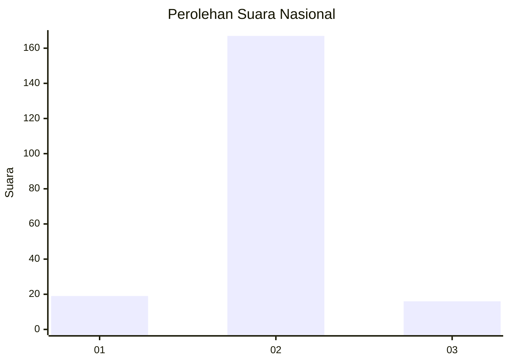
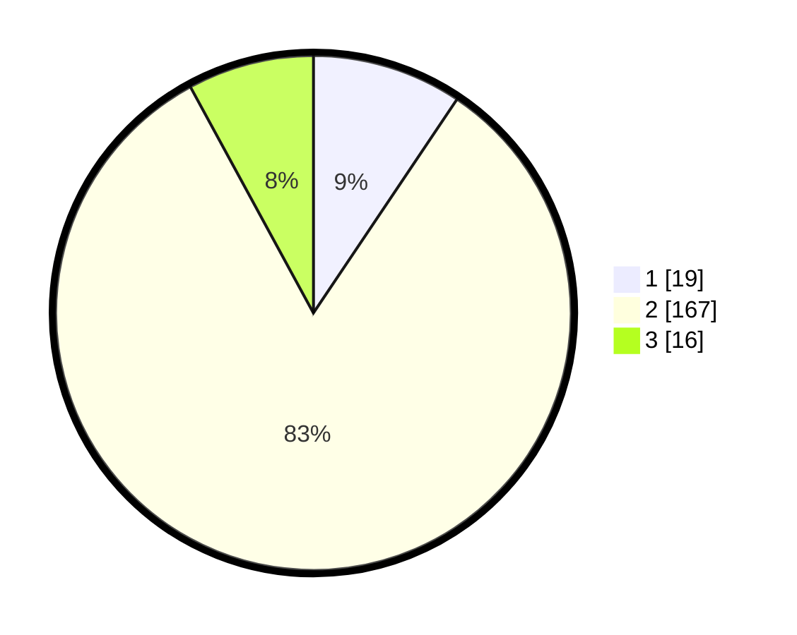

# Hasil

## Grafik

## Tabel

| No. | Nama Paslon    | Suara | Suara (raw) | Persentase |
|:--- |:-------------- | -----:| -----------:| ----------:|
| 1   | ANIES MUHAIMIN | 19    | [19][p-1]   | 9,41       |
| 2   | PRABOWO GIBRAN | 167   | [167][p-2]  | 82,67      |
| 3   | GANJAR MAHFUD  | 16    | [16][p-3]   | 7,92       |

[p-1]: https://github.com/gigit-pemilu/pemilu-2024/blob/main/pilpres/hitung-suara/sub/16-sumatera-selatan/sub/02-ogan-komering-ilir/sub/15-sungai-menang/sub/2001-sungai-menang/sub/003-tps/sub/paslon-1.txt
[p-2]: https://github.com/gigit-pemilu/pemilu-2024/blob/main/pilpres/hitung-suara/sub/16-sumatera-selatan/sub/02-ogan-komering-ilir/sub/15-sungai-menang/sub/2001-sungai-menang/sub/003-tps/sub/paslon-2.txt
[p-3]: https://github.com/gigit-pemilu/pemilu-2024/blob/main/pilpres/hitung-suara/sub/16-sumatera-selatan/sub/02-ogan-komering-ilir/sub/15-sungai-menang/sub/2001-sungai-menang/sub/003-tps/sub/paslon-3.txt

## Foto C Plano

https://sirekap-obj-formc.kpu.go.id/4be5/pemilu/ppwp/16/02/15/20/01/1602152001003-20240215-094005--8442a9a6-e1af-4232-a081-97063ea73dcc.jpg

https://sirekap-obj-formc.kpu.go.id/4be5/pemilu/ppwp/16/02/15/20/01/1602152001003-20240215-094145--8ab2242e-1451-47a3-a33d-fd3460907149.jpg

https://sirekap-obj-formc.kpu.go.id/4be5/pemilu/ppwp/16/02/15/20/01/1602152001003-20240215-094325--eabc8b8d-77a9-49cf-acf8-c714a72263a3.jpg

## Metadata

| Key        | Value               |
| ---------- | ------------------- |
| Time Stamp | 2024-02-17 04:00:03 |

