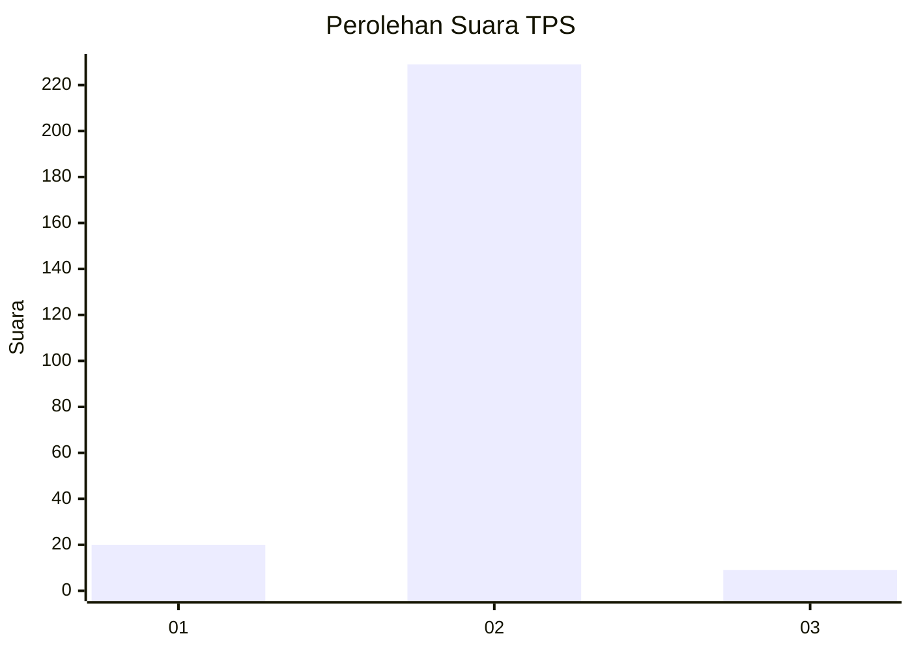
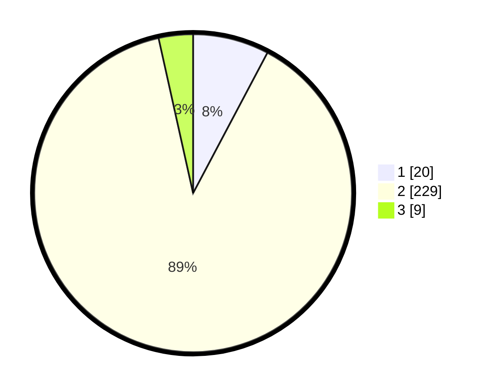

# Hasil

## Grafik

## Tabel

| No. | Nama Paslon    | Suara | Suara (raw) | Persentase |
|:--- |:-------------- | -----:| -----------:| ----------:|
| 1   | ANIES MUHAIMIN | 20    | [20][p-1]   | 7,75       |
| 2   | PRABOWO GIBRAN | 229   | [229][p-2]  | 88,76      |
| 3   | GANJAR MAHFUD  | 9     | [9][p-3]    | 3,49       |

[p-1]: https://github.com/gigit-pemilu/pemilu-2024-16-sumatera-selatan/blob/main/pilpres/hitung-suara/sub/16-sumatera-selatan/sub/02-ogan-komering-ilir/sub/15-sungai-menang/sub/2001-sungai-menang/sub/005-tps/sub/paslon-1.txt
[p-2]: https://github.com/gigit-pemilu/pemilu-2024-16-sumatera-selatan/blob/main/pilpres/hitung-suara/sub/16-sumatera-selatan/sub/02-ogan-komering-ilir/sub/15-sungai-menang/sub/2001-sungai-menang/sub/005-tps/sub/paslon-2.txt
[p-3]: https://github.com/gigit-pemilu/pemilu-2024-16-sumatera-selatan/blob/main/pilpres/hitung-suara/sub/16-sumatera-selatan/sub/02-ogan-komering-ilir/sub/15-sungai-menang/sub/2001-sungai-menang/sub/005-tps/sub/paslon-3.txt

## Foto C Plano

https://sirekap-obj-formc.kpu.go.id/5d9b/pemilu/ppwp/16/02/15/20/01/1602152001005-20240214-232400--8a621144-b79a-4d41-b196-dd56f5b5e4d1.jpg

https://sirekap-obj-formc.kpu.go.id/5d9b/pemilu/ppwp/16/02/15/20/01/1602152001005-20240214-232649--984288af-7bd1-4cfb-8217-58536cde2e95.jpg

https://sirekap-obj-formc.kpu.go.id/5d9b/pemilu/ppwp/16/02/15/20/01/1602152001005-20240214-233107--f216827a-bded-4f18-bdba-60dd8e08afaf.jpg

## Metadata

| Key        | Value               |
| ---------- | ------------------- |
| Time Stamp | 2024-02-17 03:30:02 |

