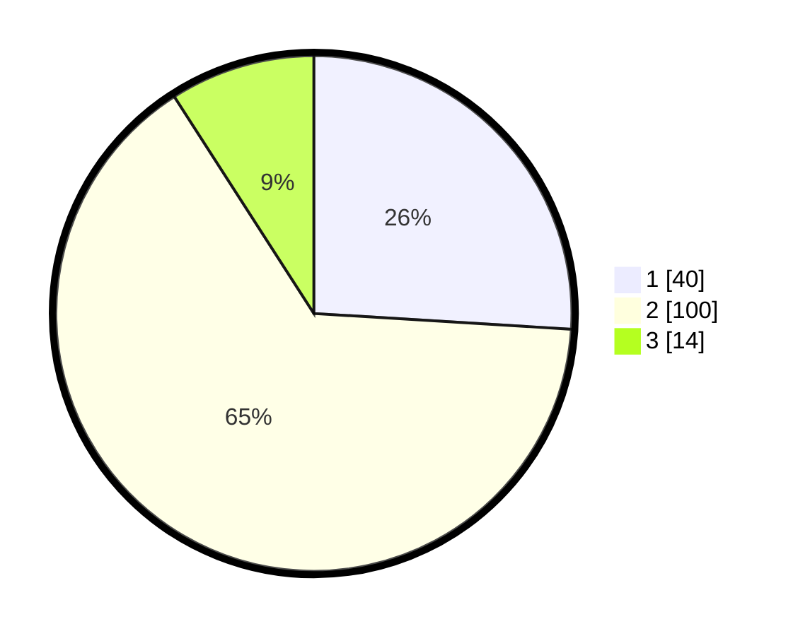

# Hasil

## Grafik

## Tabel

| No. | Nama Paslon    | Suara | Suara (raw) | Persentase |
|:--- |:-------------- | -----:| -----------:| ----------:|
| 1   | ANIES MUHAIMIN | 40    | [40][p-1]   | 25,97      |
| 2   | PRABOWO GIBRAN | 100   | [100][p-2]  | 64,94      |
| 3   | GANJAR MAHFUD  | 14    | [14][p-3]   | 9,09       |

[p-1]: https://github.com/gigit-pemilu/pemilu-2024-16-sumatera-selatan/blob/main/pilpres/hitung-suara/sub/16-sumatera-selatan/sub/02-ogan-komering-ilir/sub/15-sungai-menang/sub/2004-gajah-mati/sub/001-tps/sub/paslon-1.txt
[p-2]: https://github.com/gigit-pemilu/pemilu-2024-16-sumatera-selatan/blob/main/pilpres/hitung-suara/sub/16-sumatera-selatan/sub/02-ogan-komering-ilir/sub/15-sungai-menang/sub/2004-gajah-mati/sub/001-tps/sub/paslon-2.txt
[p-3]: https://github.com/gigit-pemilu/pemilu-2024-16-sumatera-selatan/blob/main/pilpres/hitung-suara/sub/16-sumatera-selatan/sub/02-ogan-komering-ilir/sub/15-sungai-menang/sub/2004-gajah-mati/sub/001-tps/sub/paslon-3.txt

## Foto C Plano

https://sirekap-obj-formc.kpu.go.id/7ce6/pemilu/ppwp/16/02/15/20/04/1602152004001-20240214-234930--6d7a574f-3639-4f6e-986f-f9441797b6d0.jpg

https://sirekap-obj-formc.kpu.go.id/7ce6/pemilu/ppwp/16/02/15/20/04/1602152004001-20240214-235125--ff6ed2b6-9a65-44b3-b2b5-537604b2547a.jpg

https://sirekap-obj-formc.kpu.go.id/7ce6/pemilu/ppwp/16/02/15/20/04/1602152004001-20240214-214525--bb0b425a-4ac9-4a5f-ba1a-d0c654cfb5db.jpg

## Metadata

| Key        | Value               |
| ---------- | ------------------- |
| Time Stamp | 2024-02-17 03:30:02 |

