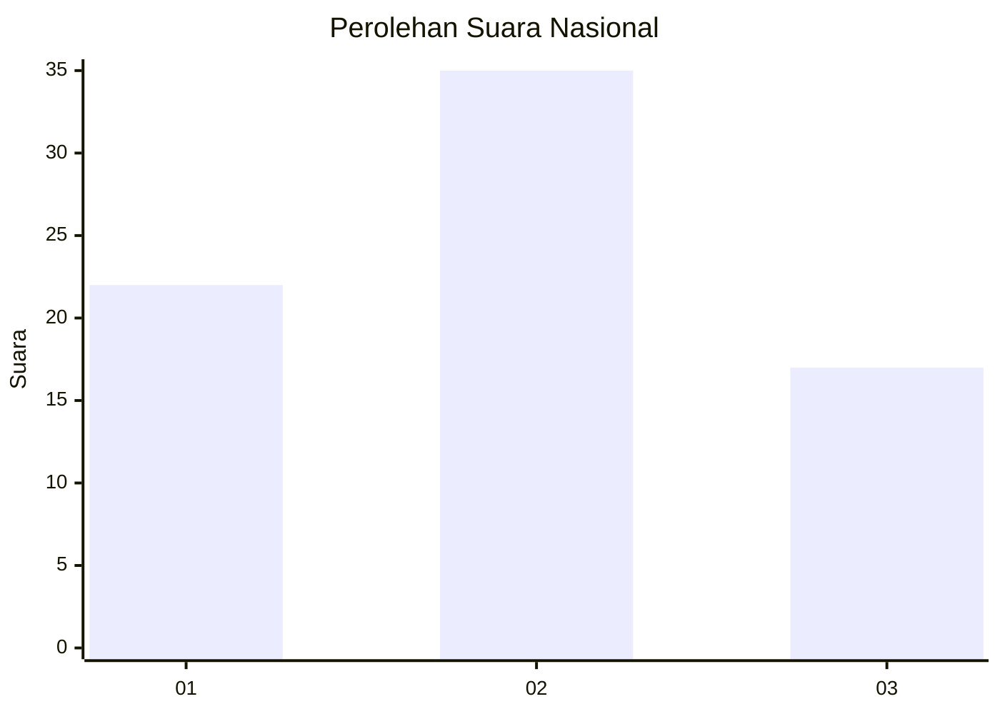
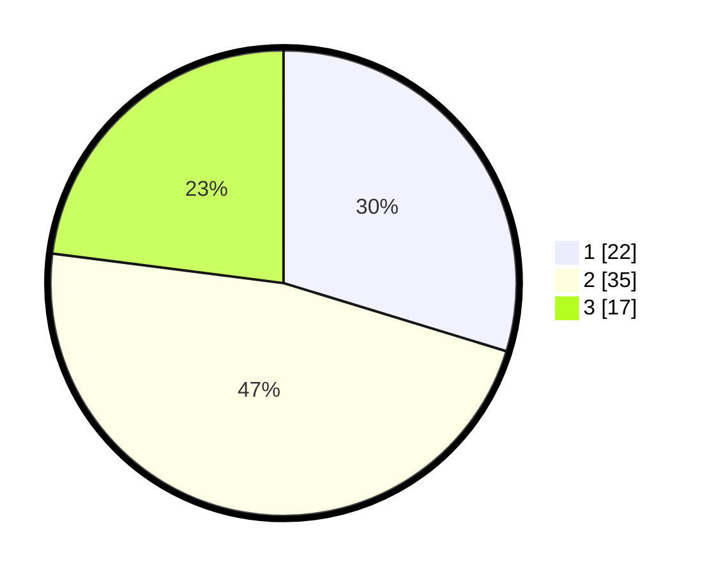

# Hasil

## Grafik

## Tabel

| No. | Nama Paslon    | Suara | Suara (raw) | Persentase |
|:--- |:-------------- | -----:| -----------:| ----------:|
| 1   | ANIES MUHAIMIN | 22    | [22][p-1]   | 29,73      |
| 2   | PRABOWO GIBRAN | 35    | [35][p-2]   | 47,30      |
| 3   | GANJAR MAHFUD  | 17    | [17][p-3]   | 22,97      |

[p-1]: https://github.com/gigit-pemilu/pemilu-2024/blob/main/pilpres/hitung-suara/sub/16-sumatera-selatan/sub/02-ogan-komering-ilir/sub/15-sungai-menang/sub/2004-gajah-mati/sub/005-tps/sub/paslon-1.txt
[p-2]: https://github.com/gigit-pemilu/pemilu-2024/blob/main/pilpres/hitung-suara/sub/16-sumatera-selatan/sub/02-ogan-komering-ilir/sub/15-sungai-menang/sub/2004-gajah-mati/sub/005-tps/sub/paslon-2.txt
[p-3]: https://github.com/gigit-pemilu/pemilu-2024/blob/main/pilpres/hitung-suara/sub/16-sumatera-selatan/sub/02-ogan-komering-ilir/sub/15-sungai-menang/sub/2004-gajah-mati/sub/005-tps/sub/paslon-3.txt

## Foto C Plano

https://sirekap-obj-formc.kpu.go.id/1b4a/pemilu/ppwp/16/02/15/20/04/1602152004005-20240214-184852--e27d446a-5e16-4e82-85a8-f0c83adecbed.jpg

https://sirekap-obj-formc.kpu.go.id/1b4a/pemilu/ppwp/16/02/15/20/04/1602152004005-20240214-185029--f4461e06-b206-4fe2-be8b-f5c692bf65dc.jpg

https://sirekap-obj-formc.kpu.go.id/1b4a/pemilu/ppwp/16/02/15/20/04/1602152004005-20240214-184853--355d5b9c-02de-472d-8bce-3366172abbb2.jpg

## Metadata

| Key        | Value               |
| ---------- | ------------------- |
| Time Stamp | 2024-02-14 21:46:01 |

## DATA PEMILIH TETAP

Jumlah pemilih dalam DPT: **739**.
 * L: **73**.
 * P: **660**.

## DATA PENGGUNA HAK PILIH

Jumlah pengguna hak pilih dalam DPT: **52**.
 * L: **0**.
 * P: **0**.

Jumlah pengguna hak pilih dalam DPTb: **0**.
 * L: **500**.
 * P: **0**.

Jumlah pengguna hak pilih dalam DPK: **0**.
 * L: **0**.
 * P: **0**.

Jumlah pengguna hak pilih: **52**.
 * L: **0**.
 * P: **0**.

## JUMLAH SUARA SAH DAN TIDAK SAH

JUMLAH SELURUH SUARA SAH: **55**.

JUMLAH SUARA TIDAK SAH: **205**.

JUMLAH SELURUH SUARA SAH DAN SUARA TIDAK SAH: **625**.

