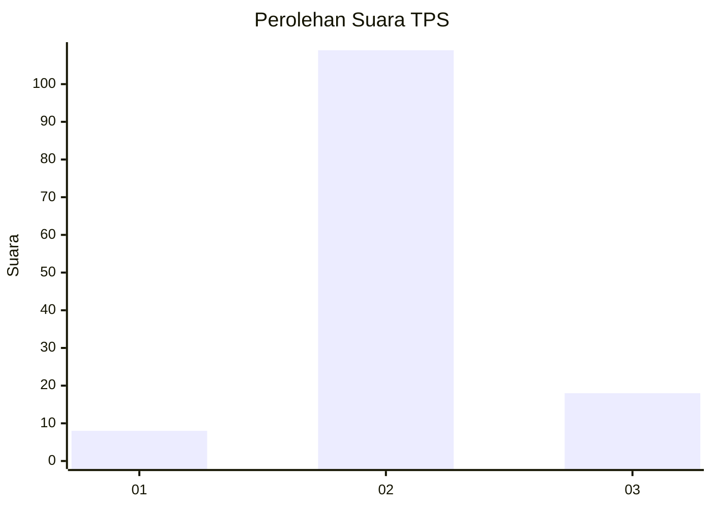
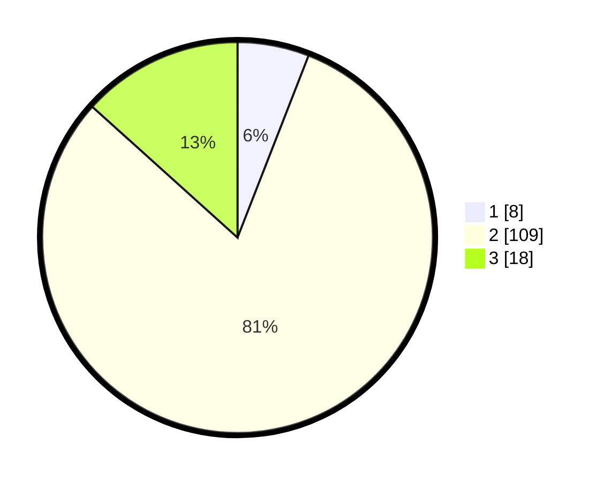

# Hasil

## Grafik

## Tabel

| No. | Nama Paslon    | Suara | Suara (raw) | Persentase |
|:--- |:-------------- | -----:| -----------:| ----------:|
| 1   | ANIES MUHAIMIN | 8     | [8][p-1]    | 5,93       |
| 2   | PRABOWO GIBRAN | 109   | [109][p-2]  | 80,74      |
| 3   | GANJAR MAHFUD  | 18    | [18][p-3]   | 13,33      |

[p-1]: https://github.com/gigit-pemilu/pemilu-2024-16-sumatera-selatan/blob/main/pilpres/hitung-suara/sub/16-sumatera-selatan/sub/02-ogan-komering-ilir/sub/15-sungai-menang/sub/2004-gajah-mati/sub/009-tps/sub/paslon-1.txt
[p-2]: https://github.com/gigit-pemilu/pemilu-2024-16-sumatera-selatan/blob/main/pilpres/hitung-suara/sub/16-sumatera-selatan/sub/02-ogan-komering-ilir/sub/15-sungai-menang/sub/2004-gajah-mati/sub/009-tps/sub/paslon-2.txt
[p-3]: https://github.com/gigit-pemilu/pemilu-2024-16-sumatera-selatan/blob/main/pilpres/hitung-suara/sub/16-sumatera-selatan/sub/02-ogan-komering-ilir/sub/15-sungai-menang/sub/2004-gajah-mati/sub/009-tps/sub/paslon-3.txt

## Foto C Plano

https://sirekap-obj-formc.kpu.go.id/476d/pemilu/ppwp/16/02/15/20/04/1602152004009-20240214-201807--a8a1d89f-1269-4169-9f42-5672c9728b7f.jpg

https://sirekap-obj-formc.kpu.go.id/476d/pemilu/ppwp/16/02/15/20/04/1602152004009-20240214-221851--d6bae236-e245-4b7f-bc01-5fba67ae895e.jpg

https://sirekap-obj-formc.kpu.go.id/476d/pemilu/ppwp/16/02/15/20/04/1602152004009-20240214-221947--9fa2fd84-6c10-4706-a7b3-92d43ccde49c.jpg

## Metadata

| Key        | Value               |
| ---------- | ------------------- |
| Time Stamp | 2024-02-19 17:00:00 |

