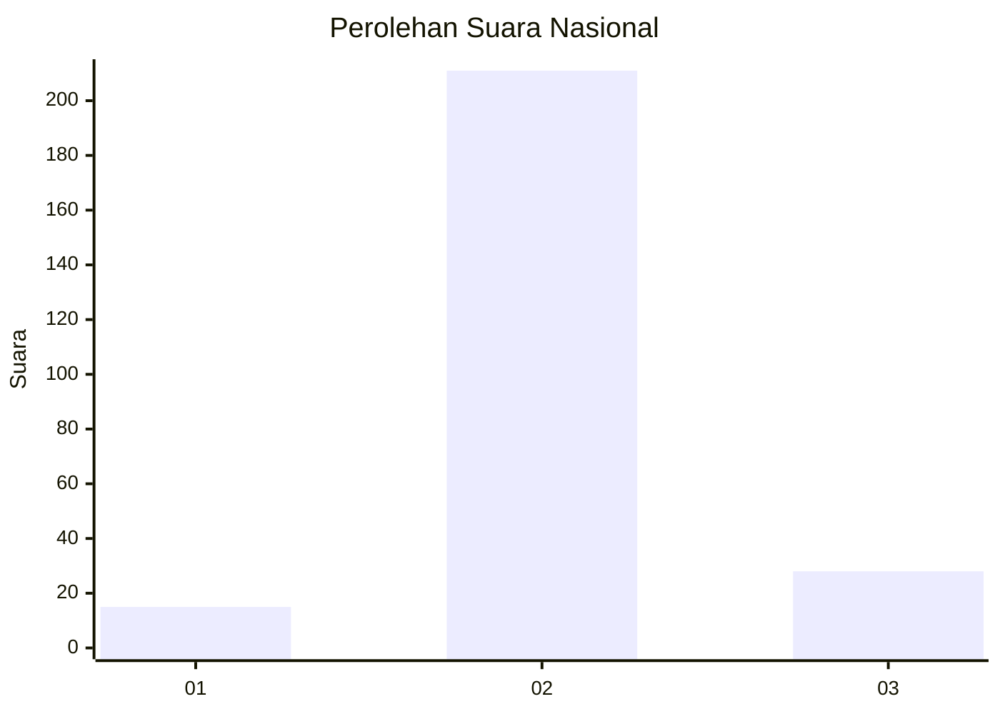
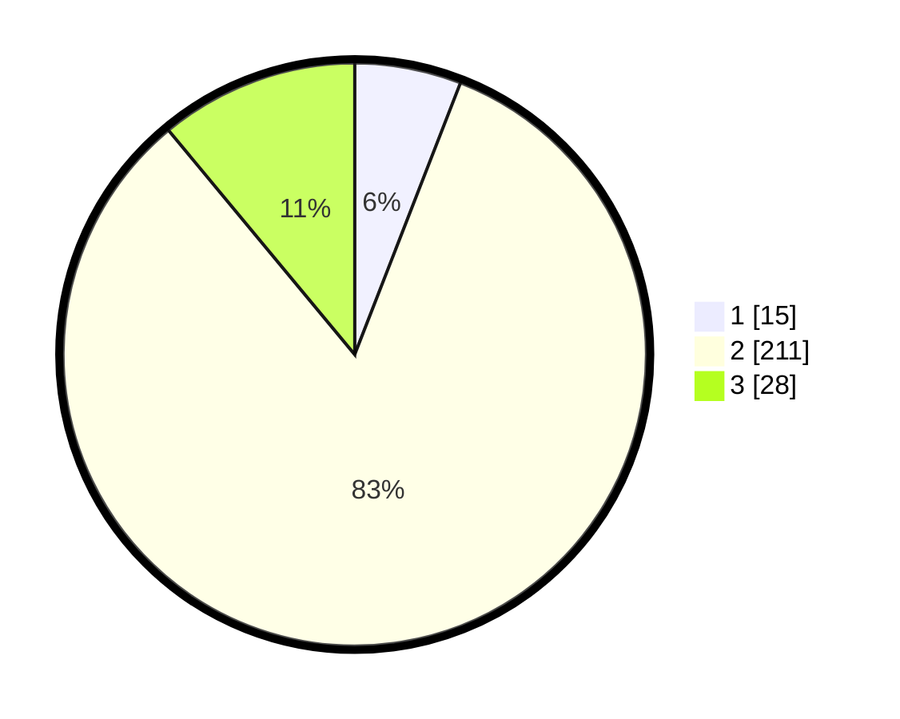

# Hasil

## Grafik

## Tabel

| No. | Nama Paslon    | Suara | Suara (raw) | Persentase |
|:--- |:-------------- | -----:| -----------:| ----------:|
| 1   | ANIES MUHAIMIN | 15    | [15][p-1]   | 5,91       |
| 2   | PRABOWO GIBRAN | 211   | [211][p-2]  | 83,07      |
| 3   | GANJAR MAHFUD  | 28    | [28][p-3]   | 11,02      |

[p-1]: https://github.com/gigit-pemilu/pemilu-2024/blob/main/pilpres/hitung-suara/sub/16-sumatera-selatan/sub/02-ogan-komering-ilir/sub/15-sungai-menang/sub/2006-sungai-sibur/sub/004-tps/sub/paslon-1.txt
[p-2]: https://github.com/gigit-pemilu/pemilu-2024/blob/main/pilpres/hitung-suara/sub/16-sumatera-selatan/sub/02-ogan-komering-ilir/sub/15-sungai-menang/sub/2006-sungai-sibur/sub/004-tps/sub/paslon-2.txt
[p-3]: https://github.com/gigit-pemilu/pemilu-2024/blob/main/pilpres/hitung-suara/sub/16-sumatera-selatan/sub/02-ogan-komering-ilir/sub/15-sungai-menang/sub/2006-sungai-sibur/sub/004-tps/sub/paslon-3.txt

## Foto C Plano

https://sirekap-obj-formc.kpu.go.id/e0bc/pemilu/ppwp/16/02/15/20/06/1602152006004-20240215-102820--91e98a09-c225-4bc2-996c-a823f4a1e8c8.jpg

https://sirekap-obj-formc.kpu.go.id/e0bc/pemilu/ppwp/16/02/15/20/06/1602152006004-20240215-102910--3a8cc0b7-46f0-4366-ad98-7f74eeba7d59.jpg

https://sirekap-obj-formc.kpu.go.id/e0bc/pemilu/ppwp/16/02/15/20/06/1602152006004-20240215-102954--3be10676-1f51-40d3-9ccf-934e86017045.jpg

## Metadata

| Key        | Value               |
| ---------- | ------------------- |
| Time Stamp | 2024-02-17 03:30:02 |

