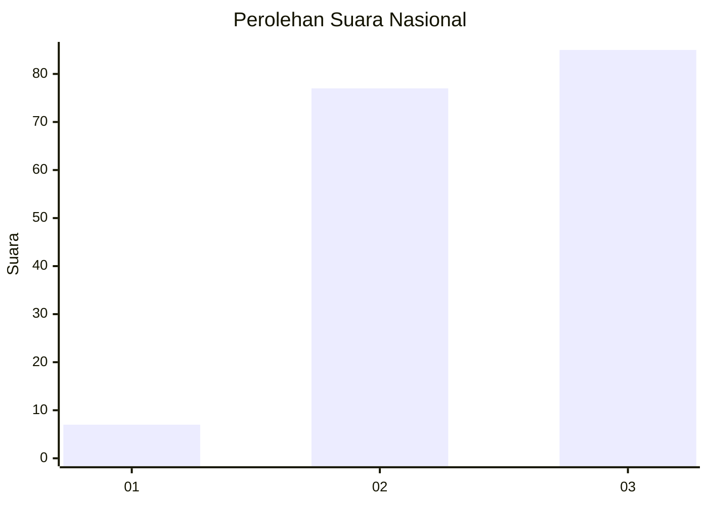
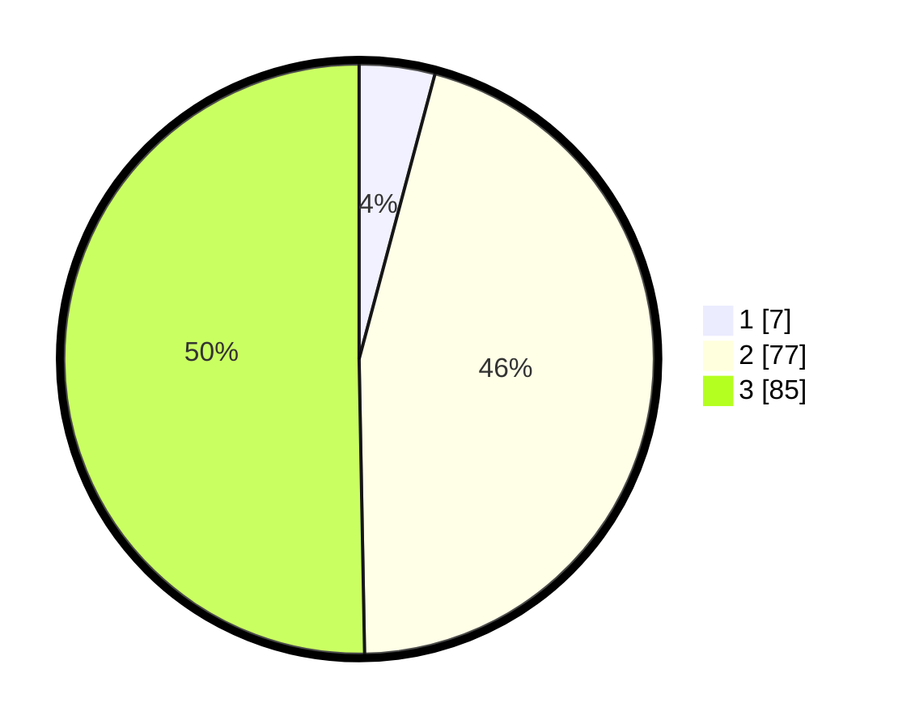

# Hasil

## Grafik

## Tabel

| No. | Nama Paslon    | Suara | Suara (raw) | Persentase |
|:--- |:-------------- | -----:| -----------:| ----------:|
| 1   | ANIES MUHAIMIN | 7     | [7][p-1]    | 4,14       |
| 2   | PRABOWO GIBRAN | 77    | [77][p-2]   | 45,56      |
| 3   | GANJAR MAHFUD  | 85    | [85][p-3]   | 50,30      |

[p-1]: https://github.com/gigit-pemilu/pemilu-2024/blob/main/pilpres/hitung-suara/sub/16-sumatera-selatan/sub/02-ogan-komering-ilir/sub/15-sungai-menang/sub/2006-sungai-sibur/sub/008-tps/sub/paslon-1.txt
[p-2]: https://github.com/gigit-pemilu/pemilu-2024/blob/main/pilpres/hitung-suara/sub/16-sumatera-selatan/sub/02-ogan-komering-ilir/sub/15-sungai-menang/sub/2006-sungai-sibur/sub/008-tps/sub/paslon-2.txt
[p-3]: https://github.com/gigit-pemilu/pemilu-2024/blob/main/pilpres/hitung-suara/sub/16-sumatera-selatan/sub/02-ogan-komering-ilir/sub/15-sungai-menang/sub/2006-sungai-sibur/sub/008-tps/sub/paslon-3.txt

## Foto C Plano

https://sirekap-obj-formc.kpu.go.id/c722/pemilu/ppwp/16/02/15/20/06/1602152006008-20240215-110730--32146b1b-1c6f-447c-9901-f3c3fbc8110f.jpg

https://sirekap-obj-formc.kpu.go.id/c722/pemilu/ppwp/16/02/15/20/06/1602152006008-20240215-111051--00e89345-6e10-4b2c-b2ce-ab331e21250d.jpg

https://sirekap-obj-formc.kpu.go.id/c722/pemilu/ppwp/16/02/15/20/06/1602152006008-20240215-111417--057b6b0e-fee6-46c6-afe5-e9dc32068302.jpg

## Metadata

| Key        | Value               |
| ---------- | ------------------- |
| Time Stamp | 2024-02-19 17:00:00 |

