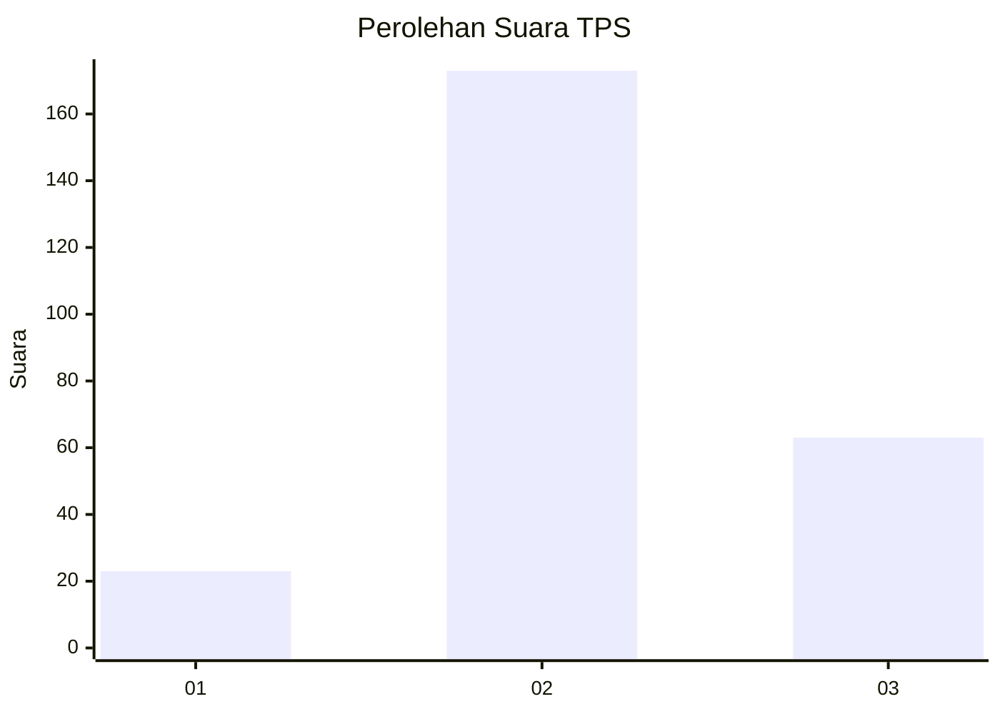
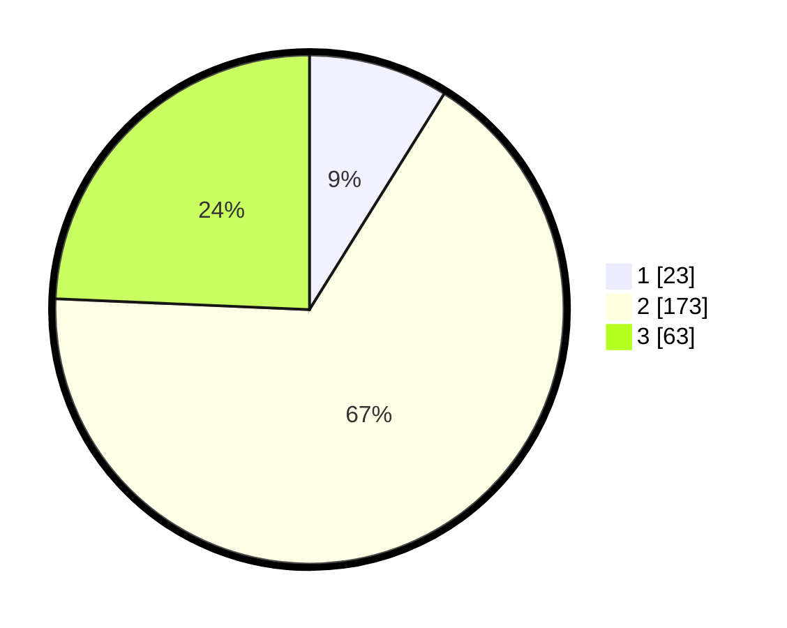

# Hasil

## Grafik

## Tabel

| No. | Nama Paslon    | Suara | Suara (raw) | Persentase |
|:--- |:-------------- | -----:| -----------:| ----------:|
| 1   | ANIES MUHAIMIN | 23    | [23][p-1]   | 8,88       |
| 2   | PRABOWO GIBRAN | 173   | [173][p-2]  | 66,80      |
| 3   | GANJAR MAHFUD  | 63    | [63][p-3]   | 24,32      |

[p-1]: https://github.com/gigit-pemilu/pemilu-2024-16-sumatera-selatan/blob/main/pilpres/hitung-suara/sub/16-sumatera-selatan/sub/02-ogan-komering-ilir/sub/15-sungai-menang/sub/2009-talang-jaya/sub/004-tps/sub/paslon-1.txt
[p-2]: https://github.com/gigit-pemilu/pemilu-2024-16-sumatera-selatan/blob/main/pilpres/hitung-suara/sub/16-sumatera-selatan/sub/02-ogan-komering-ilir/sub/15-sungai-menang/sub/2009-talang-jaya/sub/004-tps/sub/paslon-2.txt
[p-3]: https://github.com/gigit-pemilu/pemilu-2024-16-sumatera-selatan/blob/main/pilpres/hitung-suara/sub/16-sumatera-selatan/sub/02-ogan-komering-ilir/sub/15-sungai-menang/sub/2009-talang-jaya/sub/004-tps/sub/paslon-3.txt

## Foto C Plano

https://sirekap-obj-formc.kpu.go.id/8b26/pemilu/ppwp/16/02/15/20/09/1602152009004-20240214-223125--75074993-df53-4a6a-be7b-b9275d34814b.jpg

https://sirekap-obj-formc.kpu.go.id/8b26/pemilu/ppwp/16/02/15/20/09/1602152009004-20240214-230659--5c85dc75-b484-46f6-8c19-f2bfe27e86a8.jpg

https://sirekap-obj-formc.kpu.go.id/8b26/pemilu/ppwp/16/02/15/20/09/1602152009004-20240214-230905--5555e903-4a0f-4ba9-91cf-34e9b597912c.jpg

## Metadata

| Key        | Value               |
| ---------- | ------------------- |
| Time Stamp | 2024-02-17 03:30:02 |

