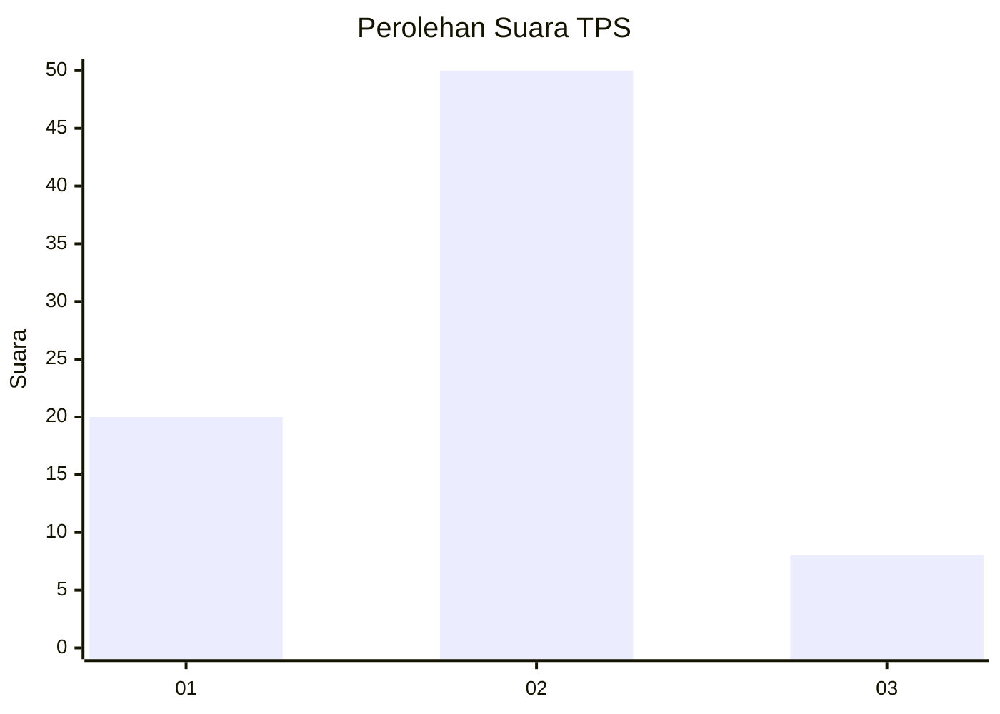
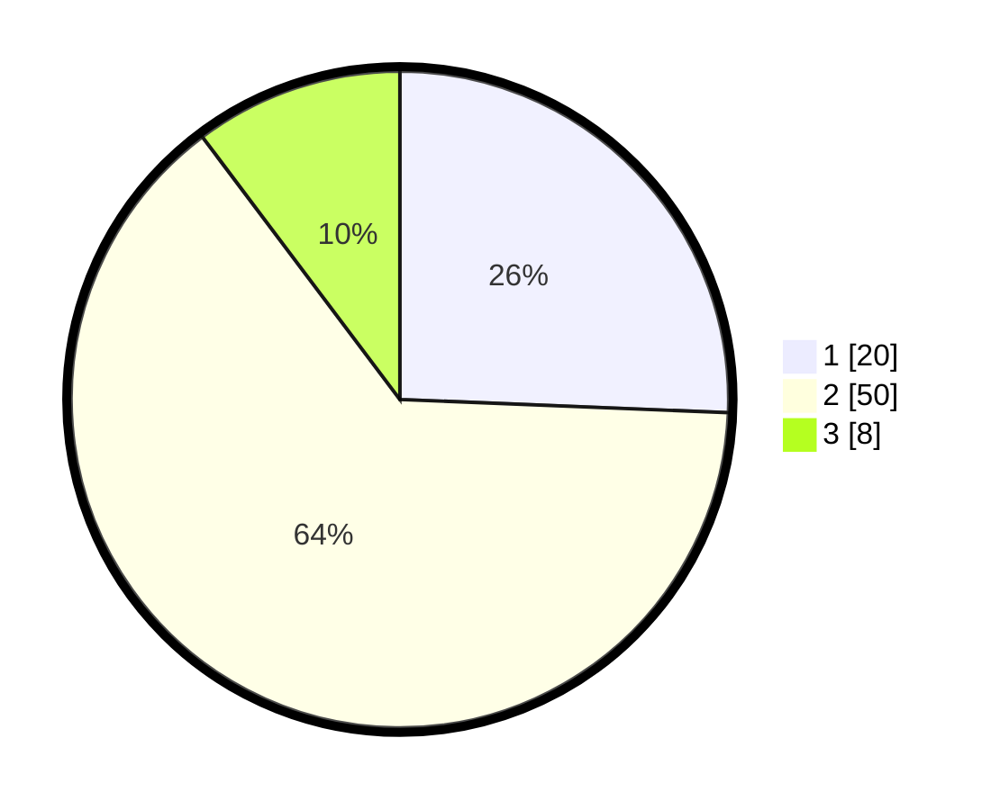

# Hasil

## Grafik

## Tabel

| No. | Nama Paslon    | Suara | Suara (raw) | Persentase |
|:--- |:-------------- | -----:| -----------:| ----------:|
| 1   | ANIES MUHAIMIN | 20    | [20][p-1]   | 25,64      |
| 2   | PRABOWO GIBRAN | 50    | [50][p-2]   | 64,10      |
| 3   | GANJAR MAHFUD  | 8     | [8][p-3]    | 10,26      |

[p-1]: https://github.com/gigit-pemilu/pemilu-2024-16-sumatera-selatan/blob/main/pilpres/hitung-suara/sub/16-sumatera-selatan/sub/02-ogan-komering-ilir/sub/15-sungai-menang/sub/2009-talang-jaya/sub/005-tps/sub/paslon-1.txt
[p-2]: https://github.com/gigit-pemilu/pemilu-2024-16-sumatera-selatan/blob/main/pilpres/hitung-suara/sub/16-sumatera-selatan/sub/02-ogan-komering-ilir/sub/15-sungai-menang/sub/2009-talang-jaya/sub/005-tps/sub/paslon-2.txt
[p-3]: https://github.com/gigit-pemilu/pemilu-2024-16-sumatera-selatan/blob/main/pilpres/hitung-suara/sub/16-sumatera-selatan/sub/02-ogan-komering-ilir/sub/15-sungai-menang/sub/2009-talang-jaya/sub/005-tps/sub/paslon-3.txt

## Foto C Plano

https://sirekap-obj-formc.kpu.go.id/642f/pemilu/ppwp/16/02/15/20/09/1602152009005-20240214-220739--374a935b-b1da-4121-87c3-4f5cc8f450fe.jpg

https://sirekap-obj-formc.kpu.go.id/642f/pemilu/ppwp/16/02/15/20/09/1602152009005-20240214-220923--f8dea39b-a24b-456f-8efa-f9630234801c.jpg

https://sirekap-obj-formc.kpu.go.id/642f/pemilu/ppwp/16/02/15/20/09/1602152009005-20240214-221130--d8d3fc6f-bf49-47f7-8fa8-8a3868978245.jpg

## Metadata

| Key        | Value               |
| ---------- | ------------------- |
| Time Stamp | 2024-02-17 03:30:02 |

